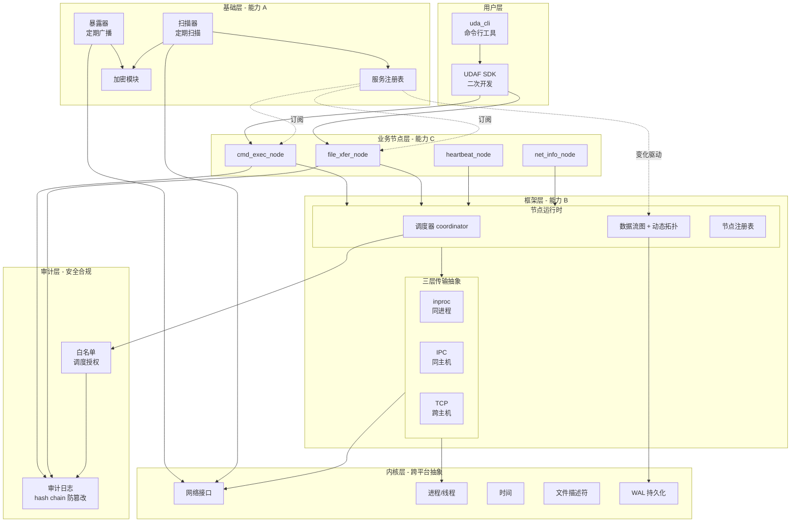
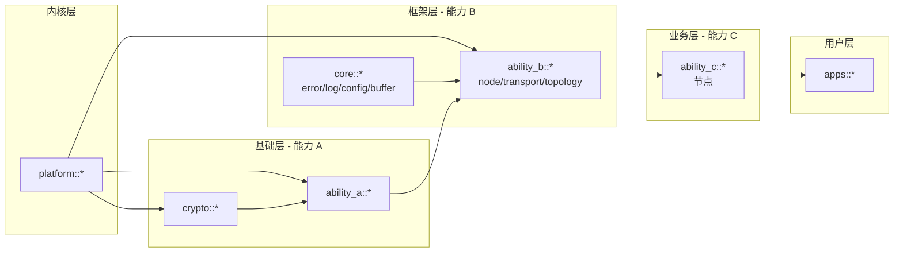
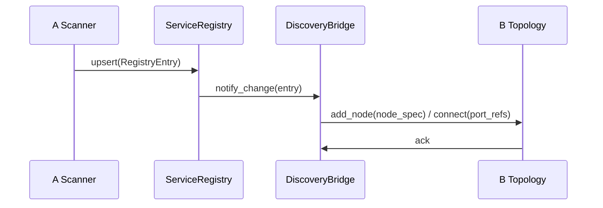

# 02 架构设计

> **项目代号**：UDAF（Unified Device & Application Framework）
> **文档版本**：v2.10
> **日期**：2026-09-01
> **阶段**：阶段 2 / 5（架构设计）
> **前置文档**：[`docs/01-requirements.md`](01-requirements.md)
> **状态**：草案，待评审

---

## 1. 架构目标与约束

### 1.1 架构目标

将需求文档 v1.0 中描述的业务能力，转化为**可实施的架构骨架**：

1. **明确分层架构**：能力 A（发现）/ B（数据流）/ C（业务节点）的边界
2. **回答需求 v1.0 的 8 项 TBD**：库选型、中间件传输、进程模型、错误码、加密、跨平台、API 形态、节点契约
3. **沉淀关键技术决策**：以 ADR 形式记录选型理由
4. **输出阶段 3 输入**：模块划分、接口契约、依赖关系

### 1.2 来自需求 v1.0 的关键约束（仅业务级）

| 维度 | 约束（业务级） | 出处 |
|------|--------------|------|
| **三大能力** | A（发现）/ B（数据流）/ C（业务节点）；A+B 共同作为 C 的基础 | v1.0 §1.2 |
| **A 是双向定期** | 每台设备都定期发现；不依赖 dora 静态 YAML | v1.0 §1.2 |
| **B 是分布式** | 多线程 + 多进程 + 跨主机 | v1.0 §1.2 |
| **C 是 B 上的节点** | 不是独立中间件 | v1.0 §1.2 |
| **性能契约** | 5.1 + 5.6 + 5.7（17 项指标 + 7 项语义契约 + 9 项边界场景） | v1.0 §5 |
| **消息语义** | 顺序（同会话内严格）/ 持久化（v1.0 不持久化）/ 投递（至少一次）/ 优先级 | v1.0 §5.6 |
| **API 语言分端** | 设备端 C API；主机端 C++ API；Python 绑定 P2 | v1.0 §10.1 |
| **认证分阶段** | v1.0 PSK；v1.x PKI；双模式共存 | v1.0 §10.3 |
| **MVP 范围** | §3.2 场景 A/B/C + 局域网零配置发现 + 4 类 C 节点 | v1.0 §10.1 |

### 1.3 阶段 2 必须回答的 8 项 TBD

| # | TBD 项 | 本章回答位置 |
|---|--------|--------------|
| 1 | 第三方库选型（评估维度） | §3 模块依赖 + ADR-001/002/004 |
| 2 | 消息中间件传输后端方案 | §4.2 + ADR-001 |
| 3 | 进程模型（设备端 / 主机端） | §5 + ADR-003 |
| 4 | 错误码体系（4 类码值分配） | §6 |
| 5 | 加密 / 认证 / 授权的具体实现机制 | §7 + ADR-004 |
| 6 | 跨平台抽象层设计 | §8 |
| 7 | API 形态（C++ / C / Python 绑定的优先级） | §9 + ADR-004 |
| 8 | 节点消息契约格式 | §10 + ADR-002 |

---

## 2. 总体架构

### 2.1 分层架构



### 2.2 进程模型概览

| 角色 | 进程模型 | 关键进程 |
|------|----------|----------|
| **设备端** | 单可执行 + 多线程 + 节点子进程 | `udaf_device`（主） + B 节点（按需 fork/exec） |
| **主机端** | 多守护进程 + 节点子进程 | `udaf_host`（主） + A/B 各为独立进程 + C 节点（按需） |
| **跨主机** | TCP 长连接 | 主机间通过 broker 联邦 |
| **设备端 watchdog** | systemd / init 拉起 | 由 OS 拉起 `udaf_device` |

**运行用户约束**（需求 §6.2 最小权限原则）：
- 设备端必须以专用用户 `udaf`（uid 独立）运行，shell 设为 `/sbin/nologin`
- systemd unit 显式 `User=udaf` / `Group=udaf`
- 文件权限：配置 600、可执行文件 755、日志 640、审计日志 640

详见 [ADR-003-process-model.md](adr/ADR-003-process-model.md)。

### 2.3 模块依赖图



---

## 3. 模块依赖与库边界

### 3.1 核心依赖矩阵

| 库 | 用途 | 集成方式 | 链接类型 | ADR |
|----|------|----------|----------|-----|
| **mbedTLS** | HMAC / TLS / 加密原语 | `find_package(MbedTLS REQUIRED)` | STATIC | — |
| **消息中间件** | inproc / IPC / TCP 传输 | 见 ADR-001 | STATIC | [ADR-001](adr/ADR-001-message-broker.md) |
| **序列化** | 节点消息 / 控制消息 | 见 ADR-002 | STATIC + codegen | [ADR-002](adr/ADR-002-serialization.md) |
| **spdlog** | 结构化日志 | `find_package(spdlog REQUIRED)` | HEADER-ONLY | — |
| **yaml-cpp** | YAML 配置解析 | `find_package(yaml-cpp REQUIRED)` | STATIC | — |
| **gtest** | 单元测试 | `find_package(GTest REQUIRED)` | STATIC（测试时） | — |
| **clang-tidy** | 静态分析 | 独立工具 | N/A | — |

### 3.2 库选型评估维度（来自需求 v1.0 §11.2）

阶段 2 的库选型按以下维度评估（ADR-001/002/004 输出具体评估矩阵）：

| 维度 | 权重 | 评估标准 |
|------|------|----------|
| **性能** | 高 | 是否满足 v1.0 §5.1 / §5.6 / §5.7 的性能契约 |
| **嵌入式 footprint** | 高 | 静态链接后体积 ≤ 8MB（设备端约束） |
| **跨平台** | 高 | Linux amd64 / aarch64 兼容；可选 Windows（主机端工具） |
| **许可证** | 中 | 兼容商业产品（避免 GPL） |
| **维护活跃度** | 中 | 最近 12 个月有 release |
| **ABI 稳定性** | 中 | 升级时是否破坏 API |
| **安全审计** | 高 | 是否经过第三方安全审计（如 mbedTLS） |

### 3.3 不允许引入的依赖

- **Rust 运行时**（仅借鉴 dora 理念，不直接依赖）
- **dora-rs 二进制**
- **任何 GPL 协议库**
- **未维护超过 18 个月的开源项目**

### 3.4 性能契约 → 模块映射表（覆盖需求 §5.1 + §5.6 + §5.7 全量 33 项）

| # | 性能契约 | 来源 | 责任模块 | 测量方法引用 |
|---|---------|------|---------|-------------|
| 1 | 设备端空闲内存 < 8MB | §5.1 | ADR-003 §5.1 内存分解 | `udaf_bench mem_idle` |
| 2 | 主机端内存 < 32MB | §5.1 | B transport + C 节点 | `udaf_bench mem_host` |
| 3 | 设备端冷启动 < 200ms | §5.1 | ADR-003 §5.2 启动分解 | `udaf_bench startup` |
| 4 | 设备端崩溃恢复 ≤ 5s | §7.6 | ADR-003 §5.2 WAL 回放 + §6 退避 | `udaf_bench recovery` |
| 5 | 同主机消息延迟 P95 < 100μs | §5.7 | transport::InprocChannel | `udaf_bench inproc_latency` |
| 6 | 跨主机消息延迟 P99 < 15ms | §5.7 | transport::TcpChannel | `udaf_bench tcp_latency` |
| 7 | 同主机吞吐 ≥ 50K msg/s | §5.6 | transport::InprocChannel | `udaf_bench inproc_throughput` |
| 8 | 跨主机吞吐 ≥ 5K msg/s | §5.6 | transport::TcpChannel | `udaf_bench tcp_throughput` |
| 9 | 单设备命令往返延迟 P95 < 5ms | §5.7 | ability_c::cmd_exec_node + transport::TcpChannel | `udaf_bench cmd_latency` |
| 10 | 远程运维 P95 < 200ms | §5.7 | ability_c::cmd_exec_node + crypto::tls | `udaf_bench remote_ops` |
| 11 | 100 设备心跳聚合 < 10ms | §5.7 | ability_c::heartbeat_node + core::buffer | `udaf_bench heartbeat_agg` |
| 12 | 文件传输 > 80 MB/s | §5.7 | ability_c::file_xfer_node + transport::TcpChannel | `udaf_bench file_xfer` |
| 13 | 最大并发节点 ≥ 1000（主机端） | §5.7 | node::Scheduler + transport::InprocChannel | `udaf_bench max_nodes` |
| 14 | 服务注册表 ≥ 10000 条目 | §5.7 | ability_a::ServiceRegistry | `udaf_bench registry` |
| 15 | PSK 握手 < 2ms P95 | §5.7 | crypto::psk（HKDF + HMAC） | `udaf_bench psk_handshake` |
| 16 | PKI 握手 < 50ms P95 | §5.7 | crypto::pki（TLS 1.3） | `udaf_bench pki_handshake` |
| 17 | 设备端 CPU 占用 < 5%（空闲） | §5.1 | A 线程 + 心跳 | `udaf_bench cpu_idle` |
| 18 | 长期内存稳定性 30 天 | §5.1 | 全模块 | 持续运行测试 |
| 19 | 增量构建 < 30s | §5.1 | CMake + ccache | CI 集成 |
| 20 | 可观测性自身开销 < 5% CPU / < 2% 内存 | §5.1 | audit::Logger（异步写入） | `udaf_bench overhead` |
| 21 | 单条消息默认 4KB / 最大 1MB | §5.6 | serialization::Serializer<T> | `udaf_bench msg_size` |
| 22 | 加密握手后每帧加密开销 ≤ 50μs | §5.7 | crypto::psk（HKDF + AES-GCM） | `udaf_bench encrypt_overhead` |
| 23 | B 调度器节点 fork+exec ≤ 80ms | §5.1 | ADR-003 §5.5 fork 性能 | `udaf_bench fork_latency` |
| 24 | C 节点冷启动 ≤ 50ms | §5.1 | ability_c + node::Lifecycle | `udaf_bench node_startup` |
| 25 | 命令往返延迟 P99 < 15ms | §5.7 | ability_c::cmd_exec_node + transport::TcpChannel | `udaf_bench command_roundtrip_p99` |
| 26 | 加密性能开销（吞吐损失）< 20% | §5.1 | crypto::psk/pki（HKDF + AES-GCM / TLS 1.3） | `udaf_bench crypto_overhead` |
| 27 | 审计日志写入吞吐 ≥ 1000 条/秒 | §5.7 | audit::Logger（异步刷盘） | `udaf_bench audit_write_throughput` |
| 28 | 设备端峰值内存 < 16MB | §5.7 | 全模块（含运行时峰值） | `udaf_bench device_peak_memory` |
| 29 | 主机端峰值内存 < 128MB | §5.7 | 全模块（含运行时峰值） | `udaf_bench host_peak_memory` |
| 30 | AEAD 大块吞吐 ≥ 200 MB/s | §5.7（v0.3.13 实现新增） | crypto::psk_aead（HKDF + AES-GCM） | `udaf_bench aead_throughput_1mb` |
| 31 | 审计 hash chain 全链校验 ≤ 100ms（500 条） | §5.7（v0.3.13 实现新增） | audit::AuditLogger（SHA-512 hash chain） | `udaf_bench audit_verify_chain` |
| 32 | WAL append+replay 完整链路 ≤ 50ms（200 条） | §5.7（v0.3.13 实现新增） | platform::fs::Wal（schema + fsync） | `udaf_bench wal_replay_full` |
| 33 | 拓扑事务批量 commit ≤ 100ms（50 节点） | §5.7（v0.3.13 实现新增） | ability_b::topology::TopologyTransaction | `udaf_bench topology_commit_50` |

> **v2.8 增量说明**：#25~#29 为对齐 05-test-plan v0.7 §5.5.1 的 29 项基准清单而补齐；与 #9/#22/#20/#1/#2 共同覆盖延迟分位、加密开销分级、审计吞吐、运行时峰值内存等维度。
>
> **v2.9 增量说明**（v0.3.13 实现新增 4 项）：#30 AEAD 大块吞吐（与 #22 单帧 256B 微基准形成"小帧延迟 + 大块吞吐"完整覆盖）；#31 审计 hash chain 全链校验（实测 78 μs / 500 条）；#32 WAL 完整 append+replay 链路（实测 1.65 ms / 200 条）；#33 拓扑事务批量 commit（实测 27 μs / 50 节点 → 1.85M items/s）。

---

## 4. 能力 A：设备/服务发现架构

### 4.1 能力 A 内部模块

| 模块 | 职责 |
|------|------|
| `discovery::Scanner` | 定期扫描 + 触发式扫描 |
| `discovery::Advertiser` | 定期广播自身 |
| `discovery::ServiceRegistry` | 动态服务注册表（线程安全） |
| `discovery::Protocol` | 发现消息编码 / 解码 |
| `discovery::Crypto` | 发现消息加密握手 |
| `discovery::Transport` | UDP / TCP 收发 |

### 4.2 服务注册表数据结构

```cpp
namespace udaf::ability_a {

// 服务注册表条目
struct RegistryEntry {
    NodeId       node_id;           // 8 字节 UUID
    std::string  hostname;
    uint32_t     ip_v4;
    uint16_t     primary_port;
    std::string  model;
    std::string  serial;
    std::string  fw_version;
    uint16_t     protocol_version;
    std::vector<ServiceDescriptor> services;  // 服务清单
    uint64_t     last_seen_ns;       // 最后心跳时间
    NodeStatus   status;             // ONLINE / OFFLINE / UNKNOWN
};

class ServiceRegistry {
public:
    Result<void> upsert(const RegistryEntry& entry);
    Result<std::vector<RegistryEntry>> find_by_service(std::string_view name) const;
    Result<RegistryEntry> find_by_node_id(const NodeId& id) const;
    Result<std::vector<RegistryEntry>> all() const;

    // 订阅回调合约（必须 noexcept，不得重入 ServiceRegistry 自身 API）
    SubscriptionId subscribe(std::function<void(const RegistryEntry&)> on_change);
    SubscriptionId subscribe_batch(std::function<void(std::span<const RegistryEntry>)> on_batch_change);
    void unsubscribe(SubscriptionId id);

    // 批量回调合约：
    //   - 入参 span 引用 ServiceRegistry 内部缓冲，仅在回调期间有效，回调返回后失效
    //   - 同一订阅上 on_change 与 on_batch_change 互斥：注册批量回调后单条 on_change 不再触发
    //   - on_batch_change 在 16ms 窗口结束后被调用，窗口内多次 upsert 合并为单次派发

    void cleanup_expired(std::chrono::seconds ttl);

private:
    mutable std::shared_mutex mutex_;
    std::unordered_map<NodeId, RegistryEntry> entries_;
    // 回调派发规则：
    //   1. upsert 先持锁更新 entries_，释放锁后再逐个派发回调（避免死锁）
    //   2. on_change 必须 noexcept，且不得调用 find_* / upsert（重入保护）
    //   3. 单次 upsert 合并 16ms 窗口内多次变更为批量通知 on_batch_change
    //   4. 回调执行超时 > 5ms 时跳过本次并告警（防慢消费者拖垮 scanner 线程）
};

}  // namespace
```

### 4.3 发现协议消息格式

```cpp
// 服务暴露消息（明文部分）
struct AdvertisementHeader {
    uint32_t magic;                // 0x55444141 "UDAA"
    uint8_t  version;              // 协议版本
    uint8_t  reserved[1];
    uint8_t  nonce[12];            // AEAD 随机 nonce（96 bit，永不重用）
    uint32_t encrypted_payload_len;
    uint8_t  mac[32];              // HMAC-SHA256（完整 256 bit，覆盖 header + 密文）
};

// 加密载荷（AES-256-GCM 加密，密钥由 HKDF 派生，详见 ADR-007）
struct AdvertisementPayload {
    NodeId       node_id;
    char         hostname[64];
    uint32_t     ip_v4;
    uint16_t     port;
    char         model[32];
    char         serial[32];
    uint16_t     protocol_version;
    uint64_t     timestamp_ns;
    uint64_t     sequence;         // 单调递增序列号（防重放）
    uint8_t      services_count;
    ServiceEntry services[8];      // 最多 8 个服务
};
```

**加密与重放防护**（详见 [ADR-007-psk-kdf.md](adr/ADR-007-psk-kdf.md)）：
- 加密方式：AES-256-GCM（AEAD），密钥由 HKDF-SHA256 从 PSK 派生
- MAC：HMAC-SHA256(MAC_key, header || ciphertext)，完整 256 bit
- 重放检测：接收方缓存最近 64 个 (node_id, sequence) 对；时间戳窗口 ≤ 5s

详细协议见 [ADR-001-message-broker.md](adr/ADR-001-message-broker.md) §"发现消息协议"。

### 4.4 A 与 B 的桥接



详见 §5.5 动态拓扑。

---

## 5. 能力 B：分布式数据流框架架构

### 5.1 能力 B 内部模块

| 模块 | 职责 |
|------|------|
| `node::Node` | 节点基类（用户继承实现业务） |
| `node::Scheduler` | 调度器（coordinator），管理节点生命周期 |
| `node::Lifecycle` | 节点启动 / 运行 / 停止 / 热加载 |
| `port::InputPort<T>` | 强类型输入端口 |
| `port::OutputPort<T>` | 强类型输出端口 |
| `topology::Graph` | 数据流图 |
| `topology::DynamicTopology` | 动态拓扑（由 A 驱动） |
| `transport::Channel<T>` | 统一传输抽象 |
| `transport::InprocChannel` | 同进程指针传递 |
| `transport::IpcChannel` | 同主机 IPC |
| `transport::TcpChannel` | 跨主机 TCP |
| `serialization::Serializer<T>` | 序列化（IPC / TCP 边界） |
| `yaml_loader::TopologyParser` | 加载 YAML 编排文件 |

### 5.2 节点契约（强类型消息）

```cpp
namespace udaf::ability_b {

template <typename T>
class InputPort {
public:
    // 接收消息（inproc：指针；IPC/TCP：反序列化）
    std::shared_ptr<const T> recv(std::optional<std::chrono::milliseconds> timeout = std::nullopt);
    std::string_view name() const noexcept;
};

template <typename T>
class OutputPort {
public:
    // 发送消息（inproc：shared_ptr；IPC/TCP：序列化）
    void send(std::shared_ptr<const T> msg);
};

class Node {
public:
    virtual ~Node() = default;
    virtual Result<void> on_init(const NodeConfig& cfg) = 0;
    virtual Result<void> run() = 0;
    virtual Result<void> on_shutdown() = 0;
    virtual std::string_view name() const noexcept = 0;
    virtual std::vector<PortInfo> inputs() const noexcept = 0;
    virtual std::vector<PortInfo> outputs() const noexcept = 0;
};

}  // namespace
```

### 5.3 三层传输抽象（对应 v1.0 §5.6 语义契约）

| 后端 | 物理层 | 数据传递 | 序列化 | 性能契约 |
|------|--------|----------|--------|----------|
| **inproc** | 同进程多线程 | 共享指针（`shared_ptr<const T>`） | ❌ 无 | < 100μs 同主机 P95 |
| **IPC** | 同主机多进程 | ZMQ `ipc://`（Unix domain socket） | ⚠️ 仅消息头 | < 100μs 同主机 P95 |
| **TCP** | 跨主机 | ZMQ `tcp://`（完整字节流） | ✅ 完整序列化（protobuf） | ≥ 5K msg/s 跨主机 |

**统一接口**：

```cpp
template <typename T>
class Channel {
public:
    virtual ~Channel() = default;
    virtual void send(std::shared_ptr<const T> msg) = 0;
    virtual std::shared_ptr<const T> recv(std::optional<std::chrono::milliseconds> timeout) = 0;
    virtual TransportType type() const noexcept = 0;
};

enum class TransportType {
    INPROC,          // 同进程：直接指针
    IPC_SOCK,        // 同主机：ZMQ ipc:// (Unix domain socket)
    TCP_SERIALIZED,  // 跨主机：ZMQ tcp:// + protobuf 序列化
};
```

详细选型见 [ADR-001-message-broker.md](adr/ADR-001-message-broker.md)。

### 5.4 数据流图

```cpp
class Topology {
public:
    // 静态声明（YAML 加载）
    Result<void> load_from_yaml(const std::string& path);

    // 动态添加节点（由 A 驱动）
    // 线程安全：所有变更接口通过内部互斥锁串行化
    Result<void> add_node(const NodeSpec& spec);
    Result<void> remove_node(const NodeId& id);

    // 动态添加边
    Result<void> connect(const PortRef& src, const PortRef& dst);
    Result<void> disconnect(const PortRef& src, const PortRef& dst);

    // 事务接口（batch 多个变更后原子落地，防抖动）
    TopologyTransaction begin_transaction();
    std::string to_yaml() const;
private:
    mutable std::shared_mutex mutex_;  // 图结构变更锁
    // 注：与 node->run() 的节点运行时锁分离，避免图变更与运行中节点冲突
};

struct TopologyTransaction {
    Topology& owner;
    TopologyTransaction& add_node(const NodeSpec& spec);
    TopologyTransaction& connect(const PortRef& src, const PortRef& dst);
    Result<void> commit();  // 原子落地所有变更
};

struct NodeSpec {
    NodeId      id;
    std::string name;
    NodeMode    mode;          // INPROC / IPC / REMOTE
    NodeId      host_id;       // 运行在哪台设备/主机
    std::string executable;
    std::vector<PortDecl> inputs;
    std::vector<PortDecl> outputs;
    YAML::Node  config;
    // 白名单调度（需求 §6.2，详见 ADR-005）
    std::vector<NodeId> trusted_hosts;  // 允许调度此节点的主机 ID 集合
};
```

### 5.5 动态拓扑（由 A 驱动）


**工作流**：
1. 调度器启动时加载静态 dataflow.yml
2. `DiscoveryBridge` 订阅 `ServiceRegistry` 变化
3. 新节点加入 → bridge 调用 `Topology::add_node` → 调度器启动节点
4. 节点离开 → bridge 调用 `Topology::remove_node` → 调度器停止节点
5. **防抖动策略**：注册表条目需稳定 30s 才通知 Bridge；200ms 窗口内多次 add/remove 合并为单次 commit；每秒最多 N 次 fork（防 fork 炸弹）

### 5.6 消息优先级与背压（需求 §5.6）

```cpp
enum class MessagePriority : uint8_t {
    HEARTBEAT  = 0,   // 最高：心跳
    CONTROL    = 1,   // 中：控制消息（调度指令）
    DATA       = 2,   // 低：业务数据
};

// RecvStatus：Channel::recv 三态返回语义（与 Result<T> 的 Ok/Err 对齐）
enum class RecvStatus : uint8_t {
    OK          = 0,  // 收到消息，写入 out（out.get() != nullptr）
    TIMEOUT     = 1,  // 在 timeout 时间内无消息，out 保持空
    CLOSED      = 2,  // 对端关闭或通道被 shutdown，out 保持空
    ERROR       = 3,  // 内部错误（序列化失败、校验不通过等），可通过 last_error() 取详细码
};

// SendResult：try_send 背压结果
enum class SendResult : uint8_t {
    OK            = 0,  // 已入队
    QUEUED        = 1,  // 已入队（高优先级挤出低优先级消息）
    DROPPED       = 2,  // 低优先级被丢弃（队列满 + 高优先级同时到达）
    BACKPRESSURE  = 3,  // 队列满且不可挤出，调用方应降低发送速率
    CLOSED        = 4,  // 通道已关闭
    ERROR         = 5,
};

template <typename T>
class Channel {
public:
    virtual ~Channel() = default;
    virtual void send(std::shared_ptr<const T> msg, MessagePriority prio = MessagePriority::DATA) = 0;
    virtual RecvStatus recv(std::shared_ptr<const T>& out,
                           std::optional<std::chrono::milliseconds> timeout = std::nullopt) = 0;
    virtual TransportType type() const noexcept = 0;

    // 背压：队列满时高优先级强制投递、低优先级丢弃并告警
    virtual SendResult try_send(std::shared_ptr<const T> msg, MessagePriority prio) = 0;
};
```

**背压策略**：
- 队列满时：HEARTBEAT / CONTROL 强制投递（挤出最低优先级消息）；DATA 丢弃并告警
- 每个 Channel 维护独立优先级队列（3 级），ZMQ 不原生支持优先级，需应用层封装

---

## 6. 错误码体系

### 6.1 错误码分类（响应需求 v1.0 §4.4 F-X-01）

> **权威源**：[`docs/adr/ADR-011-error-codes.md`](adr/ADR-011-error-codes.md) §2.3 定义完整枚举（61 条），本节不再重复。
>
> **命名约定**：`SCREAMING_SNAKE_CASE`，命名空间 `udaf::core`，基础类型 `uint32_t`。
>
> **分段规则**：协议 `0x1000-0x1FFF` / 网络 `0x2000-0x2FFF` / 加密 `0x3000-0x3FFF` / 业务 `0x4000-0x4FFF` / 资源 `0x5000-0x5FFF` / 序列化 `0x6000-0x6FFF` / 配置 `0x7000-0x7FFF` / 拓扑发现 `0x8000-0x8FFF` / 节点 `0x9000-0x9FFF` / 通用 `0xF000-0xFFFF`。
>
> **C 接口聚合桶**：见 ADR-011 §2.4（`UDAF_ERR_*` 常量，-100 至 -200）。

### 6.2 Result<T> 类型

```cpp
namespace udaf::core {

template <typename T>
class [[nodiscard]] Result {
    // 三态：Ok(T) / Err(ErrorCode) / Uninitialized（debug 模式检测未初始化）
    std::variant<T, ErrorCode> data_;
public:
    Result(T value) : data_(std::move(value)) {}
    Result(ErrorCode err) : data_(err) {}

    bool ok() const noexcept { return std::holds_alternative<T>(data_); }
    explicit operator bool() const noexcept { return ok(); }
    ErrorCode error() const noexcept { return std::get<ErrorCode>(data_); }
    const char* error_message() const noexcept;  // 国际化错误消息（§6.4）

    // 值访问
    const T& value() const& { return std::get<T>(data_); }
    T& value() & { return std::get<T>(data_); }
    T&& value() && { return std::move(std::get<T>(data_)); }
    const T& operator*() const& { return value(); }
    const T* operator->() const { return &value(); }

    // 单子操作
    template <typename F>
    auto and_then(F&& f) const -> decltype(f(std::declval<const T&>())) {
        if (ok()) return f(value());
        return decltype(f(std::declval<const T&>())){error()};
    }

    template <typename F>
    auto map(F&& f) const -> Result<std::invoke_result_t<F, const T&>> {
        if (ok()) return f(value());
        return Result<std::invoke_result_t<F, const T&>>{error()};
    }

    // 错误处理副作用：当 Result 为 Err 时调用 f（f 仅做副作用：日志/计数/告警），
    // 命名 on_error 避免与 Rust Result::or_else（恢复型）混淆；本方法不"恢复"错误
    template <typename F>
    Result<T> on_error(F&& f) const {
        if (!ok()) { f(error()); return *this; }
        return *this;
    }

    // 链式错误恢复：当 Result 为 Err 时调用 f，f 返回新的 Result<T> 用于替换当前错误
    // 与 on_error 的区别：or_else 改变 Result 内容；on_error 不改变
    template <typename F>
    Result<T> or_else(F&& f) const {
        if (!ok()) return f(error());
        return *this;
    }

    T value_or(T&& default_val) const& {
        return ok() ? value() : std::move(default_val);
    }
};

// Result<void> 特化
template <>
class [[nodiscard]] Result<void> {
    ErrorCode err_;
public:
    Result() : err_(ErrorCode::OK) {}
    Result(ErrorCode err) : err_(err) {}

    bool ok() const noexcept { return err_ == ErrorCode::OK; }
    explicit operator bool() const noexcept { return ok(); }
    ErrorCode error() const noexcept { return err_; }
    const char* error_message() const noexcept;

    template <typename F>
    auto and_then(F&& f) const -> decltype(f()) {
        if (ok()) return f();
        return decltype(f()){error()};
    }

    // 错误处理副作用：Result<void> 的 on_error 版本（语义同 Result<T>::on_error）
    template <typename F>
    Result<void> on_error(F&& f) const {
        if (!ok()) { f(error()); return *this; }
        return *this;
    }

    // 链式错误恢复：Result<void> 的 or_else 版本（语义同 Result<T>::or_else）
    template <typename F>
    Result<void> or_else(F&& f) const {
        if (!ok()) return f(error());
        return *this;
    }
};

}  // namespace
```

### 6.3 C 接口错误码（精简）

```c
typedef enum {
    UDAF_OK                          = 0,
    UDAF_ERR_INVALID_ARG             = -1,
    UDAF_ERR_TIMEOUT                 = -2,
    UDAF_ERR_NOT_FOUND               = -3,
    UDAF_ERR_INTERNAL                = -4,
    UDAF_ERR_NETWORK                 = -5,
    // ... 详见 udaf_c.h
} udaf_err_t;
```

---

## 7. 加密与认证架构

### 7.1 加密模块边界

| 模块 | 职责 |
|------|------|
| `crypto::hmac` | HMAC-SHA256（消息完整性） |
| `crypto::tls` | TLS 1.3 客户端 / 服务器封装（mbedTLS 后端） |
| `crypto::psk` | PSK 派生会话密钥 |
| `crypto::pki` | X.509 证书处理（v1.x） |
| `crypto::keystore` | 设备端密钥存储抽象 |

### 7.2 认证模型（v1.0 → v1.x 演进）

详细见 [ADR-004-auth-model.md](adr/ADR-004-auth-model.md)。

**v1.0（PSK 模式）**：
- 主机 ↔ 设备通过预共享密钥认证
- 通过 USB / 串口 / 一次性配置接口注入 PSK
- 适用：产线集中配对、设备数量 < 100 的小规模场景

**v1.x（PKI 模式，可与 PSK 共存）**：
- 引入证书管理子系统（CA / 证书签发 / 轮换 / 撤销）
- 通过配置切换认证后端（PSK 或 PKI）
- 设备首次接入由 CA 颁发 X.509 证书

**v2.0（弃用 PSK）**：
- 仅 PKI，提前 6 个月公告

### 7.3 密钥存储

| 平台 | 存储方式 |
|------|----------|
| **设备端** | 文件系统（`/etc/udaf/`），权限 600；v1.x 可选 TPM / Secure Element |
| **主机端** | 文件系统（`/etc/udaf/`）+ 加密（PSK / 私钥） |

---

## 8. 跨平台抽象层

### 8.1 文件描述符

```cpp
namespace udaf::platform {

class UniqueFd {
public:
    UniqueFd() noexcept;
    explicit UniqueFd(int fd) noexcept;
    ~UniqueFd();
    UniqueFd(UniqueFd&&) noexcept;
    UniqueFd& operator=(UniqueFd&&) noexcept;
    int get() const noexcept { return fd_; }
    explicit operator bool() const noexcept { return fd_ >= 0; }
    void close() noexcept;
private:
    int fd_;
    UniqueFd(const UniqueFd&) = delete;
};

}  // namespace
```

### 8.2 网络接口

```cpp
namespace udaf::platform {

class NetInterface {
public:
    std::string name;
    uint32_t    ip_v4;
    uint32_t    netmask;
    uint32_t    broadcast;
    std::vector<uint32_t> dns_servers;
    bool is_up;
};

std::vector<NetInterface> enumerate_interfaces();

}  // namespace
```

### 8.3 进程管理

```cpp
namespace udaf::platform {

// ForkThread 单例（避免多线程 fork UB）
class ForkThread {
public:
    static ForkThread& instance();
    std::future<pid_t> submit(std::function<pid_t()> task);
    void on_child_exit(std::function<void(pid_t)> handler);
};

// 守护进程化
Result<void> daemonize();

}  // namespace
```

### 8.4 时间

```cpp
namespace udaf::platform {

uint64_t monotonic_ns();      // 单调时间（用于超时计算）
uint64_t wall_clock_ns();     // 挂钟时间（用于日志 / 审计）
std::string format_iso8601(uint64_t ns);

}  // namespace
```

### 8.5 WAL 持久化

```cpp
namespace udaf::platform {

// Write-Ahead Log（响应 v1.0 §7.6）
class Wal {
public:
    // 写入条目（fsync 频率 ≥ 100ms 或累积 ≥ 1MB）
    Result<void> append(ByteSpan entry);

    // 回放（启动时调用，崩溃恢复时延 ≤ 5s）
    Result<std::vector<ByteBuffer>> replay();

    // 截断 / 清理
    Result<void> truncate(uint64_t offset);
};

}  // namespace
```

---

## 9. API 形态

### 9.1 API 语言分层（响应需求 v1.0 §10.1）

| 层 | 语言 | 优先级 | 说明 |
|----|------|--------|------|
| **设备端 C API** | C | P0 | 适配 8MB 内存约束；嵌入式友好；独立 API 集 |
| **主机端 C++ SDK** | C++20 | P0 | 现代 C++ 特性；面向二次开发 |
| **主机端 C 接口** | C | P0 | C++ API 的 C 子集 + 跨语言绑定入口 |
| **Python 绑定** | Python | P2 | v1.x 推迟 |

### 9.2 C++ 主 API 草案（主机端 SDK）

```cpp
#include <udaf/udaf.hpp>

namespace udaf {

class Client {
public:
    static Result<std::unique_ptr<Client>> create(const ClientConfig& cfg);

    // 能力 A
    Result<std::vector<NodeInfo>> discover(std::chrono::seconds timeout);

    // 能力 C
    Result<CmdResult> run_command(const NodeId& device, const CmdRequest& req);
    Result<void> push_file(const NodeId& device, const std::filesystem::path& local, const std::string& remote);
    Result<void> pull_file(const NodeId& device, const std::string& remote, const std::filesystem::path& local);

    // 订阅（RAII 句柄，析构即 unsubscribe）
    std::unique_ptr<Subscription> subscribe_device_changes(
        std::function<void(const NodeInfo&)> on_change,
        SubscriptionOptions opts = {});

private:
    std::unique_ptr<ClientImpl> impl_;
};

}  // namespace
```

### 9.3 设备端 C API（udaf_device_c.h）

设备端独立 API 集，不暴露主机侧操作。编译为 `libudaf_device.a`。

```c
typedef struct udaf_device_s udaf_device_t;

udaf_device_t* udaf_device_create(const char* config_path);
void udaf_device_destroy(udaf_device_t* dev);

// 能力 A：发现
int udaf_device_start_advertise(udaf_device_t* dev);
int udaf_device_start_scanner(udaf_device_t* dev);

// 能力 A：网络配置（F-A-04）
int udaf_device_set_network(udaf_device_t* dev, const udaf_net_config_t* cfg);

// 能力 A：设备信息（F-A-05）
int udaf_device_set_info(udaf_device_t* dev, const udaf_device_info_t* info);

// 能力 C：节点注册（F-C-08）
int udaf_device_register_node(udaf_device_t* dev,
                              const udaf_node_spec_t* spec,
                              udaf_node_handle_t* out);
int udaf_device_unregister_node(udaf_device_t* dev, udaf_node_handle_t handle);

// 审计日志
int udaf_device_audit_log(udaf_device_t* dev, const char* action, const char* params);

// 错误码（与主机端 C 接口对齐）
int udaf_device_last_error(udaf_device_t* dev);
int udaf_device_last_error_detail(udaf_device_t* dev);  // 返回完整 C++ ErrorCode
const char* udaf_device_error_string(udaf_device_t* dev);   // 返回当前错误的可读消息
const char* udaf_device_error_category(udaf_device_t* dev); // 返回错误分类 "protocol"/"network"/...
const char* udaf_error_string(int err);                      // 接受 C 聚合桶或 C++ ErrorCode
const char* udaf_error_category(int err);                    // 同上
```

**内存占用**：每个 `udaf_device_t` 实例 ~100KB heap；节点子进程 fork 后 COW 共享主进程代码段。

### 9.4 主机端 C 接口（udaf_host_c.h）

C++ API 的 C 子集 + 跨语言绑定入口。编译为 `libudaf_host.a`。

```c
typedef struct udaf_client_s udaf_client_t;

// ABI 版本探测
#define UDAF_C_API_VERSION_MAJOR 1
#define UDAF_C_API_VERSION_MINOR 0
#define UDAF_C_API_VERSION_PATCH 0
int udaf_get_api_version(int* major, int* minor, int* patch);

udaf_client_t* udaf_client_create(const char* config_path);
void udaf_client_destroy(udaf_client_t* client);

// 发现
int udaf_discover(udaf_client_t* client, udaf_node_info_t** nodes, size_t* count);
void udaf_node_info_free(udaf_node_info_t* arr, size_t count);

// 执行命令（流式回调版）
typedef int (*udaf_stream_cb)(const char* chunk, size_t len, void* userdata);
int udaf_run_command_stream(udaf_client_t* client, const char* device_id,
                            const char* cmd, int timeout_ms,
                            udaf_stream_cb on_stdout, udaf_stream_cb on_stderr,
                            void* userdata, int* exit_code);

// 文件传输
int udaf_push_file(udaf_client_t* client, const char* device_id,
                   const char* local_path, const char* remote_path);
int udaf_pull_file(udaf_client_t* client, const char* device_id,
                   const char* remote_path, const char* local_path);

// 错误码
int udaf_last_error(udaf_client_t* client);         // 聚合桶（负数）
int udaf_last_error_detail(udaf_client_t* client);  // 完整 C++ 码值（正数）
const char* udaf_error_string(int err);
const char* udaf_error_category(int err);           // "protocol"/"network"/...
```

**线程安全契约**（每个 API 显式标注）：

| API | 线程安全 | 说明 |
|-----|---------|------|
| `udaf_client_create` | NOT-THREAD-SAFE | 初始化操作 |
| `udaf_discover` | THREAD-SAFE | 内部加锁 |
| `udaf_run_command_stream` | THREAD-SAFE | 每个调用独立 |
| `udaf_push_file` / `udaf_pull_file` | THREAD-SAFE | 每个调用独立 |
| `udaf_last_error` | THREAD-SAFE | thread-local per client |

**内存所有权规则**：
- `udaf_discover`：库分配 `udaf_node_info_t*` 数组，调用者必须调用 `udaf_node_info_free` 释放
- 数量为 0 时 `*nodes = NULL`、`*count = 0`
- `client` 销毁后不得使用已返回的 `udaf_node_info_t*`

### 9.5 CLI 工具集

| 命令 | 能力 | 说明 |
|------|------|------|
| `udaf_discover` | A | 扫描局域网设备 |
| `udaf_run` | C | 在设备上执行命令（流式） |
| `udaf_push` / `udaf_pull` | C | 文件上传 / 下载 |
| `udaf_topology` | B | 显示当前数据流图 |
| `udaf_node` | B | 节点管理（list / start / stop / status） |
| `udaf_trust` | 安全 | 白名单管理（add / remove / list） |
| `udaf_psk` | 安全 | PSK 管理（generate / inject / rotate） |
| `udaf_auth_status` | 安全 | 认证状态查询 |
| `udaf_migrate` | 工具 | ref/ → UDAF 数据迁移（一次性子命令） |

**CLI 输出约定**：
- `--format=human|json|yaml`（默认 human）
- 退出码：0=成功、1=通用错误、2=参数错误、3=网络错误、4=认证错误、5=资源错误、6=业务错误

---

## 10. 节点消息契约

详见 [ADR-002-serialization.md](adr/ADR-002-serialization.md)。

### 10.1 契约原则

- **强类型**：每个节点的输入/输出端口有明确 C++ 类型
- **编译期检查**：类型错误在编译期发现
- **运行时校验**：反序列化时校验版本与 schema
- **版本管理**：每个消息类型带版本号，支持向前兼容

### 10.2 内置节点消息契约示例

```cpp
namespace udaf::ability_c::messages {

struct CmdRequest {
    static constexpr uint32_t SCHEMA_VERSION = 1;
    uint32_t schema_version = SCHEMA_VERSION;
    std::string command;
    std::unordered_map<std::string, std::string> vars;
    uint32_t timeout_ms;
    bool stream;
};

struct CmdResult {
    static constexpr uint32_t SCHEMA_VERSION = 1;
    uint32_t schema_version = SCHEMA_VERSION;
    int32_t  exit_code;
    std::string stdout_data;
    std::string stderr_data;
    uint64_t duration_ms;
};

struct FileChunk {
    static constexpr uint32_t SCHEMA_VERSION = 1;
    uint32_t schema_version = SCHEMA_VERSION;
    std::string file_id;
    uint64_t    offset;
    std::vector<std::byte> data;
    std::string sha256;
};

struct FileAck {
    static constexpr uint32_t SCHEMA_VERSION = 1;
    uint32_t schema_version = SCHEMA_VERSION;
    std::string file_id;
    uint64_t    received_offset;
    bool        ok;
};

struct Heartbeat {
    static constexpr uint32_t SCHEMA_VERSION = 1;
    uint32_t schema_version = SCHEMA_VERSION;
    uint64_t timestamp_ns;
    float    cpu_usage;
    uint64_t mem_used;
    uint64_t disk_used;
    float    temperature;
};

// net_info 节点消息（MVP 四类 C 节点之一，需求 §10.1）
struct NetInterfaceQuery {
    static constexpr uint32_t SCHEMA_VERSION = 1;
    uint32_t schema_version = SCHEMA_VERSION;
    std::string interface_name;  // 空 = 查询所有接口
};

struct NetInterfaceSet {
    static constexpr uint32_t SCHEMA_VERSION = 1;
    uint32_t schema_version = SCHEMA_VERSION;
    std::string interface_name;
    std::optional<uint32_t> ip_v4;
    std::optional<uint32_t> netmask;
    std::optional<uint32_t> gateway;
    std::optional<std::vector<uint32_t>> dns_servers;
};

struct NetInterfaceResult {
    static constexpr uint32_t SCHEMA_VERSION = 1;
    uint32_t schema_version = SCHEMA_VERSION;
    std::string interface_name;
    uint32_t ip_v4;
    uint32_t netmask;
    uint32_t broadcast;
    std::vector<uint32_t> dns_servers;
    bool is_up;
    bool ok;                    // 操作是否成功
    std::string error_message;  // 失败时的错误描述
};

}  // namespace
```

---

## 11. 阶段 3（概要设计）输入

进入阶段 3 前需明确：

1. **每个模块的内部头文件清单**（`<module>/include/udaf/<sub>/<class>.hpp`）
2. **每个模块的源文件拆分**（一个 .cpp 一个类 vs 多个）
3. **测试用例清单**（每个公共 API 至少 3 个测试）
4. **跨模块协作的具体调用链**（如 A 注册表变化 → bridge → B 拓扑更新）
5. **错误码的国际化字符串映射**（便于 CLI 输出）

---

## 附录 A：术语表

| 术语 | 含义 |
|------|------|
| **Coordinator** | 能力 B 的调度器进程 |
| **Node** | 能力 B 的最小执行单元 |
| **Typed Channel** | 强类型消息通道（inproc 传指针，IPC 走 ZMQ ipc:// Unix domain socket，TCP 序列化） |
| **Discovery Bridge** | A 注册表到 B 拓扑的桥接器 |
| **WAL** | Write-Ahead Log（持久化） |
| **PSK** | Pre-Shared Key |
| **PKI** | Public Key Infrastructure |

## 附录 B：ADR 索引

| ADR | 主题 | 状态 | 关键决策 |
|-----|------|------|----------|
| [ADR-001](adr/ADR-001-message-broker.md) | 消息中间件选型 | 已批准 | ZMQ（inproc/ipc/tcp）作为传输后端 |
| [ADR-002](adr/ADR-002-serialization.md) | 序列化格式选型 | 已批准 | 自研二进制（schema_version 头 + payload），不用 protobuf |
| [ADR-003](adr/ADR-003-process-model.md) | 进程模型（设备端 / 主机端） | 已批准 | 单进程多节点（fork+exec）；设备端零内存映射 |
| [ADR-004](adr/ADR-004-auth-model.md) | 认证模型（PSK → PKI 分阶段） | 已批准 | 出厂 PSK 过渡，TLS 1.3 + AEAD AES-GCM |
| [ADR-005](adr/ADR-005-peer-whitelist.md) | 跨主机调度白名单 | 已批准 | device→host 调度强制白名单（HMAC 完整性） |
| [ADR-006](adr/ADR-006-audit-log.md) | 审计日志模块 | 已批准 | SHA-512 hash chain + 创世 hash（NodeId+boot_random+boot_time） |
| [ADR-007](adr/ADR-007-psk-kdf.md) | PSK KDF 派生与 AEAD 加密 | 已批准 | HKDF-SHA256 固定输入顺序（防时序侧信道） |
| [ADR-008](adr/ADR-008-observability.md) | 可观测性方案 | 已批准 | 10 项内置指标 + Prometheus/OTLP 双导出 |
| [ADR-009](adr/ADR-009-dependency-management.md) | 依赖管理方案 | 已批准 | apt 一行安装，不走 vcpkg |
| [ADR-010](adr/ADR-010-cli-conventions.md) | CLI 工具集与输出约定 | 已批准 | 14 子命令 + 13 退出码 + 三态输出 |
| [ADR-011](adr/ADR-011-error-codes.md) | ErrorCode 统一定义（单一权威源） | 已批准 | 61 条 SCREAMING_SNAKE 错误码 + C 聚合桶（13 个 UDAF_ERR_*） |

> **状态说明**：
> - 已批准 = 提议已被设计阶段 Round 5/6 评审通过，实现阶段完成且测试通过
> - 提议 = 等待评审
> - 弃用 = 历史决策，已被新 ADR 替代

## 附录 C：变更记录

| 版本 | 日期 | 变更 |
|------|------|------|
| v0.1 | 2026-08-26 | 初稿（基于需求 v0.1，混入大量技术细节） |
| v2.0 | 2026-08-26 | **基于需求 v1.0 重写**：删除过时技术细节；新增 §1.3 阶段 2 必须回答的 8 项 TBD；新增 §3.1 核心依赖矩阵；§6 错误码体系扩展为 7 类（含资源耗尽 + 协议拒绝）；§7 加密认证明确 PSK→PKI 演进；§8.5 新增 WAL 抽象；§10 节点消息契约；附录新增 ADR 索引 |
| v2.1 | 2026-08-26 | **Round 1 安全硬约束修订**：§2.1 新增审计层（Audit + PeerWhitelist）；§2.2 新增运行用户约束；§4.2 ServiceRegistry 并发模型；§4.3 AdvertisementPayload 加 nonce/32B MAC/重放防护；§5.3 IPC 改为 ZMQ Unix domain socket；§5.4 Topology 加并发模型 + Transaction + trusted_hosts；§10.2 补全 net_info + SCHEMA_VERSION |
| v2.2 | 2026-08-26 | **Round 2 API 完整性修订**：§6.1 错误码扩展到 10 类 + C 聚合桶；§6.2 Result<T> 补全 + Result<void> 特化；§9 拆为设备端 C + 主机端 C；§9.5 CLI 扩展 + 输出约定；§5.5 防抖动；§5.6 优先级与背压 |
| v2.3 | 2026-08-26 | **Round 3 嵌入式资源 + 性能契约**：§3.4 新增 19 项性能契约 → 模块映射表；ADR-003 新增设备端资源预算 + 节点重启退避策略 |
| v2.4 | 2026-08-26 | **Round 4 P1 全部修复**：§3.4 标题改为§5.1+§5.6+§5.7 + 新增 4 项契约（21-24）；§4.2 ServiceRegistry 新增 `subscribe_batch` + `on_batch_change` 签名；§5.6 新增 RecvStatus + SendResult 枚举；§6.2 新增 `on_error`（副作用型） + `or_else`（恢复型）语义区分；§9.3 设备端 C API 新增 error_string/category；ADR-002 §4 IPC 描述修正；ADR-003 §5.3 Flash 5 年寿命量化；ADR-005 HMAC 完整性；ADR-006 DEVICE_INFO_CHANGE + 创世 hash；ADR-007 HKDF salt 时序 |
| v2.5 | 2026-08-27 | §6.1 ErrorCode 定义移至 ADR-011（单一权威源），本节改为引用；ADR 索引新增 ADR-011 |
| v2.6 | 2026-08-27 | Round 4/5 一致性小修；性能契约表头保留"19 项 + 4 项"措辞 |
| v2.7 | 2026-08-27 | §3.4 性能契约表头统一为 24 项措辞（与 03 §11.2 对齐） |
| v2.8 | 2026-08-28 | **§3.4 性能契约 24→29 项**：①新增 #25 命令往返延迟 P99 < 15ms；②新增 #26 加密性能开销（吞吐损失）< 20%；③新增 #27 审计日志写入吞吐 ≥ 1000 条/秒；④新增 #28 设备端峰值内存 < 16MB；⑤新增 #29 主机端峰值内存 < 128MB；⑥表头"24 项"→"29 项"；⑦对齐 05-test-plan v0.6 §5.5.1 全量基准清单 |
| v2.9 | 2026-09-01 | **§3.4 性能契约 29→33 项（v0.3.13 实现新增）**：①新增 #30 AEAD 大块吞吐 ≥ 200 MB/s；②新增 #31 审计 hash chain 全链校验 ≤ 100ms（500 条）；③新增 #32 WAL append+replay 完整链路 ≤ 50ms（200 条）；④新增 #33 拓扑事务批量 commit ≤ 100ms（50 节点）；⑤表头"29 项"→"33 项"；⑥对齐 03 v2.2 + 05 v0.8 + 实现 v0.3.13 |
| v2.10 | 2026-09-01 | **ADR 索引升级**：附录 B 新增"状态"+"关键决策"两列；ADR-001~010 由"提议（待评审）"批量更新为"已批准"（实现阶段 Round 5/6 评审通过 + 446/446 测试通过 + clang-tidy 0 警告）；ADR-011 维持原状态 |
