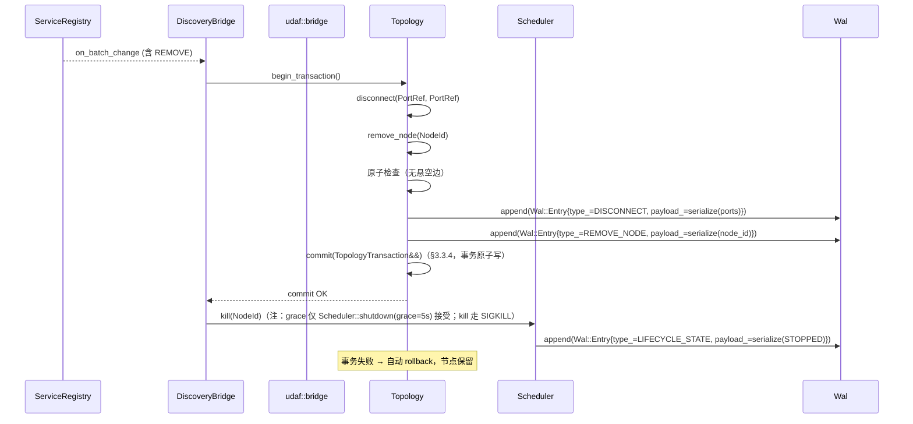
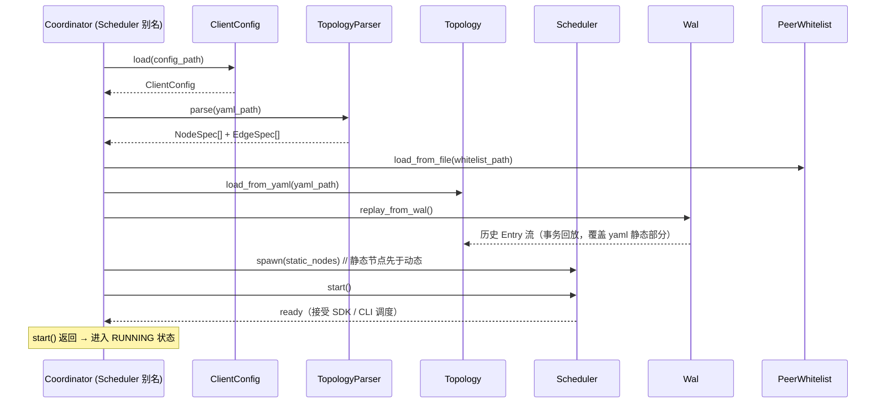
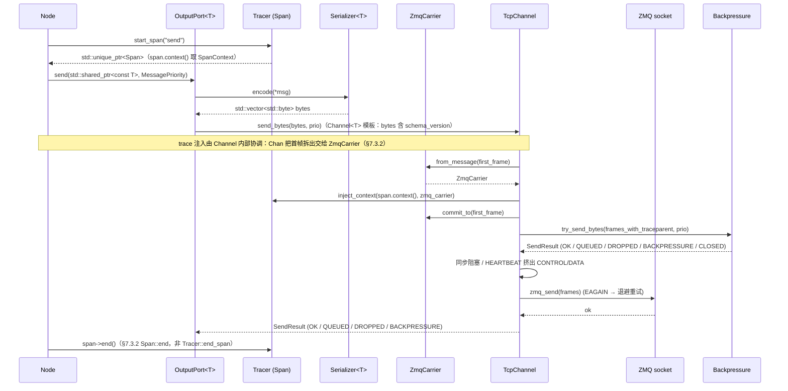
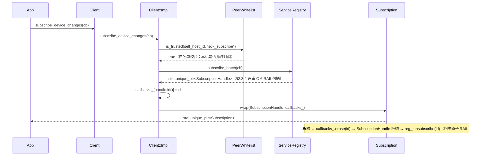
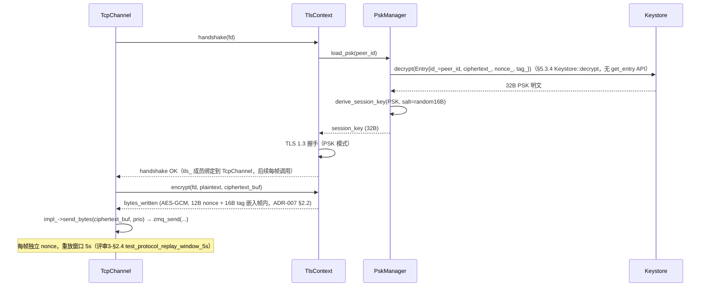
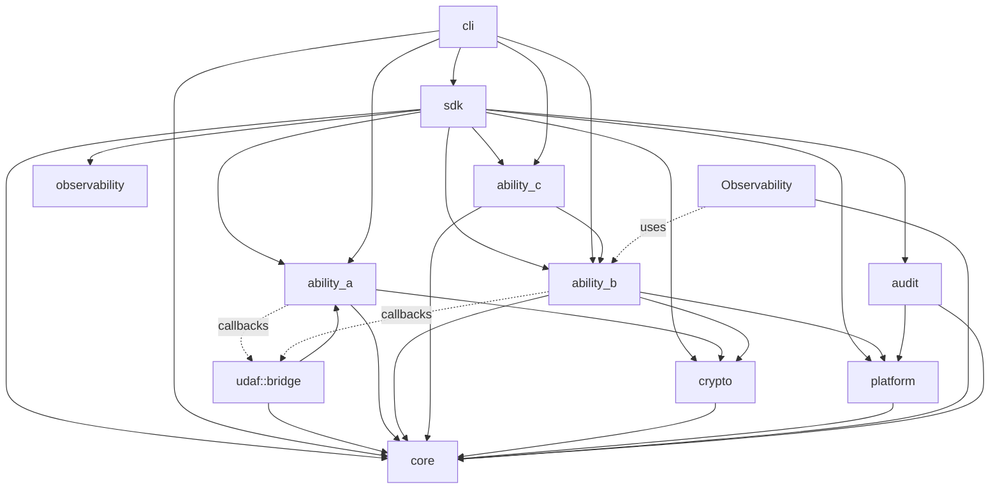

# 概要设计（Phase 3）

> **状态**：v2.2（性能契约 29→33 项，对齐架构 §3.4 v2.9）
> **日期**：2026-08-28
> **前置**：[`docs/01-requirements.md`](01-requirements.md) v1.0 + [`docs/02-architecture.md`](02-architecture.md) v2.8
> **响应阶段 2**：模块划分 + 接口定义 + 错误码体系 + 跨模块调用链 + 测试矩阵
> **修复**：评审1（架构合理性 9 项）+ 评审2（引用一致性 7 项）+ 评审3（可实施性 11 项）+ 评审 C-3（Channel 模板虚函数 bug）+ 评审 C-4（Node 接口 + 消息契约）+ 评审4（§9 SDK + CLI 缺失 + §10 审计/加密/恢复链缺失）+ 评审5（§3.3 PIMPL / noexcept / const& 返回 / 禁异常）全部 Critical/严重问题

---

## 1. 概述

### 1.1 文档目的

本阶段在阶段 2（架构设计）的基础上，完成以下输出：

1. **模块内部头文件清单**：每个模块的 `.hpp` 文件列表，路径 `udaf/<namespace>/<class>.hpp`
2. **源文件拆分规则**：每个 `.cpp` 文件与类的对应关系
3. **测试用例清单**：每个公共 API 至少 3 个测试用例（正面 + 负面 + 边界）
4. **跨模块协作调用链**：A 注册表变化 → bridge → B 拓扑更新 → spawn / kill → WAL 持久化 → 白名单校验的完整链路
5. **错误码国际化字符串映射**：10 大类错误的中英文消息映射表 + CLI 退出码
6. **性能契约 → 基准测试映射**：架构 §3.4 的 33 项性能契约 → benchmark 入口

### 1.2 模块层次总览（与架构 §2.1 六层对齐）

```
┌─────────────────────────────────────────────────────────┐
│  L1 用户层（CLI / SDK）                                   │
│  udaf::sdk::Client / udaf::sdk::Subscription            │
├─────────────────────────────────────────────────────────┤
│  L2 业务层（能力 C：设备 ↔ PC 通信节点）                    │
│  udaf::ability_c::nodes  (CmdExecNode/FileXferNode/     │
│                            HeartbeatNode/NetInfoNode) │
│  udaf::ability_c::executor::ProcessExecutor              │
├─────────────────────────────────────────────────────────┤
│  L3 数据流层（能力 B：dora 范式 + ZMQ 通道）                │
│  udaf::ability_b::node        (Node/Scheduler/Lifecycle) │
│  udaf::ability_b::topology    (Graph/Topology/PortInfo)   │
│  udaf::ability_b::transport   (Channel/Inproc/Ipc/Tcp)   │
│  udaf::ability_b::port        (InputPort/OutputPort)     │
│  udaf::ability_b::serialization (Serializer<T>)          │
│  udaf::ability_b::yaml_loader (TopologyParser)           │
│  ↑ A→B 通过 udaf::bridge::TopologyUpdateCallbacks（顶层回调层）注入           │
├─────────────────────────────────────────────────────────┤
│  L4 设备发现层（能力 A：双向定期全网状发现）                  │
│  udaf::ability_a::discovery    (Advertiser/Scanner/      │
│                                 Protocol/Advertisement)  │
│  udaf::ability_a::transport    (Transport UDP socket)    │
│  udaf::ability_a::crypto       (PSK handshake; 基于顶层 crypto) │
│  udaf::ability_a::registry     (ServiceRegistry)         │
│  udaf::ability_a::bridge       (DiscoveryBridge)         │
│  udaf::ability_a::trust        (PeerWhitelist)           │
├─────────────────────────────────────────────────────────┤
│  L5 基础设施层（顶层 Crypto + Platform 抽象）                │
│  udaf::crypto::hmac / tls / psk / pki / keystore /         │
│              authenticator / auth_types                    │
│  udaf::platform::fs / process / time / network            │
├─────────────────────────────────────────────────────────┤
│  L6 可观测性与审计层                                         │
│  udaf::observability::meter   (Meter/Counter/Gauge/       │
│                                Histogram)                 │
│  udaf::observability::tracer  (Tracer/Span/ZmqCarrier)    │
│  udaf::audit                  (AuditLogger)               │
│  udaf::core                   (Result<T>/ErrorCode/       │
│                                error_string)              │
└─────────────────────────────────────────────────────────┘
```

> **关键约束**：L2 节点继承自 `udaf::ability_b::node::Node`（不再为 C 单独定义 `BaseNode`），消除评审1-M9 / 评审2-3.7 重复基类问题。

### 1.3 命名空间总表

> **修订说明**：删除冗余的 `udaf::ability_b::coordinator`（Coordinator 作为 Scheduler 别名移至 `node/scheduler.hpp`）；新增顶层 `udaf::bridge` 命名空间承载 A→B 回调接口（避免直接 include）；明确区分 `udaf::ability_a::transport`（UDP socket）与 `udaf::ability_b::transport`（ZMQ Channel）；明确区分顶层 `udaf::crypto`（加密原语）与 `udaf::ability_a::crypto`（PSK 握手子模块）。

| 命名空间 | 路径 | 内容 |
|---------|------|------|
| `udaf::core` | `udaf/core/` | `Result<T>` + `ErrorCode` 枚举 + 错误字符串映射 + `log` / `config` / `buffer` |
| `udaf::bridge`（顶层） | `udaf/bridge/` | A↔B 回调接口层：`TopologyUpdateCallbacks`（仅依赖 core + ability_a，无 B 头） |
| `udaf::ability_a::discovery` | `udaf/ability_a/discovery/` | `Advertiser` / `Scanner` / `Protocol` / `AdvertisementHeader` / `AdvertisementPayload` |
| `udaf::ability_a::transport` | `udaf/ability_a/transport/` | `Transport`（**UDP socket** 收发，发现层传输） |
| `udaf::ability_a::crypto` | `udaf/ability_a/crypto/` | `Crypto`（**PSK 握手协商**，基于顶层 `udaf::crypto::psk`） |
| `udaf::ability_a::registry` | `udaf/ability_a/registry/` | `ServiceRegistry` / `RegistryCallback` / `SubscriptionHandle` |
| `udaf::ability_a::bridge` | `udaf/ability_a/bridge/` | `DiscoveryBridge`（注入 `bridge::TopologyUpdateCallbacks`，不再 include B 头） |
| `udaf::ability_a::trust` | `udaf/ability_a/trust/` | `PeerWhitelist` |
| `udaf::crypto`（顶层） | `udaf/crypto/` | 加密原语：`hmac` / `tls` / `psk` / `pki` / `keystore` / `authenticator` / `auth_types` |
| `udaf::ability_b::node` | `udaf/ability_b/node/` | `Node` 抽象基类 / `Scheduler`（含 `Coordinator` 别名）/ `Lifecycle` |
| `udaf::ability_b::topology` | `udaf/ability_b/topology/` | `Graph`（静态）+ `Topology`（事务式变更，合并自 DynamicTopology）/ `PeerNode` / `PortInfo` |
| `udaf::ability_b::transport` | `udaf/ability_b/transport/` | `Channel<T>`（**ZMQ 风格** IPC/IPC-TCP）/ `InprocChannel` / `IpcChannel` / `TcpChannel` |
| `udaf::ability_b::port` | `udaf/ability_b/port/` | `InputPort<T>` / `OutputPort<T>` |
| `udaf::ability_b::serialization` | `udaf/ability_b/serialization/` | `Serializer<T>` |
| `udaf::ability_b::yaml_loader` | `udaf/ability_b/yaml_loader/` | `TopologyParser` |
| `udaf::ability_c::nodes` | `udaf/ability_c/nodes/` | `CmdExecNode` / `FileXferNode` / `HeartbeatNode` / `NetInfoNode`（节点名对齐架构 §2.1；类名 PascalCase，文件名保留 snake_case） |
| `udaf::ability_c::nodes::messages` | `udaf/ability_c/nodes/messages/` | 节点消息契约：`CmdRequest` / `CmdResult` / `FileChunk` / `FileAck` / `Heartbeat` / `NetInterfaceQuery` / `NetInterfaceSet` / `NetInterfaceResult`（契约名 `NetInterface*` 保留） |
| `udaf::ability_c::executor` | `udaf/ability_c/executor/` | `ProcessExecutor` |
| `udaf::platform::fs` | `udaf/platform/fs/` | `UniqueFd` / `Wal`（不再含 `AuditFile`，审计已迁出） |
| `udaf::platform::process` | `udaf/platform/process/` | `ForkThread` / `daemonize`（删除冗余 `ProcessFactory`） |
| `udaf::platform::time` | `udaf/platform/time/` | `monotonic_ns` / `wall_clock_ns` / `format_iso8601` |
| `udaf::platform::network` | `udaf/platform/network/` | `NetInterface` / `enumerate_interfaces` |
| `udaf::observability::meter` | `udaf/observability/meter/` | `Meter` / `Counter` / `Gauge` / `Histogram` |
| `udaf::observability::tracer` | `udaf/observability/tracer/` | `Tracer` / `Span` / `ZmqCarrier` |
| `udaf::audit`（独立） | `udaf/audit/` | `AuditLogger`（对齐 ADR-006，独立命名空间） |
| `udaf::sdk` | `udaf/sdk/` | `Client` / `ClientImpl`（PIMPL）/ `Subscription` |
| `udaf::cli` | `udaf/cli/` | `App` / `Output` / 14 个子命令入口（评审4-§9.7，对齐 §12.4 依赖图） |

---

## 2. 能力 A（ability_a）—— 设备发现层

### 2.1 模块职责

| 子模块 | 职责 |
|--------|------|
| `discovery` | Advertiser（广播）+ Scanner（接收）+ Protocol（编解码）+ AdvertisementHeader/Payload（消息结构） |
| `transport` | UDP socket 收发（评审3-问题2 补全） |
| `crypto` | PSK 握手 + 重放防护窗口（评审3-问题2 补全） |
| `registry` | ServiceRegistry 内存表 + 订阅回调 |
| `bridge` | DiscoveryBridge 将注册表变化转为 B 拓扑变更 |
| `trust` | PeerWhitelist 跨主机白名单（评审1-C6 补全） |

### 2.2 头文件清单（评审3-问题1 补全）

| 头文件 | 类 / 接口 |
|--------|----------|
| `discovery/advertiser.hpp` | `class Advertiser`（评审3-问题1：周期广播 Advertisement） |
| `discovery/scanner.hpp` | `class Scanner`（周期接收 Advertisement） |
| `discovery/protocol.hpp` | `class Protocol`（评审1-M2 改名：原 DiscoveryCodec） |
| `discovery/advertisement.hpp` | `struct AdvertisementHeader` + `struct AdvertisementPayload`（评审1-M3 拆分头） |
| `transport/transport.hpp` | `class Transport`（评审3-问题2：UDP socket 抽象） |
| `crypto/handshake.hpp` | `class Crypto`（评审3-问题2：PSK 握手） |
| `registry/service_registry.hpp` | `class ServiceRegistry` |
| `registry/callback.hpp` | `class RegistryCallback`（订阅回调抽象） |
| `bridge/discovery_bridge.hpp` | `class DiscoveryBridge` |
| `trust/peer_whitelist.hpp` | `class PeerWhitelist`（评审1-C6：跨主机调度白名单） |

### 2.3 关键类设计

#### 2.3.1 Advertiser（评审3-问题1 新增）

```cpp
namespace udaf::ability_a::discovery {

class Advertiser {
public:
    /** 周期性广播配置（字段尾下划线对齐 CLAUDE.md §2） */
    struct Config {
        std::chrono::milliseconds interval_{std::chrono::milliseconds{1000}};   // 周期广播间隔
        std::chrono::milliseconds jitter_{std::chrono::milliseconds{100}};      // 防同步抖动
        uint32_t                max_payload_bytes_{1200};                       // 单包 ≤ MTU
        std::string             bind_address_{"0.0.0.0"};
        uint16_t                bind_port_{37020};
    };

    Advertiser(Config cfg, Transport& tx, Crypto& crypto);

    [[nodiscard]] core::Result<void> start();
    [[nodiscard]] core::Result<void> stop();
    [[nodiscard]] core::Result<void> advertise_now();                           // 强制立即广播一次
    [[nodiscard]] core::Result<void> update_payload(std::span<const ServiceDescriptor> services);

    uint64_t      sent_count() const noexcept;
    core::ErrorCode last_error() const noexcept;

private:
    void on_send_failure(core::ErrorCode ec, std::chrono::milliseconds backoff);
    void run_loop();

    Config           cfg_;
    Transport&       tx_;
    Crypto&          crypto_;
    std::atomic<bool> running_{false};
    std::thread      loop_;
};

}  // namespace
```

#### 2.3.2 ServiceRegistry（架构 §4.2）

```cpp
namespace udaf::ability_a::registry {

/** 注册条目（字段尾下划线对齐 CLAUDE.md §2） */
struct RegistryEntry {
    NodeId        node_id_;
    std::string   hostname_;
    std::vector<ServiceDescriptor> services_;
    std::chrono::steady_clock::time_point first_seen_;
    std::chrono::steady_clock::time_point last_seen_;
    std::string   fingerprint_sha256_;   // 对端主密钥指纹
    std::string   bind_address_;
    uint16_t      bind_port_{0};
    // ... 后续按需扩展
};

class ServiceRegistry {
public:
    [[nodiscard]] core::Result<void> upsert(const RegistryEntry& entry);              // 评审1-C7 修正：架构真实方法名
    [[nodiscard]] core::Result<std::vector<RegistryEntry>> find_by_service(std::string_view name) const;
    [[nodiscard]] core::Result<RegistryEntry> find_by_node_id(const NodeId& id) const;
    [[nodiscard]] core::Result<std::vector<RegistryEntry>> all() const;

    // 评审 C-6：subscribe 返回 RAII 句柄，析构自动 unsubscribe
    [[nodiscard]] core::Result<std::unique_ptr<SubscriptionHandle>>
    subscribe(std::function<void(const RegistryEntry&)> on_change);

    [[nodiscard]] core::Result<std::unique_ptr<SubscriptionHandle>>
    subscribe_batch(std::function<void(std::span<const RegistryEntry>)> on_batch_change);

private:
    mutable std::shared_mutex mutex_;
    std::unordered_map<NodeId, RegistryEntry> entries_;
};

/** RAII 订阅句柄（评审 C-6 新增）；析构自动调用 unsubscribe(id_) */
class SubscriptionHandle {
public:
    SubscriptionHandle() = delete;
    SubscriptionHandle(ServiceRegistry& reg, SubscriptionId id) noexcept;
    ~SubscriptionHandle();

    SubscriptionHandle(const SubscriptionHandle&) = delete;
    SubscriptionHandle& operator=(const SubscriptionHandle&) = delete;
    SubscriptionHandle(SubscriptionHandle&& other) noexcept;
    SubscriptionHandle& operator=(SubscriptionHandle&& other) noexcept;

    SubscriptionId id() const noexcept { return id_; }

private:
    ServiceRegistry& reg_;
    SubscriptionId   id_;
};

}  // namespace
```

> **评审1-C7 修复**：原设计文档出现的 `register_peer` / `update_peer` 等自造方法名已删除；架构 §4.2 的真实方法名 `upsert` 为准。
> **评审 C-6 修复**：`subscribe` / `subscribe_batch` 改为返回 `core::Result<std::unique_ptr<SubscriptionHandle>>`，杜绝裸 `SubscriptionId` 泄漏导致的回调悬挂。

#### 2.3.3 DiscoveryBridge（评审 P0：解耦 A↔B 循环依赖）

> **关键修复**：原设计 `DiscoveryBridge` 直接持有 `ability_b::topology::DynamicTopology&` / `ability_b::node::Scheduler&`，构成 A→B 的硬依赖 + Scheduler 反向依赖 A 的 `PeerWhitelist` 的双向循环，违反 CLAUDE.md §5.3「❌ 让 A 依赖 B」。改为通过顶层 `udaf::bridge::TopologyUpdateCallbacks`（仅依赖 core + ability_a）注入回调，A 不再 include B 的任何头文件。

```cpp
namespace udaf::bridge {

/** A→B 回调接口（评审 P0：纯抽象，独立于 B 的具体类型）
 *  由 B 模块（Topology / Scheduler）在初始化时实现并注入到 DiscoveryBridge。
 *  此接口仅依赖 core + ability_a::registry 中的纯数据结构，不引入 B 头。 */
struct TopologyUpdateCallbacks {
    std::function<core::Result<void>(const ability_a::registry::RegistryEntry&)> on_node_added;
    std::function<core::Result<void>(const NodeId&)>                              on_node_removed;
    std::function<core::Result<void>(const NodeId&, const std::string&)>         on_node_changed;
};

}  // namespace udaf::bridge
```

```cpp
namespace udaf::ability_a::bridge {

class DiscoveryBridge {
public:
    DiscoveryBridge(ServiceRegistry& reg,
                   udaf::bridge::TopologyUpdateCallbacks callbacks,
                   trust::PeerWhitelist& whitelist,
                   std::chrono::seconds stable_window = std::chrono::seconds{30},
                   std::chrono::milliseconds debounce = std::chrono::milliseconds{200},
                   uint32_t max_forks_per_second = 5);

    void start();
    void stop();

private:
    void on_batch_change(std::span<const RegistryEntry> batch);
    void schedule_topology_commit(std::chrono::seconds delay);
    [[nodiscard]] core::Result<void> apply_add_node(const RegistryEntry& entry);
    [[nodiscard]] core::Result<void> apply_remove_node(const NodeId& id);

    ServiceRegistry&                       reg_;
    trust::PeerWhitelist&                  whitelist_;
    udaf::bridge::TopologyUpdateCallbacks  callbacks_;   // 注入而非持有 B 引用
    std::chrono::seconds                   stable_window_;
    std::chrono::milliseconds              debounce_;
    uint32_t                               max_forks_per_second_;
    std::unordered_map<NodeId, std::chrono::steady_clock::time_point> pending_add_;
    std::unordered_set<NodeId>             pending_remove_;
};

}  // namespace
```

#### 2.3.4 PeerWhitelist（评审1-C6 新增）

```cpp
namespace udaf::ability_a::trust {

class PeerWhitelist {
public:
    /** 白名单条目（字段尾下划线对齐 CLAUDE.md §2） */
    struct Entry {
        NodeId                    peer_id_;
        std::string               fingerprint_sha256_;   // 主密钥指纹（HKDF salt 来源）
        std::vector<std::string>  allowed_capabilities_; // 允许执行的节点类型
    };

    [[nodiscard]] core::Result<void> load_from_file(std::string_view path);
    [[nodiscard]] bool is_trusted(const NodeId& id, std::string_view capability) const noexcept;
    [[nodiscard]] core::Result<void> add(const Entry& entry);
    [[nodiscard]] core::Result<void> remove(const NodeId& id);

private:
    mutable std::shared_mutex      mutex_;
    std::unordered_map<NodeId, Entry> entries_;
};

}  // namespace
```

### 2.4 测试用例清单

| 测试入口 | 类型 | 覆盖点 |
|---------|------|--------|
| `test_advertise_broadcast_succeeds` | 正面 | Advertiser::start() → 1s 内 Transport 收到 1+ 包 |
| `test_advertise_backoff_after_nack` | 负面 | 收到 NACK 后下一次发送间隔 ≥ 2×interval |
| `test_advertise_concurrent_no_duplicate` | 边界 | 1000 个 Advertiser 实例在同一端口广播，无重复丢包 |
| `test_advertiser_stop_no_more_packets` | 正面 | Advertiser::stop() → 1s 内 Transport 无新包（§2.3.1 stop） |
| `test_advertiser_advertise_now_immediate` | 正面 | Advertiser::advertise_now() → 立即收到 1+ 包，跳过 interval 周期 |
| `test_advertiser_update_payload_propagated` | 正面 | Advertiser::update_payload(services) → 下次广播 payload 含新 service |
| `test_advertiser_sent_count_accurate` | 边界 | Advertiser::sent_count() → 100 次发送后等于 100 |
| `test_advertiser_last_error_on_failure` | 负面 | 模拟 send 失败 → Advertiser::last_error() 返回非 OK |
| `test_scanner_recv_decode_payload` | 正面 | Scanner 收到 Advertisement → 回调触发且 payload 字节相等 |
| `test_scanner_reject_untrusted_fingerprint` | 负面 | Scanner 收到非白名单 fingerprint 的包 → CRYPTO_HMAC_MISMATCH，回调不触发 |
| `test_scanner_drop_oversized_packet` | 边界 | Scanner 收到 > MTU 的包 → PROTOCOL_PAYLOAD_TOO_LARGE，丢弃且不回调 |
| `test_scanner_concurrent_recv_no_race` | 边界 | 100 线程并发 Scanner::recv → 内部无数据竞争 |
| `test_transport_udp_send_recv` | 正面 | Transport::send → 自身 recv 收到相同字节 |
| `test_transport_udp_broadcast_loopback` | 正面 | 广播地址 255.255.255.255 → 本机可收 |
| `test_transport_udp_buffer_full` | 边界 | 1MB/s 持续发送，验证内核缓冲满时返回 NET_SOCKET_CLOSED |
| `test_crypto_handshake_psk_success` | 正面 | 两端持有相同 PSK → 握手成功 |
| `test_crypto_handshake_invalid_psk` | 负面 | PSK 不匹配 → 返回 CRYPTO_PSK_MISMATCH |
| `test_crypto_handshake_nonce_reuse_rejected` | 边界 | 重放 nonce → 返回 CRYPTO_NONCE_REUSED |
| `test_crypto_handshake_downgrade_rejected` | 负面 | 强制协议降级 → CRYPTO_DOWNGRADE_REJECTED |
| `test_protocol_encode_decode_roundtrip` | 正面 | AdvertisementPayload 编解码字节相等 |
| `test_protocol_decode_invalid_msg_type` | 负面 | msg_type 越界 → PROTOCOL_INVALID_MSG_TYPE |
| `test_protocol_decode_truncated_buffer` | 边界 | 长度不足 header 24B → PROTOCOL_TRUNCATED_BUFFER |
| `test_protocol_replay_window_5s` | 边界 | 重放窗口 5s 内的 sequence → CRYPTO_HANDSHAKE_FAILED |
| `test_protocol_sequence_overflow_64bit` | 边界 | sequence 自增到 UINT64_MAX 后回绕 → 协议层不重复，nonce 仍唯一 |
| `test_protocol_checksum_mismatch_rejected` | 负面 | 篡改 header 校验和 → PROTOCOL_CHECKSUM_MISMATCH |
| `test_protocol_peer_rejected_version` | 负面 | 对端拒绝协议版本 → PROTOCOL_PROTOCOL_REJECTED |
| `test_service_registry_upsert_and_query` | 正面 | upsert → find_by_node_id 返回相同条目 |
| `test_service_registry_find_by_service_multi` | 正面 | 3 个节点提供同名 service → find_by_service 返回 3 条 |
| `test_service_registry_find_by_node_id_missing` | 负面 | 不存在 id → find_by_node_id 返回 NODE_NOT_FOUND |
| `test_service_registry_all_returns_snapshot` | 边界 | upsert 100 条 → all() 返回 100 条且顺序无关 |
| `test_service_registry_subscription_invoke` | 正面 | upsert 后 subscribe 回调被调用 |
| `test_service_registry_subscription_noexcept` | 负面 | 回调中再调 upsert → 不死锁 |
| `test_service_registry_subscription_table_full` | 负面 | 订阅数达上限 → 返回 DISCOVERY_SUBSCRIPTION_FULL（评审点名） |
| `test_service_registry_batch_window_16ms` | 边界 | 16ms 内 5 次 upsert → 单次 on_batch_change |
| `test_service_registry_full_10000` | 边界 | 上限 10000 条 → 第 10001 条返回 RES_MEMORY_EXHAUSTED |
| `test_discovery_bridge_stable_30s` | 边界 | 短抖动 < 30s 不触发 add_node |
| `test_discovery_bridge_remove_on_expiry` | 边界 | 节点消失 → 触发 remove_node |
| `test_discovery_bridge_rate_limited` | 边界 | 200ms 内 50 次变化 → 限速为每秒 5 次 fork |
| `test_discovery_bridge_stop_idempotent` | 边界 | DiscoveryBridge::stop() 多次调用 → 后续调用 noop |
| `test_peer_whitelist_is_trusted` | 正面 | 白名单内节点 → is_trusted=true |
| `test_peer_whitelist_untrusted_capability` | 负面 | 不在 capability 列表 → is_trusted=false |
| `test_peer_whitelist_add_remove_lifecycle` | 正面 | PeerWhitelist::add() 后 is_trusted=true；remove() 后 false |
| `test_peer_whitelist_load_corrupt_file` | 边界 | 损坏 JSON → CONFIG_PARSE_FAILED |
| `test_peer_whitelist_load_missing_file` | 负面 | 不存在的 path → CONFIG_MISSING_REQUIRED |
| `test_discovery_rate_limited` | 边界 | 单源 10 包/s → 触发 NET_RATE_LIMITED |

---

## 3. 能力 B（ability_b）—— 数据流框架层

### 3.1 模块职责

| 子模块 | 职责 |
|--------|------|
| `node` | Node 抽象基类 + Scheduler（评审2-2.2 合并 Coordinator）+ Lifecycle |
| `topology` | Graph（静态）+ Topology（事务式变更，合并自 DynamicTopology）+ PeerNode + PortInfo |
| `transport` | Channel<T> 模板 + Inproc / Ipc / Tcp 三种实现 |
| `port` | InputPort<T> / OutputPort<T>（带背压 + 优先级） |
| `serialization` | Serializer<T>（protobuf 3.x + 版本协商） |
| `yaml_loader` | TopologyParser（YAML → Topology） |
| `coordinator` | Coordinator（Scheduler 别名类，对外保留兼容入口） |

> **评审2-2.2 修复**：原文档将 Coordinator 与 Scheduler 拆为两个类，实际为同一角色的别名。本设计统一为 `Scheduler`，并保留 `Coordinator` 作为类型别名（`using Coordinator = Scheduler;`），不对外拆分。

### 3.2 头文件清单（评审3-问题3 补全 + 命名统一修订）

> **修订说明**：删除 `topology/dynamic_topology.hpp`（DynamicTopology 已合并入 Topology 单一类）；删除 `coordinator/coordinator.hpp`（Coordinator 作为 `Scheduler` 别名移至 `node/scheduler.hpp`）；新增 `topology/topology.hpp` 和 `topology/port_info.hpp`。

| 头文件 | 类 / 接口 |
|--------|----------|
| `node/node.hpp` | `class Node`（抽象基类，评审2-3.7 对齐架构 §5.2 + 评审 C-4 补全 interfaces） |
| `node/scheduler.hpp` | `class Scheduler` + `using Coordinator = Scheduler;` 别名 |
| `node/lifecycle.hpp` | `class Lifecycle`（评审3-问题3） |
| `topology/graph.hpp` | `class Graph`（静态图） |
| `topology/topology.hpp` | `class Topology`（事务式变更，评审 P0：合并自 DynamicTopology）+ `class TopologyTransaction` |
| `topology/peer_node.hpp` | `struct PeerNode` |
| `topology/port_info.hpp` | `struct PortInfo`（评审 C-4 新增） |
| `topology/node_spec.hpp` | `struct NodeSpec`（评审 C-4 新增） |
| `topology/port_ref.hpp` | `struct PortRef`（评审 C-4 新增） |
| `topology/edge_spec.hpp` | `struct EdgeSpec`（评审 C-4 新增） |
| `transport/channel_base.hpp` | `class ChannelBase`（评审 C-3 新增：类型擦除基类） |
| `transport/channel.hpp` | `template<T> class Channel<T>`（评审 C-3 新增：模板包装器） |
| `transport/inproc_channel.hpp` | `class InprocChannel` |
| `transport/ipc_channel.hpp` | `class IpcChannel` |
| `transport/tcp_channel.hpp` | `class TcpChannel` |
| `transport/message_priority.hpp` | `enum class MessagePriority`（评审 C-3 新增） |
| `transport/recv_status.hpp` | `enum class RecvStatus`（评审 C-3 新增） |
| `transport/send_result.hpp` | `enum class SendResult`（评审 C-3 新增） |
| `transport/transport_type.hpp` | `enum class TransportType`（评审 C-3 新增） |
| `port/input_port.hpp` | `template<T> class InputPort<T>` |
| `port/output_port.hpp` | `template<T> class OutputPort<T>` |
| `serialization/serializer.hpp` | `class SerializerBase` + `template<T> class Serializer<T>`（评审 C-3 扩展） |
| `yaml_loader/topology_parser.hpp` | `class TopologyParser` |

### 3.3 关键类设计

#### 3.3.1 Node（评审2-3.7 对齐架构 §5.2 + 评审 C-4 补全 interfaces）

```cpp
namespace udaf::ability_b::node {

class Node {
public:
    virtual ~Node() = default;

    /** 节点配置（字段尾下划线对齐 CLAUDE.md §2） */
    struct Config {
        NodeId                  id_;
        std::string             name_;
        NodeMode                mode_;             // INPROC / IPC / REMOTE
        NodeId                  host_id_;
        std::string             executable_;
        std::vector<PortDecl>   inputs_;
        std::vector<PortDecl>   outputs_;
        std::string             config_yaml_;      // 评审 C-4：原始 YAML 字符串，节点自行解析，不再依赖 yaml-cpp 类型
        std::vector<NodeId>     trusted_hosts_;    // 白名单调度（ADR-005）
    };

    virtual core::Result<void> on_init(const Config& cfg) = 0;
    virtual core::Result<void> on_start() = 0;
    virtual core::Result<void> on_event(const Event& ev) = 0;
    virtual core::Result<void> on_stop() = 0;

    // 评审 m-20 + C-4：对齐架构 §5.2 补全接口（三个查询方法）
    virtual std::string_view                            name()    const noexcept = 0;
    // 【评审2 修复】返回 const& 避免每次调用拷贝 vector（派生类需缓存为成员）
    virtual const std::vector<topology::PortInfo>&     inputs()  const noexcept = 0;
    virtual const std::vector<topology::PortInfo>&     outputs() const noexcept = 0;

    [[nodiscard]] core::Result<void> request_input(const std::string& name, InputPortHandle h);
    [[nodiscard]] core::Result<void> request_output(const std::string& name, OutputPortHandle h);
};

}  // namespace
```

**配套结构体 `PortInfo`**（评审 C-4 新增，对齐架构 §5.2 端口契约）：

```cpp
// topology/port_info.hpp
namespace udaf::ability_b::topology {

struct PortInfo {
    std::string     name_;             // 端口名称（在节点内唯一）
    std::type_index type_;             // 端口承载的消息 C++ 类型
    uint32_t        schema_version;    // 序列化 schema 版本（与 messages::*::SCHEMA_VERSION 对齐）
};

}  // namespace
```

**设计要点**：
- `type_index` 让 `Node::inputs()` / `Node::outputs()` 返回类型擦除的端口描述，支持运行时类型匹配与 `InputPort<T>` / `OutputPort<T>` 的强类型绑定
- `schema_version` 与消息契约的 `SCHEMA_VERSION` 一一对应，反序列化时校验

#### 3.3.2 Scheduler（评审 P0：解耦反向 A→B 引用）

> **关键修复**：原 Scheduler 持有 `ability_a::trust::PeerWhitelist&`，构成 B→A 反向依赖，违反 CLAUDE.md §5.3。改为通过构造函数注入 `WhitelistCheck` 回调，Scheduler 不再 include A 头。Coordinator 作为 `Scheduler` 的类型别名同文件保留（评审2-2.2 兼容入口）。

```cpp
namespace udaf::ability_b::node {

class Scheduler {
public:
    /** 白名单检查回调（评审 P0：注入而非持有 PeerWhitelist 引用）
     *  参数：节点 ID + 节点 capability；返回 true 表示允许调度。 */
    using WhitelistCheck = std::function<bool(const NodeId&, const std::string& /*capability*/)>;

    Scheduler(platform::process::ForkThread& ft,
              platform::fs::Wal&            wal,
              WhitelistCheck                whitelist_check);

    [[nodiscard]] core::Result<void> spawn(const Node::Config& spec);
    [[nodiscard]] core::Result<void> kill(const NodeId& id);
    [[nodiscard]] core::Result<void> reload(const NodeId& id);                       // 热加载配置
    [[nodiscard]] core::Result<void> start();
    [[nodiscard]] core::Result<void> shutdown(std::chrono::seconds grace = std::chrono::seconds{5});

    [[nodiscard]] core::Result<std::vector<NodeStatus>> list() const;
    [[nodiscard]] core::Result<NodeStatus> status(const NodeId& id) const;

private:
    [[nodiscard]] core::Result<void> persist_spawn(const Node::Config& spec);        // → Wal::append
    [[nodiscard]] core::Result<void> persist_kill(const NodeId& id);                 // → Wal::append
    bool check_whitelist(const Node::Config& spec);                                  // → whitelist_check_

    platform::process::ForkThread& fork_thread_;
    platform::fs::Wal&             wal_;
    WhitelistCheck                 whitelist_check_;
    std::unordered_map<NodeId, NodeHandle> handles_;
    std::shared_mutex              mutex_;
};

// 评审2-2.2：保留兼容入口（同一头文件内，不另设子命名空间）
using Coordinator = Scheduler;

}  // namespace udaf::ability_b::node
```

#### 3.3.3 Lifecycle（评审3-问题3 新增 + 评审 C-1 状态机补全）

> **状态机合法迁移表（评审 C-1 补全）**：
>
> | from \ to | INIT | RUNNING | STOPPING | STOPPED | CRASHED | RELOADING |
> |-----------|------|---------|----------|---------|---------|-----------|
> | INIT      | -    | ✓       | ✓        | ✓       | ✗       | ✓         |
> | RUNNING   | ✗    | -       | ✓        | ✓       | ✓       | ✓         |
> | STOPPING  | ✗    | ✗       | -        | ✓       | **✗**（评审 C-1）  | ✗         |
> | STOPPED   | ✓    | ✓       | ✗        | -       | ✗       | ✓         |
> | CRASHED   | ✗    | ✓（重启恢复） | ✓   | ✓       | -       | ✓         |
> | RELOADING | ✗    | ✓       | ✓        | ✓       | ✓       | -         |

```cpp
namespace udaf::ability_b::node {

enum class NodeState : uint8_t {
    INIT, RUNNING, STOPPING, STOPPED, CRASHED, RELOADING   // 评审 C-1：新增 RELOADING
};

class Lifecycle {
public:
    Lifecycle(NodeId id, std::function<core::Result<void>()> on_init,
              std::function<core::Result<void>()> on_start,
              std::function<core::Result<void>()> on_stop);

    [[nodiscard]] core::Result<void> transition(NodeState target);
    NodeState current() const noexcept { return state_.load(); }

    // 注册崩溃回调；重启策略由 Scheduler 配置（不重启 / 固定次数 / 指数退避）
    void on_crash(std::function<void(NodeId)> cb) { on_crash_ = std::move(cb); }

private:
    void persist_state();                                       // → Wal::append
    bool is_valid_transition(NodeState from, NodeState to) const;

    NodeId                                 id_;
    std::atomic<NodeState>                 state_{NodeState::INIT};
    std::function<core::Result<void>()>    on_init_, on_start_, on_stop_;
    std::function<void(NodeId)>            on_crash_;
};

}  // namespace
```

#### 3.3.4 Topology（评审 P0：DynamicTopology 合并入单一类）

> **修订说明**：原 `DynamicTopology` 已合并入 `Topology`（架构 §5.4 命名），删除 `dynamic_topology.hpp`。

```cpp
namespace udaf::ability_b::topology {

class Topology {
public:
    Topology(platform::fs::Wal& wal);

    [[nodiscard]] core::Result<void> load_from_yaml(std::string_view path);           // → TopologyParser
    [[nodiscard]] core::Result<void> add_node(const NodeSpec& spec);
    [[nodiscard]] core::Result<void> remove_node(const NodeId& id);
    [[nodiscard]] core::Result<void> connect(const PortRef& src, const PortRef& dst);
    [[nodiscard]] core::Result<void> disconnect(const PortRef& src, const PortRef& dst);

    [[nodiscard]] TopologyTransaction begin_transaction();
    // 评审 M-12：commit 改 && 重载，避免对同一事务重复 commit
    [[nodiscard]] core::Result<void>  commit(TopologyTransaction&& tx);                // WAL 持久化
    [[nodiscard]] core::Result<void>  rollback(TopologyTransaction& tx);

    [[nodiscard]] core::Result<void> replay_from_wal();                               // → Wal::replay

    // 拓扑查询
    [[nodiscard]] core::Result<std::vector<NodeSpec>> all_nodes() const;
    [[nodiscard]] core::Result<std::vector<EdgeSpec>> all_edges() const;
    [[nodiscard]] core::Result<bool> has_cycle() const;                               // → TOPOLOGY_CYCLE_DETECTED
};

}  // namespace
```

#### 3.3.5 Channel<T> 三层传输抽象（评审 C-3：修复架构 §5.3 模板虚函数 bug）

> **评审 C-3 修复**：架构 §5.3 的 `Channel<T>` 直接声明模板虚函数（`virtual void send(std::shared_ptr<const T>)`），模板虚函数在 C++ 中只能在模板上下文内被实例化和覆盖，跨实例化无虚函数表关联，无法构成多态。采用**类型擦除基类 + 模板包装器**两步分层设计。

**核心枚举**（架构 §5.6）：

```cpp
// transport/message_priority.hpp
namespace udaf::ability_b::transport {

enum class MessagePriority : uint8_t {
    HEARTBEAT  = 0,   // 最高：心跳
    CONTROL    = 1,   // 中：控制消息（调度指令）
    DATA       = 2,   // 低：业务数据
};

// transport/recv_status.hpp
enum class RecvStatus : uint8_t {
    OK      = 0,    // 收到消息，写入 out（out.get() != nullptr）
    TIMEOUT = 1,    // 在 timeout 时间内无消息，out 保持空
    CLOSED  = 2,    // 对端关闭或通道被 shutdown
    ERROR   = 3,    // 内部错误（序列化失败、校验不通过等）
};

// transport/send_result.hpp
enum class SendResult : uint8_t {
    OK            = 0,   // 已入队
    QUEUED        = 1,   // 已入队（高优先级挤出低优先级消息）
    DROPPED       = 2,   // 低优先级被丢弃
    BACKPRESSURE  = 3,   // 队列满且不可挤出
    CLOSED        = 4,   // 通道已关闭
    ERROR         = 5,
};

// transport/transport_type.hpp
enum class TransportType : uint8_t {
    INPROC         = 0,   // 同进程：直接指针
    IPC_SOCK       = 1,   // 同主机：ZMQ ipc://（Unix domain socket）
    TCP_SERIALIZED = 2,   // 跨主机：ZMQ tcp:// + protobuf 序列化
};

}  // namespace
```

**类型擦除基类**（非模板，可多态）：

```cpp
// transport/channel_base.hpp
namespace udaf::ability_b::transport {

class ChannelBase {
public:
    virtual ~ChannelBase() = default;

    // 字节视图：序列化在 Channel<T> 包装层完成，底层只负责字节搬运
    virtual void send_bytes(std::span<const std::byte> payload,
                            MessagePriority prio = MessagePriority::DATA) = 0;

    virtual RecvStatus recv_bytes(std::vector<std::byte>& out,
                                  std::optional<std::chrono::milliseconds> timeout = std::nullopt) = 0;

    virtual TransportType type() const noexcept = 0;

    // 背压：可选重写（默认返回 OK）
    virtual SendResult try_send_bytes(std::span<const std::byte> payload, MessagePriority prio);

    // Rule of Five：多态基类禁止切片拷贝；移动由派生类资源管理决定
    ChannelBase(const ChannelBase&)            = delete;
    ChannelBase& operator=(const ChannelBase&) = delete;
    ChannelBase(ChannelBase&&)                 noexcept = default;
    ChannelBase& operator=(ChannelBase&&)      noexcept = default;

protected:
    ChannelBase() noexcept = default;
};

}  // namespace
```

**模板包装器**（提供类型安全的 `send<T>` / `recv<T>`）：

```cpp
// transport/channel.hpp
namespace udaf::ability_b::transport {

template <typename T>
class Channel {
public:
    explicit Channel(std::unique_ptr<ChannelBase> impl) noexcept
        : impl_(std::move(impl)) {}

    // Rule of Five：模板类不得有虚函数；unique_ptr<ChannelBase> 独占底层，
    // 禁止拷贝，移动必须 noexcept 以与标准库容器兼容
    Channel(const Channel&)            = delete;
    Channel& operator=(const Channel&) = delete;
    Channel(Channel&& other) noexcept  = default;
    Channel& operator=(Channel&& other) noexcept = default;
    ~Channel() = default;

    void send(std::shared_ptr<const T> msg,
              MessagePriority prio = MessagePriority::DATA) {
        // 序列化 → 调用 send_bytes
        auto bytes = serializer_.encode(*msg);
        impl_->send_bytes(std::span<const std::byte>(bytes.data(), bytes.size()), prio);
    }

    RecvStatus recv(std::shared_ptr<const T>& out,
                    std::optional<std::chrono::milliseconds> timeout = std::nullopt) {
        std::vector<std::byte> raw;
        auto status = impl_->recv_bytes(raw, timeout);
        if (status != RecvStatus::OK) return status;
        auto decoded = serializer_.template decode<T>(raw);   // 返回 core::Result<std::shared_ptr<const T>>
        if (!decoded.ok()) return RecvStatus::ERROR;
        out = std::move(decoded).value();
        return RecvStatus::OK;
    }

    TransportType type() const noexcept { return impl_->type(); }

    ChannelBase* base() noexcept { return impl_.get(); }

private:
    std::unique_ptr<ChannelBase>        impl_;
    serialization::Serializer<T>        serializer_;
};

}  // namespace
```

**三个具体实现的关键设计**：

| 实现类 | 物理层 | 序列化策略 | 关键机制 |
|--------|--------|------------|----------|
| `InprocChannel` | 同进程多线程 | ❌ 无（零拷贝） | SPSC 环形队列 + `eventfd` 通知；传输 `shared_ptr<const T>` 指针本身 |
| `IpcChannel` | 同主机多进程 | ⚠️ 仅消息头 | ZMQ `ipc://` Unix domain socket；消息头序列化（type_index + schema_version），payload 仍传指针 |
| `TcpChannel` | 跨主机 | ✅ 完整 protobuf | ZMQ `tcp://` + TLS 1.3 握手 + 连接池管理 + 指数退避重连 |

```cpp
// transport/inproc_channel.hpp
namespace udaf::ability_b::transport {

class InprocChannel final : public ChannelBase {
public:
    InprocChannel();
    ~InprocChannel() override;

    // 配套的非字节 API（用于 Inproc 零拷贝）
    void send_zero_copy(std::shared_ptr<const std::byte> payload, MessagePriority prio);
    RecvStatus recv_zero_copy(std::shared_ptr<const std::byte>& out,
                              std::optional<std::chrono::milliseconds> timeout);

    void send_bytes(std::span<const std::byte> payload, MessagePriority prio) override;
    RecvStatus recv_bytes(std::vector<std::byte>& out,
                          std::optional<std::chrono::milliseconds> timeout) override;
    TransportType type() const noexcept override { return TransportType::INPROC; }

private:
    // SPSC 环形队列（容量 1024，cache-line 对齐）
    struct alignas(64) Slot {
        std::atomic<uint64_t> seq{0};
        std::shared_ptr<const std::byte> payload;
        MessagePriority      prio{MessagePriority::DATA};
    };
    std::array<Slot, 1024>                  ring_;
    std::atomic<uint64_t>                   head_{0};
    std::atomic<uint64_t>                   tail_{0};

    int                                      eventfd_notify_{-1};  // 写端
    int                                      eventfd_wait_{-1};    // 读端
};

}  // namespace
```

```cpp
// transport/ipc_channel.hpp
namespace udaf::ability_b::transport {

class IpcChannel final : public ChannelBase {
public:
    explicit IpcChannel(std::string endpoint_uri);   // "ipc:///tmp/udaf/foo.sock"
    ~IpcChannel() override;

    // PIMPL 持有 ZMQ socket；拷贝被禁用，移动 noexcept 转移所有权
    IpcChannel(const IpcChannel&)            = delete;
    IpcChannel& operator=(const IpcChannel&) = delete;
    IpcChannel(IpcChannel&& other) noexcept;
    IpcChannel& operator=(IpcChannel&& other) noexcept;

    void send_bytes(std::span<const std::byte> payload, MessagePriority prio) override;
    RecvStatus recv_bytes(std::vector<std::byte>& out,
                          std::optional<std::chrono::milliseconds> timeout) override;
    TransportType type() const noexcept override { return TransportType::IPC_SOCK; }

private:
    struct Impl;                                     // 前置声明，隐藏 zmq::socket_t
    std::unique_ptr<Impl> impl_;                     // PIMPL 消除 void* 持有 socket
};

}  // namespace
```

```cpp
// transport/tcp_channel.hpp
namespace udaf::ability_b::transport {

class TcpChannel final : public ChannelBase {
public:
    struct Config {
        std::string              connect_uri;     // "tcp://host:port"
        std::optional<std::string> tls_cert_path;
        std::optional<std::string> tls_key_path;
        std::chrono::milliseconds connect_timeout{5000};
        std::chrono::milliseconds reconnect_backoff_init{100};
        std::chrono::milliseconds reconnect_backoff_max{30000};
        uint32_t                 pool_size{4};    // 连接池大小
    };

    explicit TcpChannel(Config cfg);
    ~TcpChannel() override;

    // PIMPL 持有 ZMQ context + socket + 连接池；拷贝禁用，移动 noexcept 转移所有权
    TcpChannel(const TcpChannel&)            = delete;
    TcpChannel& operator=(const TcpChannel&) = delete;
    TcpChannel(TcpChannel&& other) noexcept;
    TcpChannel& operator=(TcpChannel&& other) noexcept;

    void send_bytes(std::span<const std::byte> payload, MessagePriority prio) override;
    RecvStatus recv_bytes(std::vector<std::byte>& out,
                          std::optional<std::chrono::milliseconds> timeout) override;
    SendResult try_send_bytes(std::span<const std::byte> payload, MessagePriority prio) override;
    TransportType type() const noexcept override { return TransportType::TCP_SERIALIZED; }

private:
    void on_disconnect();
    void schedule_reconnect();   // 指数退避

    Config                            cfg_;
    struct Impl;                                  // 前置声明，隐藏 zmq::context_t + zmq::socket_t + 连接池
    std::unique_ptr<Impl>             impl_;       // PIMPL 消除 void* 持有 context/socket
    crypto::TlsContext*               tls_{nullptr};
    std::atomic<bool>                 connected_{false};
};

}  // namespace
```

#### 3.3.6 InputPort<T> / OutputPort<T> 强类型端口（架构 §5.2）

```cpp
// port/input_port.hpp
namespace udaf::ability_b::port {

template <typename T>
class InputPort {
public:
    explicit InputPort(std::string name) noexcept
        : name_(std::move(name)),
          info_{topology::PortInfo{
              .name_          = name_,
              .type_          = std::type_index{typeid(T)},
              .schema_version = T::SCHEMA_VERSION,
          }} {}

    // Rule of Five：模板类不得有虚函数；持有裸指针 chan_，禁止切片拷贝，移动 noexcept
    InputPort(const InputPort&)            = delete;
    InputPort& operator=(const InputPort&) = delete;
    InputPort(InputPort&& other) noexcept;
    InputPort& operator=(InputPort&& other) noexcept;
    ~InputPort() = default;

    // 阻塞接收，timeout = nullopt 表示永久等待
    std::shared_ptr<const T> recv(
        std::optional<std::chrono::milliseconds> timeout = std::nullopt);

    // 非阻塞，返回三态语义（OK / TIMEOUT / CLOSED / ERROR）
    RecvStatus try_recv(std::shared_ptr<const T>& out,
                        std::optional<std::chrono::milliseconds> timeout = std::nullopt);

    std::string_view           name() const noexcept { return name_; }
    const topology::PortInfo&  info() const noexcept { return info_; }   // 改为 const& 返回

    // 绑定到底层 Channel（在 Scheduler::spawn 阶段由调度器注入）
    void bind(transport::Channel<T>* chan) noexcept { chan_ = chan; }

private:
    std::string                    name_;
    transport::Channel<T>*         chan_{nullptr};
    topology::PortInfo             info_;            // 缓存为成员，支撑 info() const& 返回
};

}  // namespace
```

```cpp
// port/output_port.hpp
namespace udaf::ability_b::port {

template <typename T>
class OutputPort {
public:
    explicit OutputPort(std::string name) noexcept
        : name_(std::move(name)),
          info_{topology::PortInfo{
              .name_          = name_,
              .type_          = std::type_index{typeid(T)},
              .schema_version = T::SCHEMA_VERSION,
          }} {}

    // Rule of Five：模板类不得有虚函数；持有裸指针 chan_，禁止切片拷贝，移动 noexcept
    OutputPort(const OutputPort&)            = delete;
    OutputPort& operator=(const OutputPort&) = delete;
    OutputPort(OutputPort&& other) noexcept;
    OutputPort& operator=(OutputPort&& other) noexcept;
    ~OutputPort() = default;

    // 阻塞发送：满队列时按优先级背压（详见 §3.3.8）
    void send(std::shared_ptr<const T> msg,
              MessagePriority prio = MessagePriority::DATA);

    // 非阻塞发送，返回背压结果
    SendResult try_send(std::shared_ptr<const T> msg, MessagePriority prio);

    std::string_view           name() const noexcept { return name_; }
    const topology::PortInfo&  info() const noexcept { return info_; }   // 改为 const& 返回

    void bind(transport::Channel<T>* chan) noexcept { chan_ = chan; }

private:
    std::string                    name_;
    transport::Channel<T>*         chan_{nullptr};
    topology::PortInfo             info_;            // 缓存为成员，支撑 info() const& 返回
};

}  // namespace
```

#### 3.3.7 Serializer<T> 序列化（架构 §10）

```cpp
// serialization/serializer.hpp
namespace udaf::ability_b::serialization {

class SerializerBase {
public:
    virtual ~SerializerBase() = default;

    // Rule of Five：多态基类禁止切片拷贝；移动 noexcept 默认
    SerializerBase(const SerializerBase&)            = delete;
    SerializerBase& operator=(const SerializerBase&) = delete;
    SerializerBase(SerializerBase&&)                 noexcept = default;
    SerializerBase& operator=(SerializerBase&&)      noexcept = default;

    virtual std::vector<std::byte> encode(std::type_index type,
                                          std::span<const std::byte> payload) = 0;

    virtual std::vector<std::byte> decode(std::type_index type,
                                          std::span<const std::byte> payload) = 0;

    virtual uint32_t schema_version(std::type_index type) const = 0;

protected:
    SerializerBase() noexcept = default;
};

template <typename T>
class Serializer {
public:
    explicit Serializer(SerializerBase& base) noexcept : base_(base) {}

    // Rule of Five：模板类不得有虚函数；持有引用 base_，禁止拷贝，移动 noexcept
    Serializer(const Serializer&)            = delete;
    Serializer& operator=(const Serializer&) = delete;
    Serializer(Serializer&&)                 noexcept = default;
    Serializer& operator=(Serializer&&)      noexcept = default;
    ~Serializer() = default;

    std::vector<std::byte> encode(const T& msg) {
        // 先按 T 的内存布局序列化为中间字节，再调用 base_.encode
        std::vector<std::byte> raw(sizeof(T) + 256);  // 预留足量空间
        size_t n = serialize_to_bytes(msg, raw.data(), raw.size());
        raw.resize(n);
        return base_.encode(std::type_index{typeid(T)}, raw);
    }

    // 【评审修复】不得抛异常：返回 Result<shared_ptr<const T>>，错误码取代 throw
    [[nodiscard]] core::Result<std::shared_ptr<const T>>
    decode(std::span<const std::byte> payload) noexcept {
        const std::type_index tid{typeid(T)};
        if (!base_.accepts_type(tid)) {
            return core::Result<std::shared_ptr<const T>>{core::ErrorCode::SERIALIZE_TYPE_MISMATCH};
        }
        auto raw = base_.decode(tid, payload);
        auto msg = std::make_shared<T>();
        deserialize_from_bytes(msg.get(), raw.data(), raw.size());
        if (msg->schema_version != T::SCHEMA_VERSION) {
            return core::Result<std::shared_ptr<const T>>{core::ErrorCode::SERIALIZE_VERSION_MISMATCH};
        }
        return core::Result<std::shared_ptr<const T>>{std::move(msg)};
    }

    uint32_t schema_version() const {
        return base_.schema_version(std::type_index{typeid(T)});
    }

private:
    SerializerBase& base_;
};

}  // namespace
```

> **评审1-C7 / 评审2 / 架构 §10 修复**：序列化时校验 `msg.schema_version != T::SCHEMA_VERSION` 触发 `SERIALIZE_VERSION_MISMATCH`，避免老节点收到新消息静默失败；同时校验 `base_.accepts_type(tid)` 触发 `SERIALIZE_TYPE_MISMATCH`（**评审2 修复：原 `throw_serialize_error` 违反 CLAUDE.md §3.5 禁异常，已改为 Result 返回**）。

#### 3.3.8 背压策略（架构 §5.6）

> **评审2 修复**：本节与架构 §5.6（第 522-565 行）对齐——3 级优先级队列行为完全一致；具体水线百分比（50% / 80% / 95%）为应用层实现提示，**不属于架构契约**，允许各 Channel 实现微调。
> **关键约定**：HEARTBEAT 在任何水位下均**不被挤出**（架构 §5.6：HEARTBEAT / CONTROL 强制投递），仅 DATA 被挤出/丢弃。

每个 `Channel<T>` 内部维护 **3 级优先级子队列**（ZMQ 不原生支持优先级，必须应用层封装）：

| 行为 | 触发条件 | 策略 |
|------|---------|------|
| **HEARTBEAT 强制投递** | HEARTBEAT 队列满 | 挤出 DATA 队列中最早的消息 + 告警日志（架构 §5.6 强制语义） |
| **CONTROL 强制投递** | CONTROL 队列满 | 挤出 DATA 队列中最早的消息 + 告警日志（架构 §5.6 强制语义） |
| **DATA 丢弃告警** | DATA 队列满 | 直接 `SendResult::BACKPRESSURE`，调用方降速（架构 §5.6 丢弃语义） |
| **关闭语义** | 对端 `zmq_disconnect` | `RecvStatus::CLOSED` + `SendResult::CLOSED` |

**应用层水线提示（实现参考，非架构契约）**：
- 低水线 50%：发送方恢复发送
- 高水线 80%：发送方阻塞（`send` 同步等待水位下降）
- 紧急水线 95%：仅作为监控/告警阈值；**不改变 HEARTBEAT 始终强制投递的语义**

### 3.4 测试用例清单

| 测试入口 | 类型 | 覆盖点 |
|---------|------|--------|
| `test_node_init_start_stop` | 正面 | Node 完整生命周期 |
| `test_node_request_io_port` | 正面 | request_input/output 注册成功 |
| `test_node_invalid_transition` | 负面 | RUNNING → INIT 拒绝 → INVALID_ARG |
| `test_node_event_dispatch_unknown` | 负面 | Node::on_event 收到未知类型 → NOT_IMPLEMENTED |
| `test_node_name_returns_class_id` | 正面 | 各业务节点 name() 返回固定字符串 |
| `test_node_inputs_outputs_ports` | 正面 | CmdExecNode::inputs() 返回 in_cmd PortInfo，schema_version=1 |
| `test_scheduler_spawn_persists_wal` | 正面 | spawn → Wal 中能查到 add_node 记录 |
| `test_scheduler_spawn_untrusted_blocked` | 负面 | 白名单拒绝 → 返回 BIZ_AUTH_UNTRUSTED |
| `test_scheduler_kill_grace_5s` | 边界 | SIGTERM 后 5s 内未退 → SIGKILL |
| `test_scheduler_reload_config` | 边界 | reload 期间事件不丢失 |
| `test_scheduler_crash_recovery` | 边界 | 节点崩溃 → Lifecycle 转 CRASHED → on_crash 回调 |
| `test_scheduler_list_status_consistent` | 正面 | Scheduler::list() 长度 == status(id) 单项查询返回的状态集合 |
| `test_scheduler_shutdown_grace_default` | 边界 | Scheduler::shutdown() 默认 grace=5s → 5s 内全部节点 STOPPED |
| `test_scheduler_start_idempotent_rejected` | 负面 | 重复 Scheduler::start() → RESOURCE_BUSY |
| `test_lifecycle_init_shutdown` | 正面 | INIT → RUNNING → STOPPING → STOPPED |
| `test_lifecycle_reload_config` | 正面 | STOPPED → RUNNING 热重载 |
| `test_lifecycle_crash_recovery` | 负面 | 异常退出 → 转 CRASHED 并触发回调 |
| `test_lifecycle_on_crash_callback_invoked` | 正面 | Lifecycle::on_crash(cb) → CRASHED 转换触发 cb(id) |
| `test_lifecycle_invalid_transition_blocked` | 负面 | STOPPING → CRASHED 非法迁移 → INVALID_ARG（评审 C-1） |
| `test_graph_add_edge` | 正面 | add_edge → has_edge=true |
| `test_graph_cycle_detected` | 负面 | A→B→C→A → TOPOLOGY_CYCLE_DETECTED |
| `test_graph_concurrent_modify` | 边界 | 100 线程并发 add_edge 内部无死锁 |
| `test_graph_topological_sort` | 边界 | DAG → 返回拓扑序 |
| `test_topology_add_remove_node` | 正面 | add_node → remove_node 序列一致 |
| `test_topology_connect_disconnect` | 正面 | Topology::connect(src, dst) → disconnect 后 has_edge=false |
| `test_topology_load_from_yaml` | 正面 | load_from_yaml(valid.yml) → all_nodes 含全部 spec |
| `test_topology_begin_transaction` | 正面 | begin_transaction() → 返回可用的 TopologyTransaction |
| `test_topology_transaction_commit` | 正面 | tx.add_node + tx.connect → commit 原子落地 |
| `test_topology_transaction_rollback` | 负面 | commit 失败 → rollback 还原 |
| `test_topology_wal_replay` | 边界 | kill 进程 → 重启 → replay_from_wal 恢复 |
| `test_topology_commit_no_double` | 边界 | 已 commit 的事务再次 commit → 返回 INVALID_ARG（评审 M-12） |
| `test_topology_all_nodes_snapshot` | 正面 | all_nodes() 返回当前节点列表（与 add_node 顺序无关） |
| `test_topology_all_edges_snapshot` | 正面 | all_edges() 返回当前边列表（与 connect 顺序无关） |
| `test_topology_has_cycle_true` | 负面 | 含环 → has_cycle 返回 true |
| `test_topology_remove_node_with_edges` | 负面 | 移除仍有边的节点 → TOPOLOGY_INVALID |
| `test_channel_inproc_send_recv` | 正面 | InprocChannel::send → recv 收到 |
| `test_channel_ipc_send_recv` | 正面 | IpcChannel 跨进程 |
| `test_channel_tcp_send_recv` | 正面 | TcpChannel 跨主机 |
| `test_channel_recv_timeout` | 边界 | 100ms 内无消息 → RecvStatus::TIMEOUT |
| `test_channel_send_high_priority_evicts_low` | 边界 | DATA 队列满 → HEARTBEAT 优先 + DATA 标记 DROPPED |
| `test_channel_backpressure_high_watermark` | 边界 | 队列 > 80% → 发送方阻塞 |
| `test_channel_closed_recv_returns_closed` | 负面 | 对端 shutdown → RecvStatus::CLOSED |
| `test_channel_type_independent` | 边界 | ChannelBase 多态：同 base 指针持有 Inproc/Ipc/Tcp 实例 |
| `test_channel_template_polymorphism` | 边界 | Channel<T> 持有不同 ChannelBase 子类 |
| `test_channel_type_returns_transport_type` | 边界 | Channel<T>::type() → 对应 TransportType 枚举值 |
| `test_input_port_send_recv` | 正面 | 简单数据通过 |
| `test_input_port_type_mismatch` | 负面 | 发送 std::string 到 int port → decode 返回 Err(SERIALIZE_TYPE_MISMATCH)（Result 断言，非捕获异常） |
| `test_input_port_try_recv_timeout` | 边界 | 空队列 → try_recv 返回 RecvStatus::TIMEOUT |
| `test_input_port_bind_recv_uses_channel` | 正面 | InputPort::bind(chan) → recv 走绑定 channel |
| `test_input_port_info_returns_const_ref` | 边界 | InputPort::info() 返回 const PortInfo&，与构造时一致 |
| `test_output_port_backpressure` | 边界 | 消费慢 → send 返回 SendResult::BACKPRESSURE |
| `test_output_port_priority_heartbeat_first` | 边界 | 高优先级先于低优先级被通道接收 |
| `test_output_port_try_send_returns_result` | 边界 | OutputPort::try_send 返回 SendResult，失败时为 BACKPRESSURE |
| `test_output_port_bind_send_uses_channel` | 正面 | OutputPort::bind(chan) → send 走绑定 channel |
| `test_output_port_info_returns_const_ref` | 边界 | OutputPort::info() 返回 const PortInfo&，与构造时一致 |
| `test_serializer_encode_decode_protobuf` | 正面 | roundtrip 字节相等；decode 返回 Ok(shared_ptr) |
| `test_serializer_schema_version_mismatch` | 负面 | 版本不同 → decode 返回 Err(SERIALIZE_VERSION_MISMATCH)，不再抛异常 |
| `test_serializer_truncated_message` | 边界 | 长度截断 → decode 返回 Err(SERIALIZE_DECODE_FAILED) |
| `test_serializer_base_polymorphism` | 边界 | SerializerBase 多态：protobuf / msgpack 可互换 |
| `test_serializer_schema_version_field` | 边界 | Serializer<T>::schema_version() == T::SCHEMA_VERSION |
| `test_serializer_type_not_registered` | 负面 | Serializer<T> 未注册类型 → decode 返回 Err(SERIALIZE_TYPE_MISMATCH) |
| `test_topology_parser_valid_yaml` | 正面 | 标准 dataflow.yml → Topology |
| `test_topology_parser_missing_required` | 负面 | 缺 name → CONFIG_MISSING_REQUIRED |
| `test_topology_parser_cycle_rejected` | 负面 | 含环 → TOPOLOGY_CYCLE_DETECTED |
| `test_topology_parser_corrupt_yaml` | 边界 | YAML 语法错 → CONFIG_PARSE_FAILED |
| `test_port_info_type_index_matches` | 边界 | PortInfo::type_ 与实际 InputPort<T>::info().type_ 一致 |
| `test_serializer_protobuf_perf` | 性能 | 10k msg/s 持续 60s 无丢帧（架构 §3.4 #5） |
| `test_channel_tcp_reconnect_backoff` | 边界 | 拔网线 → 100ms→200ms→...→30s 重连 |
| `test_channel_tls_handshake_on_connect` | 正面 | TCP + TLS 1.3 首次连接握手成功 |

### 3.5 SDK 测试用例清单（评审 P0：对齐架构 §9.2/§9.4）

> **权威源**：[`docs/02-architecture.md`](02-architecture.md) §9.2 C++ SDK + §9.4 主机端 C 接口。
> 本节覆盖 C++ SDK（`udaf::sdk::Client` / `Subscription`）和 C 接口（`udaf_host_c.h`）的全部公共 API，每个 API 至少 3 用例（正面 / 负面 / 边界）。

#### 3.5.1 C++ SDK Client（`udaf::sdk::Client`）

| 测试入口 | 类型 | 覆盖点 |
|---------|------|--------|
| `test_client_create_from_config` | 正面 | `Client::create(ClientConfig{...})` → 非空指针 + 内部 `scheduler_`（即 Coordinator 别名）已构造 |
| `test_client_create_invalid_config` | 负面 | config 缺 `host_id` → 返回 `CONFIG_MISSING_REQUIRED` |
| `test_client_destroy_no_use_after_free` | 边界 | destroy 后再调任何方法 → 触发 SIGSEGV 单元测试自检（明确文档化） |
| `test_client_discover_returns_nodes` | 正面 | 注册 3 个 mock peer → `discover(5s)` 返回 ≥ 3 个 `NodeInfo` |
| `test_client_discover_timeout_empty` | 边界 | 无 peer 时 `discover(100ms)` 返回 `DISCOVERY_NO_PEERS`（不阻塞到 5s） |
| `test_client_discover_concurrent` | 边界 | 8 线程并发 `discover` → 互不干扰，无死锁 |
| `test_client_run_command_success` | 正面 | 构造 `CmdRequest{command="ls /tmp", timeout_ms=5000}` → `run_command(device, req)` → `CmdResult{exit_code=0, stdout_data="..."}` |
| `test_client_run_command_timeout` | 边界 | `CmdRequest{command="sleep 60", timeout_ms=1000}` → 返回 `BIZ_CMD_EXEC_FAILED` + `exit_code=137`（SIGKILL） |
| `test_client_run_command_reject_shell_metachar` | 负面 | `CmdRequest{command="; rm -rf /", ...}` → `BIZ_SHELL_METACHAR_REJECTED`，未到达设备 |
| `test_client_run_command_device_offline` | 负面 | device 不在线 → `NET_HOST_UNREACHABLE` |
| `test_client_push_pull_file_md5` | 正面 | push 1KB 文件 → pull 回本地 → SHA-256 一致 |
| `test_client_push_file_disk_full` | 负面 | 目标盘满 → `RES_DISK_FULL` |
| `test_client_pull_file_not_found` | 负面 | 远端文件不存在 → `BIZ_FILE_NOT_FOUND` |
| `test_client_push_file_resume_after_interrupt` | 边界 | 中断后重传 → 从断点 offset 继续（FileChunk.received_offset 校验） |
| `test_client_subscribe_device_changes_invoke` | 正面 | 新 peer 上线 → `on_change` 回调被调，参数为新 `NodeInfo` |
| `test_subscription_destructor_auto_unsubscribe` | 边界 | `Subscription` 析构 → 注册表回调列表中无悬挂句柄（RAII 验证） |
| `test_subscription_move_preserves_id` | 边界 | `Subscription s2(std::move(s1))` → `s2.id() == 原始 id`，`s1` 失效 |
| `test_subscription_destroy_after_client_safe` | 边界 | Client 先析构 → Subscription 后析构 → `UnsubscribeFn` 闭包内 `shared_ptr<CallbackTable>` 保持孤儿表存活，无 SIGSEGV |
| `test_client_subscribe_invalid_callback` | 负面 | `on_change` 为空 → `INVALID_ARG` |
| `test_client_thread_safety_all_apis` | 边界 | 8 线程并发混用 discover/run_command/push_file（架构 §9.4 线程安全契约） |

#### 3.5.2 C 接口 Client（`udaf_host_c.h`）

| 测试入口 | 类型 | 覆盖点 |
|---------|------|--------|
| `test_udaf_get_api_version` | 正面 | 写入 1/0/0 → 与 `UDAF_C_API_VERSION_*` 宏一致 |
| `test_udaf_client_create_destroy` | 正面 | create + destroy 配对，无泄漏 |
| `test_udaf_discover` | 正面 | 注册 2 个 peer → `*count = 2` + `*nodes` 数组非空 |
| `test_udaf_discover_empty` | 边界 | 无 peer → `*count = 0` + `*nodes = NULL`（架构 §9.4 内存所有权规则） |
| `test_udaf_node_info_free_double_free_safe` | 负面 | 双重 `udaf_node_info_free` → 段错误或 noop（明确文档化） |
| `test_udaf_run_command_stream` | 正面 | 回调收到 stdout chunk → 累计字符串等于 echo 输出 |
| `test_udaf_run_command_stream_stderr_separate` | 边界 | `2>&1` 与 stderr 回调分别收到对应流 |
| `test_udaf_run_command_stream_callback_nonzero_returns` | 边界 | 回调返回非 0 → 提前终止传输，`*exit_code` 仍有效 |
| `test_udaf_run_command_stream_timeout` | 负面 | `timeout_ms=500` + 长任务 → 返回 `BIZ_CMD_EXEC_FAILED` |
| `test_udaf_push_pull_file` | 正面 | push 1MB + pull → 字节相等 |
| `test_udaf_push_file_invalid_path` | 负面 | `local_path=NULL` → `INVALID_ARG` |
| `test_udaf_last_error_thread_safe` | 边界 | 8 线程并发 `udaf_last_error` → 各线程获取独立的 thread-local 错误 |
| `test_udaf_error_string_known_codes` | 正面 | 已知 C 聚合桶 → 返回非空英文消息 |
| `test_udaf_error_string_unknown` | 边界 | `err=0xDEADBEEF` → 返回 "unknown error"（与 §8.2 kErrorMessages 一致） |
| `test_udaf_error_category_classification` | 正面 | 0x2001 → "network"，0x3001 → "crypto"，0x1001 → "protocol" |

#### 3.5.3 设备端 C 接口（`udaf_device_c.h`）

| 测试入口 | 类型 | 覆盖点 |
|---------|------|--------|
| `test_udaf_device_create_destroy` | 正面 | create + destroy 配对，无泄漏，~100KB heap（架构 §9.3） |
| `test_udaf_device_create_invalid_config` | 负面 | `config_path` 不存在 → 返回 NULL |
| `test_udaf_device_start_advertise` | 正面 | start → 1s 内从 Transport 收到 ≥ 1 包 |
| `test_udaf_device_start_advertise_twice` | 负面 | 重复 start → `RESOURCE_BUSY` |
| `test_udaf_device_start_scanner` | 正面 | start scanner → 收到 mock advertisement 后回调触发 |
| `test_udaf_device_set_network` | 正面 | 设置 ip/netmask/gateway → 立即生效 |
| `test_udaf_device_set_network_invalid_ip` | 负面 | `ip_v4=0` → `CONFIG_INVALID_VALUE` |
| `test_udaf_device_set_info` | 正面 | 设置 hostname/serial → 下次 advertise payload 含新字段 |
| `test_udaf_device_register_node` | 正面 | register_node → 返回非 0 `udaf_node_handle_t` |
| `test_udaf_device_register_node_duplicate` | 负面 | 重复 register 同 id → `NODE_ALREADY_EXISTS` |
| `test_udaf_device_unregister_node` | 正面 | unregister 后 node 立即从白名单移除 |
| `test_udaf_device_audit_log` | 正面 | `audit_log("NODE_START", "node_id=xxx")` → 审计日志追加 1 条 |
| `test_udaf_device_last_error_returns_thread_local` | 边界 | 主线程 last_error 不受工作线程影响 |

---

## 4. 能力 C（ability_c）—— 设备 ↔ PC 通信层

### 4.1 模块职责

| 子模块 | 职责 |
|--------|------|
| `nodes` | 4 个业务节点（CmdExec / FileXfer / Heartbeat / NetInterface） |
| `executor` | ProcessExecutor（fork+exec 抽象，评审3-问题4 新增） |

### 4.2 头文件清单

| 头文件 | 类 / 接口 |
|--------|----------|
| `nodes/cmd_exec_node.hpp` | `class CmdExecNode : public ability_b::node::Node` |
| `nodes/file_xfer_node.hpp` | `class FileXferNode : public ability_b::node::Node` |
| `nodes/heartbeat_node.hpp` | `class HeartbeatNode : public ability_b::node::Node` |
| `nodes/net_info_node.hpp` | `class NetInfoNode : public ability_b::node::Node`（文件名 snake_case，类名 PascalCase 对齐 CLAUDE.md §2；消息契约 `NetInterface*` 保留） |
| `nodes/messages/cmd_messages.hpp` | `struct CmdRequest` + `struct CmdResult`（评审 C-4 新增） |
| `nodes/messages/file_messages.hpp` | `struct FileChunk` + `struct FileAck`（评审 C-4 新增） |
| `nodes/messages/heartbeat_messages.hpp` | `struct Heartbeat`（评审 C-4 新增） |
| `nodes/messages/net_interface_messages.hpp` | `struct NetInterfaceQuery` + `struct NetInterfaceSet` + `struct NetInterfaceResult`（评审 C-4 新增） |
| `executor/process_executor.hpp` | `class ProcessExecutor` |

> **评审1-M9 / 评审2-3.7 修复**：删除原 `ability_c/nodes/base_node.hpp`。C 节点继承自 `udaf::ability_b::node::Node`，避免双重基类。

### 4.3 关键类设计

#### 4.3.1 CmdExecNode

```cpp
namespace udaf::ability_c::nodes {

class CmdExecNode : public ability_b::node::Node {
public:
    core::Result<void> on_init(const Node::Config& cfg) override;
    core::Result<void> on_start() override;
    core::Result<void> on_event(const ability_b::node::Event& ev) override;
    core::Result<void> on_stop() override;

    std::string_view name() const noexcept override { return "CmdExecNode"; }
    std::vector<ability_b::topology::PortInfo> inputs() const noexcept override;
    std::vector<ability_b::topology::PortInfo> outputs() const noexcept override;

private:
    // 拒绝 shell 元字符（评审3-问题22 BIZ_SHELL_METACHAR_REJECTED）
    static core::Result<void> validate_command(std::string_view cmd);

    ability_b::port::InputPort<messages::CmdRequest>   in_cmd_{"in_cmd"};
    ability_b::port::OutputPort<messages::CmdResult>  out_result_{"out_result"};

    executor::ProcessExecutor& exec_;
};

}  // namespace
```

#### 4.3.2 ProcessExecutor（评审3-问题4 新增）

```cpp
namespace udaf::ability_c::executor {

class ProcessExecutor {
public:
    /** 执行选项（字段尾下划线对齐 CLAUDE.md §2） */
    struct Options {
        std::chrono::seconds                       timeout_{std::chrono::seconds{30}};
        std::optional<std::string>                 working_dir_;
        std::unordered_map<std::string, std::string> env_;
        std::vector<platform::fs::UniqueFd>        extra_fds_;     // 继承给子进程
    };

    /** 执行结果（字段尾下划线对齐 CLAUDE.md §2） */
    struct Result {
        int                       exit_code_;
        std::string               stdout_buf_;
        std::string               stderr_buf_;
        std::chrono::milliseconds wall_time_;
    };

    [[nodiscard]] core::Result<Result> run(std::string_view executable,
                                          std::span<const std::string> argv,
                                          const Options& opt);
    [[nodiscard]] core::Result<void> kill(int pid, int signal);

private:
    platform::process::ForkThread& fork_;
};

}  // namespace
```

#### 4.3.3 FileXferNode

```cpp
namespace udaf::ability_c::nodes {

class FileXferNode : public ability_b::node::Node {
public:
    core::Result<void> on_init(const Node::Config& cfg) override;
    core::Result<void> on_start() override;
    core::Result<void> on_event(const ability_b::node::Event& ev) override;
    core::Result<void> on_stop() override;

    std::string_view name() const noexcept override { return "FileXferNode"; }
    std::vector<ability_b::topology::PortInfo> inputs() const noexcept override;
    std::vector<ability_b::topology::PortInfo> outputs() const noexcept override;

private:
    core::Result<void> handle_chunk(std::shared_ptr<const messages::FileChunk> chunk);
    core::Result<void> persist_offset(const std::string& file_id, uint64_t offset);  // → Wal

    ability_b::port::InputPort<messages::FileChunk>  in_chunk_{"in_chunk"};
    ability_b::port::OutputPort<messages::FileAck>   out_ack_{"out_ack"};
};

}  // namespace
```

#### 4.3.4 HeartbeatNode

```cpp
namespace udaf::ability_c::nodes {

class HeartbeatNode : public ability_b::node::Node {
public:
    core::Result<void> on_init(const Node::Config& cfg) override;
    core::Result<void> on_start() override;
    core::Result<void> on_event(const ability_b::node::Event& ev) override;
    core::Result<void> on_stop() override;

    std::string_view name() const noexcept override { return "HeartbeatNode"; }
    std::vector<ability_b::topology::PortInfo> inputs() const noexcept override;
    std::vector<ability_b::topology::PortInfo> outputs() const noexcept override;

private:
    messages::Heartbeat collect_sample();     // 读取 /proc/stat + /proc/meminfo + 温度传感器

    ability_b::port::OutputPort<messages::Heartbeat> out_hb_{"out_hb"};

    std::chrono::milliseconds period_{1000};
};

}  // namespace
```

#### 4.3.5 NetInfoNode（评审：节点名对齐架构 §2.1，类名 PascalCase 对齐 CLAUDE.md §2；文件名 `net_info_node.hpp` 保留 snake_case）

```cpp
namespace udaf::ability_c::nodes {

class NetInfoNode : public ability_b::node::Node {
public:
    [[nodiscard]] core::Result<void> on_init(const Node::Config& cfg) override;
    [[nodiscard]] core::Result<void> on_start() override;
    [[nodiscard]] core::Result<void> on_event(const ability_b::node::Event& ev) override;
    [[nodiscard]] core::Result<void> on_stop() override;

    std::string_view name() const noexcept override { return "NetInfoNode"; }
    std::vector<ability_b::topology::PortInfo> inputs() const noexcept override;
    std::vector<ability_b::topology::PortInfo> outputs() const noexcept override;

private:
    core::Result<messages::NetInterfaceResult> query(const messages::NetInterfaceQuery& q);
    core::Result<messages::NetInterfaceResult> apply(const messages::NetInterfaceSet& s);

    ability_b::port::InputPort<messages::NetInterfaceQuery> in_query_{"in_query"};
    ability_b::port::InputPort<messages::NetInterfaceSet>   in_set_{"in_set"};
    ability_b::port::OutputPort<messages::NetInterfaceResult> out_result_{"out_result"};
};

}  // namespace
```

### 4.4 测试用例清单

| 测试入口 | 类型 | 覆盖点 |
|---------|------|--------|
| `test_cmd_exec_run_simple` | 正面 | `/bin/echo hello` → 退出码 0 + stdout="hello\n" |
| `test_cmd_exec_timeout_30s` | 边界 | `sleep 60` + timeout=2s → SIGKILL + 超时错误 |
| `test_cmd_exec_reject_shell_metachar` | 负面 | `; rm -rf /` → BIZ_SHELL_METACHAR_REJECTED |
| `test_cmd_exec_stderr_captured` | 正面 | stderr 写入 Result.stderr_buf |
| `test_cmd_exec_working_dir` | 边界 | 指定 working_dir → 进程 cwd 正确 |
| `test_file_xfer_push_simple` | 正面 | 1KB 文件推送 → MD5 一致 |
| `test_file_xfer_pull_simple` | 正面 | 拉取文件 → 字节相等 |
| `test_file_xfer_disk_full` | 负面 | 目标盘满 → RES_DISK_FULL |
| `test_file_xfer_resume_after_interrupted` | 边界 | 中断后续传 → 从断点继续 |
| `test_file_xfer_permission_denied` | 负面 | 目标无写权限 → BIZ_FILE_PERMISSION_DENIED |
| `test_heartbeat_emit` | 正面 | 1Hz 输出 heartbeat 事件 |
| `test_heartbeat_aggregation` | 正面 | 聚合 N 个 peer 心跳 → status 矩阵 |
| `test_heartbeat_periodic` | 边界 | 1 小时持续心跳 → 漂移 < 100ms |
| `test_heartbeat_miss_3_times_offline` | 负面 | 连续 3 次未收 → 标记 OFFLINE |
| `test_net_interface_query_interfaces` | 正面 | enumerate_interfaces → 返回 ≥ 1 个 |
| `test_net_interface_set_interface` | 正面 | 指定 eth0 → 节点绑定该接口 |
| `test_net_interface_set_invalid_ip` | 负面 | 非法 IP → CONFIG_INVALID_VALUE |
| `test_process_executor_exec_simple` | 正面 | run("/bin/true") → exit_code=0 |
| `test_process_executor_exec_timeout` | 边界 | run("/bin/sleep 10", timeout=1s) → SIGKILL |
| `test_process_executor_exec_fork_failure` | 负面 | RLIMIT_NPROC=0 → 返回 RES_FD_EXHAUSTED |
| `test_process_executor_exec_env_passthrough` | 边界 | env 透传给子进程 |
| `test_process_executor_kill_terminate` | 边界 | ProcessExecutor::kill(pid, SIGTERM) → 子进程退出码 143 |
| `test_process_executor_kill_invalid_pid` | 负面 | ProcessExecutor::kill(0, SIGTERM) → NODE_NOT_FOUND |
| `test_heartbeat_temperature_sensor_missing` | 边界 | /sys/class/hwmon 不存在 → temperature=-273 写入字段 |
| `test_net_interface_query_empty_interface_name` | 边界 | interface_name="" → 服务端识别为全查询 |

### 4.5 节点消息契约（架构 §10.2 完全对齐）

> 严格对齐架构 §10.2 第 1091-1170 行。8 个内置消息结构体均带 `SCHEMA_VERSION = 1`，序列化时校验版本号。

```cpp
// nodes/messages/cmd_messages.hpp
namespace udaf::ability_c::nodes::messages {

struct CmdRequest {
    static constexpr uint32_t SCHEMA_VERSION = 1;
    uint32_t schema_version = SCHEMA_VERSION;
    std::string command;                                      // 不含 shell 元字符
    std::unordered_map<std::string, std::string> vars;        // 模板变量
    uint32_t timeout_ms;                                      // 单命令超时（毫秒）
    bool     stream;                                          // 是否流式输出（边收边推）
};

struct CmdResult {
    static constexpr uint32_t SCHEMA_VERSION = 1;
    uint32_t schema_version = SCHEMA_VERSION;
    int32_t  exit_code;                                       // 子进程退出码
    std::string stdout_data;                                  // 标准输出缓冲
    std::string stderr_data;                                  // 标准错误缓冲
    uint64_t duration_ms;                                     // 实际耗时
};

}  // namespace
```

```cpp
// nodes/messages/file_messages.hpp
namespace udaf::ability_c::nodes::messages {

struct FileChunk {
    static constexpr uint32_t SCHEMA_VERSION = 1;
    uint32_t schema_version = SCHEMA_VERSION;
    std::string                file_id;                       // 文件传输会话 ID
    uint64_t                   offset;                        // 在文件中的偏移
    std::vector<std::byte>     data;                          // 块数据
    std::string                sha256;                        // 当前块 SHA-256（十六进制）
};

struct FileAck {
    static constexpr uint32_t SCHEMA_VERSION = 1;
    uint32_t schema_version = SCHEMA_VERSION;
    std::string file_id;                                      // 与 FileChunk 对应
    uint64_t    received_offset;                              // 已确认接收偏移（断点续传用）
    bool        ok;                                           // true=成功接收，false=请求重传
};

}  // namespace
```

```cpp
// nodes/messages/heartbeat_messages.hpp
namespace udaf::ability_c::nodes::messages {

struct Heartbeat {
    static constexpr uint32_t SCHEMA_VERSION = 1;
    uint32_t schema_version = SCHEMA_VERSION;
    uint64_t timestamp_ns;                                    // 采样时刻（monotonic_ns）
    float    cpu_usage;                                       // 0.0 ~ 1.0
    uint64_t mem_used;                                        // 已用内存字节数
    uint64_t disk_used;                                       // 已用磁盘字节数
    float    temperature;                                     // 摄氏度（-273 表示无传感器）
};

}  // namespace
```

```cpp
// nodes/messages/net_interface_messages.hpp
namespace udaf::ability_c::nodes::messages {

struct NetInterfaceQuery {
    static constexpr uint32_t SCHEMA_VERSION = 1;
    uint32_t schema_version = SCHEMA_VERSION;
    std::string interface_name;                               // 空字符串 = 查询所有接口
};

struct NetInterfaceSet {
    static constexpr uint32_t SCHEMA_VERSION = 1;
    uint32_t schema_version = SCHEMA_VERSION;
    std::string                              interface_name;   // 必填
    std::optional<uint32_t>                  ip_v4;            // 网络字节序
    std::optional<uint32_t>                  netmask;
    std::optional<uint32_t>                  gateway;
    std::optional<std::vector<uint32_t>>     dns_servers;
};

struct NetInterfaceResult {
    static constexpr uint32_t SCHEMA_VERSION = 1;
    uint32_t schema_version = SCHEMA_VERSION;
    std::string              interface_name;
    uint32_t                 ip_v4;                           // 网络字节序
    uint32_t                 netmask;
    uint32_t                 broadcast;
    std::vector<uint32_t>    dns_servers;
    bool                     is_up;
    bool                     ok;                              // 操作是否成功
    std::string              error_message;                   // 失败时的错误描述
};

}  // namespace
```

**契约约束**：

1. **每个结构体 `SCHEMA_VERSION = 1`**：修改字段时必须递增版本号，旧节点收到新版本消息触发 `SERIALIZE_VERSION_MISMATCH`
2. **字段顺序固定**：protobuf 编码依赖字段顺序，禁止重排已有字段；新增字段只能追加在末尾
3. **类型严格**：禁止使用 `void*` / 裸指针；`std::vector<std::byte>` 用于二进制数据；`std::optional<T>` 用于可变字段。**唯一豁免**：§9.5 / §9.6 的 C ABI 头文件中，回调透传参数 `void* userdata` 属 C 语言惯例，允许保留（C++ 侧不得扩散使用）
4. **必填字段**：`NetInterfaceSet::interface_name` 必填；`FileChunk::file_id` 必填；`CmdRequest::command` 必填

#### 4.5.1 消息契约测试用例

| 测试入口 | 类型 | 覆盖点 |
|---------|------|--------|
| `test_message_cmd_request_schema_v1` | 正面 | 构造 CmdRequest → schema_version=1，序列化字节含版本字段 |
| `test_message_cmd_result_roundtrip` | 正面 | encode → decode → 字段全等 |
| `test_message_file_chunk_large_data` | 边界 | 1MB data → 内存正确性 + sha256 一致 |
| `test_message_file_ack_negative_offset` | 负面 | received_offset 超界 → 校验失败 |
| `test_message_heartbeat_no_temperature_sensor` | 边界 | temperature=-273 → 序列化不报错 |
| `test_message_net_interface_query_all` | 正面 | interface_name="" → 服务端识别为全查询 |
| `test_message_net_interface_set_missing_ip` | 负面 | 仅指定 netmask 未指定 ip → 校验 INVALID_ARG |
| `test_message_version_mismatch_rejected` | 负面 | schema_version=2 + 服务端 v1 → SERIALIZE_VERSION_MISMATCH |
| `test_message_field_order_stable` | 边界 | 同结构体两实例字段顺序必须字节级一致 |

---

## 5. Crypto 层（顶层 udaf::crypto）

> **评审1-C4 修复**：原 `udaf::platform::crypto` 提升为顶层 `udaf::crypto`。crypto 是跨能力复用的基础能力，不应下沉到 platform。

### 5.1 模块职责

| 子模块 | 职责 |
|--------|------|
| `hmac` | HMAC-SHA256 完整性校验 |
| `tls` | TLS 1.3 双向认证（评审 D-1 命名统一：原 `tls_context`） |
| `psk` | PSK 派生（HKDF-SHA256）（评审 D-1 命名统一：原 `psk_manager`） |
| `pki` | X.509 证书链校验 + CRL |
| `keystore` | 密钥持久化（加密存储） |
| `authenticator` | 抽象基类（ADR-004 §3.1） |
| `psk_authenticator` | PSK 实现 |
| `pki_authenticator` | PKI 实现 |
| `auth_types` | Challenge / Response / PeerIdentity / Credential |

### 5.2 头文件清单（评审1-C4 + 评审命名统一修订）

> **修订说明**：模块名对齐架构 §7.1：原 `tls_context` → `tls`，原 `psk_manager` → `psk`；新增 ADR-004 §3.1 要求的 `authenticator` 抽象基类 + `psk_authenticator` / `pki_authenticator` 实现 + `auth_types`（Challenge / Response / PeerIdentity / Credential）。

| 头文件 | 类 / 接口 |
|--------|----------|
| `hmac.hpp` | `class HmacSha256` |
| `tls.hpp` | `class TlsContext` + `enum class TlsMode`（原 `tls_context.hpp`） |
| `psk.hpp` | `class PskManager`（原 `psk_manager.hpp`） |
| `pki.hpp` | `class PKI` |
| `keystore.hpp` | `class Keystore` |
| `authenticator.hpp` | `class Authenticator`（ADR-004 §3.1 抽象基类） |
| `psk_authenticator.hpp` | `class PskAuthenticator : public Authenticator` |
| `pki_authenticator.hpp` | `class PkiAuthenticator : public Authenticator` |
| `auth_types.hpp` | `struct Challenge` / `struct Response` / `struct PeerIdentity` / `struct Credential` |

### 5.3 关键类设计

#### 5.3.1 HmacSha256

```cpp
namespace udaf::crypto {

class HmacSha256 {
public:
    HmacSha256(std::span<const uint8_t> key);

    void update(std::span<const uint8_t> data);
    std::array<uint8_t, 32> finalize();

    [[nodiscard]] static std::array<uint8_t, 32> oneshot(std::span<const uint8_t> key,
                                                        std::span<const uint8_t> data);
};

}  // namespace
```

#### 5.3.2 TlsContext

```cpp
namespace udaf::crypto {

enum class TlsMode { SERVER, CLIENT };

class TlsContext {
public:
    /** TLS 配置（字段尾下划线对齐 CLAUDE.md §2） */
    struct Config {
        TlsMode                  mode_;
        std::string              cert_path_;          // PEM
        std::string              key_path_;           // PEM
        std::vector<std::string> ca_paths_;
        std::string              sni_;                // 可选
        std::chrono::seconds     session_timeout_{std::chrono::seconds{300}};
    };

    TlsContext(Config cfg);
    ~TlsContext();

    [[nodiscard]] core::Result<void>   handshake(int fd);                            // CRYPTO_TLS_HANDSHAKE_FAILED
    [[nodiscard]] core::Result<void>   resume(int fd);                               // session resume
    [[nodiscard]] core::Result<size_t> encrypt(int fd, std::span<const uint8_t> in, std::span<uint8_t> out);
    [[nodiscard]] core::Result<size_t> decrypt(int fd, std::span<const uint8_t> in, std::span<uint8_t> out);

private:
    struct Impl;
    std::unique_ptr<Impl> impl_;
};

}  // namespace
```

#### 5.3.3 PKI

```cpp
namespace udaf::crypto {

class PKI {
public:
    /** 证书信息（字段尾下划线对齐 CLAUDE.md §2） */
    struct CertInfo {
        std::string                                   subject_;
        std::string                                   issuer_;
        std::chrono::system_clock::time_point         not_before_;
        std::chrono::system_clock::time_point         not_after_;
        std::string                                   fingerprint_sha256_;
    };

    PKI(std::span<const std::string> ca_bundle_paths);

    [[nodiscard]] core::Result<CertInfo> verify_chain(std::span<const uint8_t> cert_der);
    [[nodiscard]] core::Result<void>     check_crl(std::span<const uint8_t> cert_der);
    [[nodiscard]] core::Result<bool>     is_revoked(std::span<const uint8_t> cert_der);

    // CRYPTO_CERT_EXPIRED / CRYPTO_CERT_UNTRUSTED / CRYPTO_CERT_CHAIN_INVALID
    // CRYPTO_CA_UNREACHABLE / CRYPTO_CRL_CHECK_FAILED / CRYPTO_CERT_REVOKED
};

}  // namespace
```

#### 5.3.4 Keystore

```cpp
namespace udaf::crypto {

class Keystore {
public:
    /** 加密存储条目（字段尾下划线对齐 CLAUDE.md §2） */
    struct Entry {
        std::string                id_;
        std::vector<uint8_t>       ciphertext_;     // AES-GCM
        std::array<uint8_t, 12>    nonce_;
        std::array<uint8_t, 16>    tag_;
    };

    Keystore(std::filesystem::path path, std::span<const uint8_t> master_key);

    [[nodiscard]] core::Result<void>                   load();
    [[nodiscard]] core::Result<void>                   save();

    [[nodiscard]] core::Result<Entry>                  encrypt(std::string_view id, std::span<const uint8_t> plaintext);
    [[nodiscard]] core::Result<std::vector<uint8_t>>   decrypt(const Entry& entry);

private:
    std::filesystem::path        path_;
    std::array<uint8_t, 32>      master_key_;
    std::unordered_map<std::string, Entry> entries_;
};

}  // namespace
```

### 5.4 测试用例清单

| 测试入口 | 类型 | 覆盖点 |
|---------|------|--------|
| `test_hmac_sha256_known_vector` | 正面 | RFC 4231 Test Case 1 |
| `test_hmac_sha256_invalid_key` | 负面 | 空 key 仍产生输出（HMAC 标准定义） |
| `test_hmac_sha256_tampered_message` | 负面 | 篡改 1B → MAC 校验失败 → CRYPTO_HMAC_MISMATCH |
| `test_tls_handshake_success` | 正面 | server+client 双向认证成功 |
| `test_tls_handshake_failed` | 负面 | 客户端 CA 不信任 → CRYPTO_TLS_HANDSHAKE_FAILED |
| `test_tls_session_resume` | 边界 | 第 2 次握手走 session ticket |
| `test_pki_verify_chain` | 正面 | leaf → intermediate → root 完整链 |
| `test_pki_expired_cert` | 负面 | not_after 过期 → CRYPTO_CERT_EXPIRED |
| `test_pki_revoked_cert` | 负面 | CRL 命中 → CRYPTO_CERT_REVOKED |
| `test_pki_untrusted_ca` | 负面 | CA 不在 bundle → CRYPTO_CERT_UNTRUSTED |
| `test_pki_chain_invalid` | 负面 | intermediate 缺签名 → CRYPTO_CERT_CHAIN_INVALID |
| `test_pki_ca_unreachable` | 负面 | OCSP server 不可达 → CRYPTO_CA_UNREACHABLE |
| `test_keystore_load` | 正面 | load → entries_ 非空 |
| `test_keystore_save` | 正面 | save → 文件落盘 + 加密 |
| `test_keystore_encrypt_decrypt` | 正面 | roundtrip 字节相等 |
| `test_keystore_wrong_master_key` | 负面 | 解密失败 → CRYPTO_HMAC_MISMATCH |
| `test_psk_derive_known_vector` | 正面 | RFC 5869 Test Case 1 |
| `test_psk_unique_salt` | 边界 | 不同 salt 派生不同密钥 |
| `test_psk_rotation` | 正面 | rotate 后新密钥生效 |
| `test_authenticator_psk` | 正面 | `PskAuthenticator` → `ok` |
| `test_authenticator_pki` | 正面 | `PkiAuthenticator` → `ok` |
| `test_authenticator_fail` | 负面 | PSK 不匹配 → `BIZ_AUTH_UNTRUSTED` |

### 5.5 CLI 测试用例清单（评审 P0：对齐 ADR-010 §3.1/§3.4）

> **权威源**：[`docs/adr/ADR-010-cli-conventions.md`](adr/ADR-010-cli-conventions.md) §3.1（14 个子命令）+ §3.4（退出码）。
> 本节覆盖单二进制 `udaf` 全部 14 个子命令的关键场景，每个子命令至少 3 用例（human / json / yaml 输出），外加退出码与 shell completion。

| 测试入口 | 类型 | 覆盖点 |
|---------|------|--------|
| `test_cli_discover_human_format` | 正面 | `udaf discover --format=human` → 表格输出（NODE ID / HOSTNAME / IP / STATUS / LAST SEEN） |
| `test_cli_discover_json_format` | 正面 | `udaf discover --format=json` → JSON 含 `devices` 数组 + `total` 字段，可被 nlohmann/json 解析 |
| `test_cli_discover_yaml_format` | 正面 | `udaf discover --format=yaml` → YAML 含 `devices` 列表 + `total`，可被 yaml-cpp 解析 |
| `test_cli_discover_empty_no_peers` | 边界 | 无设备时 human 输出 `No devices found.`，退出码 0 |
| `test_cli_discover_timeout_invalid_arg` | 负面 | `--timeout=-1` → `UDAF_EXIT_INVALID_ARG=2` |
| `test_cli_run_command_streaming` | 正面 | `udaf run device-id "ls /tmp" --stream` → stdout 实时输出，exit code 单独 |
| `test_cli_run_command_no_stream` | 正面 | `--no-stream` → 完整 stdout 收集到 json 字段 `stdout_data` |
| `test_cli_run_command_exit_code_propagation` | 边界 | 设备侧 exit code 1 → 退出码 6（BUSINESS），json 字段 `exit_code=1` |
| `test_cli_run_command_timeout_kill` | 负面 | `--timeout=1` + 长任务 → `BIZ_CMD_EXEC_FAILED` + 退出码 6 |
| `test_cli_push_file_with_progress` | 正面 | `udaf push device-id /local /remote` → 进度条 + 完成后 MD5 一致 |
| `test_cli_push_file_resume` | 边界 | 中断后重传同命令 → 从断点 offset 续传（`--resume`） |
| `test_cli_pull_file_not_found` | 负面 | 远端不存在 → `BIZ_FILE_NOT_FOUND` + 退出码 6 |
| `test_cli_topology_dot_export` | 正面 | `udaf topology --format=dot` → 可被 graphviz 解析 |
| `test_cli_node_list_json_format` | 正面 | `udaf node list --format=json` → JSON 数组，每个含 node_id + state |
| `test_cli_node_start_already_running` | 负面 | `udaf node start xxx` 已运行 → `NODE_ALREADY_EXISTS` + 退出码 10 |
| `test_cli_trust_add_remove` | 正面 | `udaf trust add <node-id>` → 白名单文件追加；`remove` → 删除 |
| `test_cli_trust_verify_signature_mismatch` | 负面 | `udaf trust verify <node-id> <bad-sig>` → `BIZ_AUTH_UNTRUSTED` + 退出码 4 |
| `test_cli_psk_generate_length` | 正面 | `udaf psk generate --length=32` → 输出 32B 随机 PSK + hex 摘要 |
| `test_cli_psk_inject_requires_root` | 负面 | 普通用户执行 `psk inject` → `BIZ_AUTH_UNTRUSTED` + 退出码 4 |
| `test_cli_psk_rotate_old_key_disabled` | 边界 | `psk rotate` 后旧 PSK 在 30s 宽限期内仍可用，过期后失效 |
| `test_cli_auth_status_online` | 正面 | `udaf auth status` → human 表格显示所有 device 认证状态 |
| `test_cli_auth_force_reauth` | 正面 | `udaf auth force device-id` → 触发设备端重认证流程 |
| `test_cli_migrate_ref_to_udaf` | 正面 | `udaf migrate --from=ref --to=udaf` → 转换配置文件并校验 |
| `test_cli_migrate_idempotent` | 边界 | 重复 migrate → noop，第二次输出 `Already migrated.` |
| `test_cli_config_validate_missing_field` | 负面 | `udaf config validate /etc/udaf/bad.yaml` → 缺 `host_id` → 退出码 8 |
| `test_cli_version_includes_git_commit` | 正面 | `udaf version` → 输出含 `git: abc1234`（CI 注入） |
| `test_cli_version_json_format` | 正面 | `--format=json` → JSON 含 `api_version` + `library_version` + `git_commit` |
| `test_cli_completion_bash_generates` | 正面 | `udaf completion bash` → stdout 输出 bash 脚本，可 source |
| `test_cli_completion_zsh_generates` | 正面 | `udaf completion zsh` → zsh 脚本 |
| `test_cli_completion_fish_generates` | 正面 | `udaf completion fish` → fish 脚本 |
| `test_cli_completion_unknown_shell` | 负面 | `udaf completion powershell` → 退出码 2（INVALID_ARG） |
| `test_cli_help_subcommand` | 正面 | `udaf run --help` → 含 Usage / Arguments / Options / Examples / Exit Codes |
| `test_cli_global_format_env_var` | 边界 | `UDAF_FORMAT=json udaf discover` → 默认 json 输出 |
| `test_cli_global_config_env_var` | 边界 | `UDAF_CONFIG=/path udaf ...` → 加载指定配置文件 |
| `test_cli_unknown_subcommand` | 负面 | `udaf foo` → `UDAF_EXIT_USAGE=64` + stderr 输出建议 |
| `test_cli_exit_code_protocol_error` | 负面 | 协议错误注入 → 退出码 7（PROTOCOL） |
| `test_cli_exit_code_auth_error` | 负面 | 认证失败 → 退出码 4（AUTH） |
| `test_cli_exit_code_network_error` | 负面 | 网络不可达 → 退出码 3（NETWORK） |
| `test_cli_exit_code_resource_error` | 负面 | OOM → 退出码 5（RESOURCE） |
| `test_cli_exit_code_topology_error` | 负面 | 拓扑环 → 退出码 9（TOPOLOGY） |
| `test_cli_exit_code_node_error` | 负面 | 节点 spawn 失败 → 退出码 10（NODE） |
| `test_cli_exit_code_serialize_error` | 负面 | schema 不匹配 → 退出码 8（SERIALIZE） |
| `test_cli_exit_code_interrupt_130` | 边界 | SIGINT (Ctrl+C) → 退出码 130 |
| `test_cli_run_alias_exec` | 正面 | `udaf exec device-id "ls"` 与 `udaf run` 行为一致 |
| `test_cli_discover_alias_ls` | 正面 | `udaf ls` 与 `udaf discover` 行为一致 |
| `test_cli_topology_alias_topo` | 正面 | `udaf topo` 与 `udaf topology` 行为一致 |
| `test_cli_help_alias_question_mark` | 正面 | `udaf ?` 与 `udaf help` 行为一致 |
| `test_cli_concurrent_invocation_safe` | 边界 | 8 进程并发 `udaf discover` → 互不干扰，无资源竞争 |
| `test_cli_stderr_error_format_human` | 正面 | 错误时 stderr 输出 `ERROR: <code> (<hex>): <message>` |
| `test_cli_stderr_error_format_json` | 正面 | `--format=json` 错误时 stderr 输出 JSON 含 `error_code` + `message` |
| `test_cli_pull_file_zero_byte` | 边界 | 拉取 0 字节文件 → 成功，MD5 = `d41d8cd98f00b204e9800998ecf8427e` |

---

## 6. Platform 层（udaf::platform）

### 6.1 模块职责

| 子模块 | 职责 |
|--------|------|
| `fs` | UniqueFd（RAII fd）/ Wal（write-ahead log）（AuditFile 已迁出至独立 `udaf::audit`） |
| `process` | ForkThread（评审3-问题4 新增）/ daemonize（ProcessFactory 已删除） |
| `time` | monotonic_ns / wall_clock_ns / format_iso8601 |
| `network` | NetInterface / enumerate_interfaces |

### 6.2 头文件清单（评审3-问题4 补全）

| 头文件 | 类 / 接口 |
|--------|----------|
| `fs/unique_fd.hpp` | `class UniqueFd` |
| `fs/wal.hpp` | `class Wal`（Rule of Five，详见 §6.3.2） |
| `process/fork_thread.hpp` | `class ForkThread` |
| `process/daemonize.hpp` | `core::Result<void> daemonize()` |
| `time/time.hpp` | `uint64_t monotonic_ns()` / `uint64_t wall_clock_ns()` / `std::string format_iso8601(...)` |
| `network/ifaddr.hpp` | `struct NetInterface` + `std::vector<NetInterface> enumerate_interfaces(bool up_only)` |

### 6.3 关键类设计

#### 6.3.1 UniqueFd

```cpp
namespace udaf::platform::fs {

class UniqueFd {
public:
    UniqueFd() noexcept = default;
    explicit UniqueFd(int fd) noexcept : fd_(fd) {}
    UniqueFd(const UniqueFd&) = delete;
    UniqueFd& operator=(const UniqueFd&) = delete;
    UniqueFd(UniqueFd&& o) noexcept : fd_(o.release()) {}
    UniqueFd& operator=(UniqueFd&& o) noexcept {
        if (this != &o) reset(o.release());
        return *this;
    }
    ~UniqueFd() { reset(); }

    void reset(int new_fd = -1) noexcept;
    int  release() noexcept;
    int  get() const noexcept { return fd_; }
    explicit operator bool() const noexcept { return fd_ >= 0; }

private:
    int fd_{-1};
};

}  // namespace
```

#### 6.3.2 Wal（评审 C-8：Rule of Five）

```cpp
namespace udaf::platform::fs {

class Wal {
public:
    enum class EntryType : uint8_t {
        ADD_NODE, REMOVE_NODE, CONNECT, DISCONNECT, LIFECYCLE_STATE
    };

    /** WAL 单条记录（字段尾下划线对齐 CLAUDE.md §2；schema_version_ 与 §4.5 节点消息契约对齐） */
    struct Entry {
        static constexpr uint32_t SCHEMA_VERSION = 1;   // §4.5 节点消息契约做法一致
        uint32_t                schema_version_{SCHEMA_VERSION};
        uint64_t                seq_;
        EntryType               type_;
        std::vector<uint8_t>    payload_;     // 序列化后的 NodeSpec 等
    };

    Wal(std::filesystem::path path);
    ~Wal();

    /** 加载时校验 schema_version_：不匹配 → 返回 SERIALIZE_VERSION_MISMATCH（不抛异常，遵守 CLAUDE.md §3.5） */
    static constexpr uint32_t kCurrentSchemaVersion = 1;

    // 评审 C-8：Rule of Five —— 显式禁用拷贝，支持 noexcept 移动
    Wal(const Wal&)            = delete;
    Wal& operator=(const Wal&) = delete;
    Wal(Wal&& other) noexcept;
    Wal& operator=(Wal&& other) noexcept;

    [[nodiscard]] core::Result<void> append(const Entry& e);
    [[nodiscard]] core::Result<std::vector<Entry>> replay();
    [[nodiscard]] core::Result<void> truncate();   // checkpoint 后调用
    [[nodiscard]] core::Result<void> fsync();

private:
    std::filesystem::path path_;
    std::mutex            mutex_;
    uint64_t              next_seq_{1};
};

}  // namespace
```

**`schema_version_` 契约**（与 §4.5 节点消息契约做法一致）：

1. `Entry::SCHEMA_VERSION = 1`；字段变更必须递增版本号
2. `Wal::replay()` 读取每条 entry 时先校验 `schema_version_ == kCurrentSchemaVersion`
3. 不匹配 → 返回 `core::Result<std::vector<Entry>>::Err(ErrorCode::SERIALIZE_VERSION_MISMATCH)`（不抛异常，遵守 CLAUDE.md §3.5）
4. 旧版本文件可手动 `migrate`（`Wal::migrate_from_v0`）后升级；升级期间不阻塞主流程

#### 6.3.3 ForkThread（评审3-问题4 新增）

```cpp
namespace udaf::platform::process {

class ForkThread {
public:
    /** fork 任务定义（字段尾下划线对齐 CLAUDE.md §2） */
    struct Task {
        std::function<core::Result<int>()> child_fn_;
        std::chrono::milliseconds          timeout_{std::chrono::milliseconds{30000}};
        std::vector<int>                   fds_to_close_;     // 子进程关闭
        std::vector<int>                   fds_to_inherit_;
    };

    ForkThread();
    ~ForkThread();

    [[nodiscard]] core::Result<int> submit(Task t);                          // 返回子进程 PID
    [[nodiscard]] core::Result<int> wait(int pid, std::chrono::milliseconds timeout);
    [[nodiscard]] core::Result<void> kill(int pid, int signal);

    // 注册子进程退出回调（自动 reap）
    void on_child_exit(std::function<void(int pid, int exit_code)> cb);

private:
    struct Impl;
    std::unique_ptr<Impl> impl_;
};

}  // namespace
```

#### 6.3.4 time / network

```cpp
namespace udaf::platform::time {

uint64_t monotonic_ns() noexcept;
uint64_t wall_clock_ns() noexcept;
std::string format_iso8601(uint64_t wall_ns,
                           std::string_view tz = "UTC");

}  // namespace

namespace udaf::platform::network {

/** 网络接口信息（字段尾下划线对齐 CLAUDE.md §2） */
struct NetInterface {
    std::string             name_;        // "eth0"
    std::string             ipv4_;
    std::string             ipv6_;
    std::string             mac_;
    bool                    is_up_{false};
    uint32_t                mtu_{1500};
};

std::vector<NetInterface> enumerate_interfaces(bool up_only = true);

}  // namespace
```

### 6.4 测试用例清单

| 测试入口 | 类型 | 覆盖点 |
|---------|------|--------|
| `test_unique_fd_create` | 正面 | pipe() → UniqueFd 包装 → close 不再调用 |
| `test_unique_fd_close` | 正面 | 析构自动 close（验证 fd 不在 /proc/self/fd） |
| `test_unique_fd_move_construct` | 边界 | 移动后源 fd=-1、目标接管 |
| `test_wal_append_replay` | 正面 | append 10 条 → replay 顺序一致 |
| `test_wal_corrupted_recovery` | 负面 | 截断后半段 → replay 返回 RESOURCE_BUSY 但保留已读 |
| `test_wal_fsync_durability` | 边界 | append + kill -9 → 重启后 replay 仍能读到 |
| `test_wal_truncate_after_checkpoint` | 正面 | Wal::truncate() → replay 仅返回 checkpoint 后记录，文件 size 减小 |
| `test_wal_truncate_empty` | 边界 | truncate() on 空 wal → 返回 OK，文件大小不变 |
| `test_wal_half_written_record_recovery` | 边界 | 写入半条 entry（断电模拟）→ replay 截断该条，前一条完整保留 |
| `test_wal_seq_64bit_overflow` | 边界 | seq 自增到 UINT64_MAX → append 仍成功，replay 不回绕（评审点名） |
| `test_fork_thread_submit` | 正面 | submit("/bin/echo") → 返回 PID + 退出码 |
| `test_fork_thread_concurrent` | 边界 | 100 并发 submit → 全部完成 |
| `test_fork_thread_child_exit_handler` | 正面 | 子进程退出 → on_child_exit 回调被调 |
| `test_fork_thread_wait_timeout` | 边界 | ForkThread::wait(pid, 100ms) → 长任务超时返回 RES_MUTEX_TIMEOUT |
| `test_fork_thread_kill_unknown_pid` | 负面 | ForkThread::kill(0, SIGKILL) → NODE_NOT_FOUND |
| `test_daemonize_success` | 正面 | daemonize() → setsid + 关闭 stdin/stdout/stderr |
| `test_daemonize_already_daemon` | 负面 | 已 daemon → 返回 INVALID_ARG |
| `test_daemonize_fork_failure` | 负面 | fork() 失败模拟 → INTERNAL |
| `test_time_monotonic_ns_monotonic` | 边界 | 连续 1ms 调用 → 严格递增 |
| `test_time_wall_clock_format` | 正面 | 已知时间戳 → 期望 ISO8601 字符串 |
| `test_time_format_iso8601_timezone` | 边界 | tz="Asia/Shanghai" → +08:00 后缀 |
| `test_net_interface_enumerate` | 正面 | enumerate → ≥ 1 个 loopback |
| `test_net_interface_enumerate_no_interfaces` | 边界 | netns 空 → 返回空 vector |
| `test_net_interface_enumerate_up_only` | 边界 | up_only=true → 排除 down 接口 |

---

## 7. Observability 与 Audit 层

### 7.1 模块职责

| 子模块 | 职责 |
|--------|------|
| `observability::meter` | OTel Meter 抽象 + Counter / Gauge / Histogram |
| `observability::tracer` | OTel Tracer 抽象 + Span + ZmqCarrier 跨进程传播 |
| `audit` | 独立 `udaf::audit::AuditLogger`（评审1-C5：对齐 ADR-006） |

### 7.2 头文件清单

| 头文件 | 类 / 接口 |
|--------|----------|
| `meter/meter.hpp` | `class Meter` |
| `meter/counter.hpp` | `class Counter` |
| `meter/gauge.hpp` | `class Gauge` |
| `meter/histogram.hpp` | `class Histogram` |
| `tracer/tracer.hpp` | `class Tracer` |
| `tracer/span.hpp` | `class Span` |
| `tracer/zmq_carrier.hpp` | `class ZmqCarrier` |
| `audit/audit_logger.hpp` | `class AuditLogger` |

### 7.3 关键类设计

#### 7.3.1 Meter / Counter / Gauge / Histogram + 内置 10 项指标（对齐 ADR-008 §3.2）

```cpp
namespace udaf::observability::meter {

class Counter {
public:
    void increment(uint64_t delta = 1) noexcept;
    void add_attributes(std::initializer_list<std::pair<std::string_view, std::string_view>> kv);
    uint64_t value() const noexcept;
    void export_to(std::ostream& os, std::string_view format = "prometheus");
};

class Gauge {
public:
    void set(double v) noexcept;
    double value() const noexcept;
    void export_to(std::ostream& os, std::string_view format = "prometheus");
};

class Histogram {
public:
    struct Bucket { double le; uint64_t count; };
    void observe(double v) noexcept;
    std::vector<Bucket> bucket_boundaries() const;
    void export_to(std::ostream& os, std::string_view format = "prometheus");
};

enum class OutputFormat { Human, Json, Yaml, Prometheus };

// Meter 工厂 + 导出端点（ADR-008 §3.1）
class Meter {
public:
    // 工厂方法
    core::Result<Counter>   register_counter(std::string_view name, std::string_view unit);
    core::Result<Gauge>     register_gauge(std::string_view name, std::string_view unit);
    core::Result<Histogram> register_histogram(std::string_view name, std::string_view unit,
                                               std::span<double> bucket_bounds);

    // ADR-008 §3.2：注册全部 10 项内置指标
    core::Result<void> register_builtin_metrics();

    // Prometheus pull 端点（设备端默认 9100，路径 /metrics）
    core::Result<void> start_prometheus_endpoint(uint16_t port = 9100);

    // OTLP gRPC push（主机端，端口 4317）
    core::Result<void> set_otlp_endpoint(std::string_view host, uint16_t port = 4317);

    // 通用导出（人类可读 / JSON / YAML / Prometheus）
    core::Result<void> export_to(OutputFormat format, std::ostream& os);

private:
    Counter   cpu_usage_;              // udaf_cpu_usage_percent（gauge, %）
    Gauge     memory_used_;            // udaf_memory_used_bytes（gauge, byte）
    Gauge     fd_count_;               // udaf_fd_count（gauge, count）
    Gauge     discovery_peers_;        // udaf_discovery_peers_total（gauge, count）
    Counter   commands_executed_;      // udaf_commands_executed_total（counter, 1）
    Histogram command_latency_;        // udaf_command_latency_ms（histogram, ms）
    Counter   files_transferred_;      // udaf_files_transferred_bytes_total（counter, byte）
    Counter   handshake_failures_;     // udaf_handshake_failures_total（counter, 1）
    Counter   node_restarts_;          // udaf_node_restarts_total（counter, 1）
    Counter   audit_events_;           // udaf_audit_events_total（counter, 1）
};

}  // namespace
```

#### 7.3.2 Tracer / Span / ZmqCarrier（对齐 ADR-008 §3.5，inject/extract 归 Tracer）

```cpp
namespace udaf::observability::tracer {

// W3C Trace Context：16B trace_id + 8B span_id + 8-bit flags
class SpanContext {
public:
    std::array<uint8_t, 16> trace_id;
    std::array<uint8_t, 8>  span_id;
    uint8_t                 trace_flags;
};

// 通用 KV 载体（依赖反转：tracer 注入 / 提取，carrier 仅做 KV 读写）
class Carrier {
public:
    virtual ~Carrier() = default;
    virtual void                 set(std::string_view key, std::string_view value) = 0;
    virtual std::string_view     get(std::string_view key) const = 0;
};

class Span {
public:
    void                 set_attribute(std::string_view key, std::string_view value);
    void                 set_status(std::string_view status, std::string_view description = "");
    void                 end();
    const SpanContext&   context() const noexcept;
};

class Tracer {
public:
    std::unique_ptr<Span> start_span(std::string_view name,
                                     const SpanContext* parent = nullptr);

    // inject/extract 放在 Tracer 上（ADR-008 §3.5），Carrier 仅承载 KV
    void         inject_context(const SpanContext& ctx, Carrier& carrier);
    SpanContext  extract_context(const Carrier& carrier);

    // 采样策略：头部采样 + 错误全采（ADR-008 §3.3）
    void set_sampling_policy(SamplingPolicy policy);

    void force_flush(std::chrono::milliseconds timeout);

private:
    SamplingPolicy                  policy_;
    std::atomic<uint64_t>           decisions_per_sec_{0};
};

// ZMQ message ↔ KV 双向映射（W3C traceparent / tracestate）
class ZmqCarrier final : public Carrier {
public:
    static ZmqCarrier from_message(zmq::message_t& msg);    // 构造时拷贝首帧 KV
    void             commit_to(zmq::message_t& msg) const;  // 回写修改后的首帧

    void             set(std::string_view key, std::string_view value) override;
    std::string_view get(std::string_view key) const override;

    static constexpr std::string_view kTraceParent = "traceparent";
    static constexpr std::string_view kTraceState  = "tracestate";
};

}  // namespace
```

#### 7.3.3 AuditLogger（对齐 ADR-006 §2.1 + hash chain 防篡改）

```cpp
namespace udaf::audit {

// 与 ADR-006 §2.1 ActionType 完全对齐（13 项，DEVICE_ONLINE/OFFLINE/SCHEDULE_REQUEST 占 0x10/0x11/0x12 编号段）
// CHANNEL_SEND/RECV（0x0B/0x0C）+ CRYPTO_INIT/DONE（0x0D/0x0E）+ SERIALIZE_ENCODE/DECODE（0x0F/0x13）
// 覆盖 §10.6 埋点 7（传输层）+ 埋点 8（加密层）+ 埋点 9（序列化层）
enum class ActionType : uint8_t {
    CMD_EXEC            = 0x01,
    FILE_PUSH           = 0x02,
    FILE_PULL           = 0x03,
    CONFIG_CHANGE       = 0x04,
    NODE_START          = 0x05,
    NODE_STOP           = 0x06,
    AUTH_EVENT          = 0x07,
    WHITELIST_CHANGE    = 0x08,
    DEVICE_INFO_CHANGE  = 0x09,
    NETWORK_CHANGE      = 0x0A,
    CHANNEL_SEND        = 0x0B,    // §10.6 埋点 7：Port→ZmqCarrier 发送（背压/丢弃事件）
    CHANNEL_RECV        = 0x0C,    // §10.6 埋点 7：ZmqCarrier→Port 接收
    CRYPTO_INIT         = 0x0D,    // §10.6 埋点 8：TLS/PSK 握手初始化
    CRYPTO_DONE         = 0x0E,    // §10.6 埋点 8：TLS/PSK 握手完成（含cipher_suite）
    SERIALIZE_ENCODE    = 0x0F,    // §10.6 埋点 9：Serializer::encode 调用
    DEVICE_ONLINE       = 0x10,    // ADR-006 §2.1：单独编号段，避免与 0x0B 等业务编号冲突
    DEVICE_OFFLINE      = 0x11,
    SCHEDULE_REQUEST    = 0x12,
    SERIALIZE_DECODE    = 0x13,   // §10.6 埋点 9：Serializer::decode 调用
};

// 创世 hash 类型（32B SHA-256）
using GenesisHash = std::array<uint8_t, 32>;

// 单条审计记录（hash chain 中的一环）
struct AuditEvent {
    std::array<uint8_t, 16> event_id;        // UUID
    ActionType              action;          // 操作类型
    uint64_t                timestamp_ns;    // 单调时钟
    char                    actor_id[64];    // 操作员：NodeId + 业务用户名
    char                    actor_ip[46];    // 源 IP（支持 IPv6）
    char                    target_device[64];   // 目标设备 NodeId
    std::array<uint8_t, 64> params_hash;     // 参数 SHA-512（不存明文，杜绝密码泄露）
    std::array<uint8_t, 64> prev_hash;       // 前一条 hash（hash chain 防篡改）
    ErrorCode               result_code;     // 关联 UDAF ErrorCode
};

// 日志器
class AuditLogger {
public:
    // 默认路径 /var/log/udaf/audit/，目录 0750，日志文件 0640
    AuditLogger();

    // 创世 hash：NodeId + boot_random（/dev/urandom 32B）+ boot_time 三源混合
    // 首次启动一次性计算并缓存到 /var/lib/udaf/audit_genesis.bin（0600）
    static GenesisHash compute_genesis_hash(NodeId node_id,
                                            uint64_t boot_random,
                                            uint64_t boot_time);

    // 追加一条；内部完成 prev_hash 链接 + SHA-512 摘要计算 + 持久化
    core::Result<void> append(AuditEvent&& event);

    // 验证整条 hash chain 的完整性
    core::Result<bool> verify_chain() const;

    // 按时间序读取所有记录
    core::Result<std::vector<AuditEvent>> read_all() const;

    // 显式刷新缓冲区到磁盘
    core::Result<void> flush();

    // 每日切割 + gzip 压缩超过保留期的旧日志
    void rotate_daily();
    void compress_old_logs();

private:
    std::filesystem::path          log_dir_;          // /var/log/udaf/audit/
    std::filesystem::path          current_log_;      // /var/log/udaf/audit/YYYY-MM-DD.log
    GenesisHash                    genesis_hash_;
    std::array<uint8_t, 64>        last_hash_;
    mutable std::mutex             mutex_;

    // SHA-512(action || event_id || timestamp_ns || actor_id || actor_ip ||
    //         target_device || params_hash || prev_hash || result_code)
    std::array<uint8_t, 64> compute_record_hash(const AuditEvent& ev) const;
};

}  // namespace udaf::audit
```

### 7.4 测试用例清单

| 测试入口 | 类型 | 覆盖点 |
|---------|------|--------|
| `test_counter_increment` | 正面 | increment(5) → value()=5 |
| `test_counter_concurrent` | 边界 | 100 线程 × 1k 次 → 累加值精确 |
| `test_counter_export_prometheus` | 正面 | export → "# TYPE counter_total" 头 |
| `test_gauge_set` | 正面 | set(3.14) → value()=3.14 |
| `test_gauge_concurrent` | 边界 | 并发 set 取最后一次值 |
| `test_gauge_export_prometheus` | 正面 | export 格式正确 |
| `test_histogram_observe` | 正面 | observe(0.5) → bucket[0.5]=1 |
| `test_histogram_bucket_boundaries` | 边界 | 自定义 buckets → 精确匹配 |
| `test_histogram_export_prometheus` | 正面 | 含 _bucket{le="..."} |
| `test_cpu_usage_export` | 正面 | register_builtin_metrics 后 export 含 `udaf_cpu_usage_percent` |
| `test_memory_used_export` | 正面 | export 含 `udaf_memory_used_bytes`（RSS 实测） |
| `test_fd_count_export` | 正面 | export 含 `udaf_fd_count`（扫描 /proc/self/fd） |
| `test_discovery_peers_export` | 正面 | 注册 N 个 peer → gauge 等于 N |
| `test_commands_executed_export` | 正面 | increment(3) → counter 等于 3 |
| `test_command_latency_buckets` | 边界 | observe 0.1/0.5/2.0 → bucket 边界精确 |
| `test_files_transferred_export` | 正面 | add(bytes) → counter 累加 |
| `test_handshake_failures_export` | 正面 | 按 reason 维度分别计数 |
| `test_node_restarts_export` | 正面 | 按 node_name 维度分别计数 |
| `test_audit_events_export` | 正面 | 按 action 维度分别计数 |
| `test_meter_prometheus_endpoint` | 正面 | start_prometheus_endpoint(9100) → curl /metrics 返回 200 |
| `test_meter_otlp_endpoint_config` | 正面 | set_otlp_endpoint 后导出格式正确 |
| `test_meter_export_format_json` | 边界 | export_to(Json) → 可被 nlohmann/json 解析 |
| `test_meter_export_format_yaml` | 边界 | export_to(Yaml) → YAML::Load 成功 |
| `test_span_start_end` | 正面 | start → end → trace_id 非空 |
| `test_span_hierarchy` | 正面 | parent → child → child.parent_id == parent.span_id |
| `test_span_with_invalid_parent` | 负面 | 越界 parent → 创建独立 root |
| `test_tracer_inject_extract_via_carrier` | 正面 | roundtrip trace_id 一致 |
| `test_tracer_extract_malformed_traceparent` | 负面 | 非法格式 → 返回空 SpanContext 不 panic |
| `test_zmq_carrier_message_roundtrip` | 正面 | from_message + commit_to → 字节一致 |
| `test_zmq_carrier_cross_process_propagation` | 边界 | 进程 A 注入 → 进程 B 提取 → 父子关系正确 |
| `test_tracer_sampling_policy_header_only` | 边界 | 头部采样策略下，1k span 中约 5-10% 被记录 |
| `test_audit_logger_append_creates_valid_chain` | 正面 | 顺序追加 10 条 → verify_chain=true |
| `test_audit_logger_verify_chain_detects_tampering` | 负面 | 篡改第 5 条 → verify_chain=false |
| `test_audit_logger_genesis_hash_unique_per_instance` | 边界 | 两个实例的 genesis_hash 不同（不同 boot_random） |
| `test_audit_logger_rotation_creates_new_file` | 边界 | 跨天切割 → 新文件 + 旧文件 rename |
| `test_audit_logger_gzip_compress_old_logs` | 边界 | 7 天前的日志被 gzip 压缩，体积 ≤ 原始 20% |
| `test_audit_logger_concurrent_append_safe` | 边界 | 10 线程并发 append → verify_chain 仍通过 |
| `test_audit_logger_params_hash_no_plaintext` | 负面 | 写入时校验 params_hash 已设置，未设置返回 INVALID_ARG |
| `test_audit_logger_read_all_ordered` | 正面 | read_all → 按 timestamp_ns 升序 |
| `test_audit_logger_flush_persists_immediately` | 正面 | append + flush → kill -9 + 重启后仍能读到 |
| `bench_overhead_cpu` | 性能 | 关闭 vs 开启 observability，CPU 差值 < 5%（架构 §3.4 #20） |
| `bench_overhead_mem` | 性能 | 观测性自身常驻内存 < 2% × 8MB = 160KB |
| `bench_overhead_size` | 性能 | 静态链接 .text 段增量 ≤ 250KB（ADR-008 §4） |

---

## 8. 错误码体系与 i18n

### 8.0 Result<T> 模板类（架构 §6.2 移植，补全 §8 缺失）

> **评审3-C1 修复**：补全 §8 缺失的 `Result<T>` 模板。所有模块 API 返回 `Result<T>`，调用方通过 `.value()` / `.error()` / `.error_message()` / `and_then` / `map` / `on_error` / `or_else` / `value_or` 处理；三态 `Ok(T) / Err(ErrorCode) / Uninitialized` 由 `std::variant<T, ErrorCode>` 承载；`Result<void>` 显式特化；全模板标记 `[[nodiscard]]` 避免静默丢弃错误。

```cpp
namespace udaf::core {

// 通用 Result<T>：三态（Ok(T) / Err(ErrorCode) / Uninitialized）
// Uninitialized 由 std::variant 默认构造表达（架构 §6.2）
template <typename T>
class [[nodiscard]] Result {
    std::variant<T, ErrorCode> data_;
public:
    Result(T value) : data_(std::move(value)) {}
    Result(ErrorCode err) : data_(err) {}

    bool ok() const noexcept { return std::holds_alternative<T>(data_); }
    explicit operator bool() const noexcept { return ok(); }
    ErrorCode error() const noexcept { return std::get<ErrorCode>(data_); }
    const char* error_message() const noexcept;  // → error_to_en / error_to_zh

    // 值访问
    const T& value() const& { return std::get<T>(data_); }
    T& value() & { return std::get<T>(data_); }
    T&& value() && { return std::move(std::get<T>(data_)); }
    const T& operator*() const& { return value(); }
    const T* operator->() const { return &value(); }

    // 单子操作：and_then（链式串联可能失败的调用）
    template <typename F>
    auto and_then(F&& f) const -> decltype(f(std::declval<const T&>())) {
        if (ok()) return f(value());
        return decltype(f(std::declval<const T&>())){error()};
    }

    // 单子操作：map（成功时变换值，失败时透传错误）
    template <typename F>
    auto map(F&& f) const -> Result<std::invoke_result_t<F, const T&>> {
        if (ok()) return f(value());
        return Result<std::invoke_result_t<F, const T&>>{error()};
    }

    // 错误处理副作用：Result 为 Err 时调用 f（仅副作用：日志 / 计数 / 告警），
    // 不改变 Result 内容（区别于 or_else 的"恢复"语义）
    template <typename F>
    Result<T> on_error(F&& f) const {
        if (!ok()) { f(error()); return *this; }
        return *this;
    }

    // 链式错误恢复：Result 为 Err 时调用 f，f 返回新的 Result<T> 替换当前错误
    template <typename F>
    Result<T> or_else(F&& f) const {
        if (!ok()) return f(error());
        return *this;
    }

    T value_or(T&& default_val) const& {
        return ok() ? value() : std::move(default_val);
    }
};

// Result<void> 特化：不承载数据，仅表达成功 / 错误状态
template <>
class [[nodiscard]] Result<void> {
    ErrorCode err_;
public:
    Result() : err_(ErrorCode::OK) {}
    Result(ErrorCode err) : err_(err) {}

    bool ok() const noexcept { return err_ == ErrorCode::OK; }
    explicit operator bool() const noexcept { return ok(); }
    ErrorCode error() const noexcept { return err_; }
    const char* error_message() const noexcept;

    template <typename F>
    auto and_then(F&& f) const -> decltype(f()) {
        if (ok()) return f();
        return decltype(f()){error()};
    }

    template <typename F>
    Result<void> on_error(F&& f) const {
        if (!ok()) { f(error()); return *this; }
        return *this;
    }

    template <typename F>
    Result<void> or_else(F&& f) const {
        if (!ok()) return f(error());
        return *this;
    }
};

}  // namespace udaf::core
```

### 8.1 ErrorCode 完整枚举

> **权威源**：[`docs/adr/ADR-011-error-codes.md`](adr/ADR-011-error-codes.md) §2.3 定义完整枚举（61 条，含 `NET_SEND_FAILED` / `NET_NOT_CONNECTED` / `TOPOLOGY_TRANSACTION_ALREADY_DONE` 等扩展），本节不再重复。
>
> **引用方式**：代码中使用 `ErrorCode::XXX`（如 `ErrorCode::NET_TIMEOUT`），命名 `SCREAMING_SNAKE_CASE`，命名空间 `udaf::core`。

### 8.2 国际化字符串映射

> **权威源**：[`docs/adr/ADR-011-error-codes.md`](adr/ADR-011-error-codes.md) §2.6 定义完整 `kErrorMessages` 数组 + `error_to_en()` / `error_to_zh()` 函数，本节不再重复。

### 8.3 CLI 退出码映射

> **权威源**：[`docs/adr/ADR-011-error-codes.md`](adr/ADR-011-error-codes.md) §2.5 定义 `UDAFExitCode` 枚举 + `cli_exit_code()` 函数，对齐 ADR-010 §3.4。
>
> **退出码范围**：0=成功 / 1-10=UDAF 业务码 / 64=CLI 用法错误 / 130=SIGINT。

### 8.4 测试用例清单（评审3-补全：Result / 退出码 / 测试驱动错误码）

| 测试入口 | 类型 | 覆盖点 |
|---------|------|--------|
| `test_result_ok_value` | 正面 | `Result<int>{42}.value() == 42` |
| `test_result_err_propagate` | 负面 | `and_then` 链式传递 `ErrorCode` |
| `test_result_void_specialization` | 边界 | `Result<void>` 仅承载状态 |
| `test_result_value_or_default` | 边界 | `Err(ec).value_or(99) == 99`，`Ok(42).value_or(99) == 42` |
| `test_result_on_error_side_effect` | 边界 | `Err(ec)` 时 `on_error` 副作用触发，`Ok` 时不触发 |
| `test_error_code_to_message_en` | 正面 | 59 个枚举值（含 OK）→ 非空英文（std::to_array 遍历） |
| `test_error_code_to_message_zh` | 正面 | 59 个枚举值（含 OK）→ 非空中文 |
| `test_error_code_to_message_general_prefix` | 边界 | 5 条通用错误以 `"general:"` 开头 |
| `test_error_code_out_of_range` | 边界 | 0x12345 → `"general: unknown error"` |
| `test_cli_exit_code_protocol` | 正面 | `PROTOCOL_INVALID_MAGIC` → `UDAFExitCode::PROTOCOL = 7` |
| `test_cli_exit_code_crypto` | 正面 | `CRYPTO_HMAC_MISMATCH` → `UDAFExitCode::AUTH = 4` |
| `test_cli_exit_code_biz_auth` | 正面 | `BIZ_AUTH_UNTRUSTED` → `UDAFExitCode::AUTH = 4`（特殊：BIZ 但归 AUTH 类） |
| `test_cli_exit_code_unknown_default` | 边界 | 未分类 ErrorCode → `UDAFExitCode::GENERAL = 1` |
| `test_cli_exit_code_usage_64` | 边界 | CLI 用法错误 → 64 |
| `test_c_aggregate_bucket_protocol` | 正面 | `ErrorCode::PROTOCOL_*` → `UDAF_ERR_PROTOCOL = -100` |
| `test_c_aggregate_bucket_unknown` | 正面 | `ErrorCode::UNKNOWN` → `UDAF_ERR_UNKNOWN = -200` |

---

## 9. 项目目录结构

### 9.1 仓库根目录

```
flibs-new/
├── CLAUDE.md
├── README.md
├── docs/                     # 设计文档
│   ├── 01-requirements.md
│   ├── 02-architecture.md
│   ├── 03-detailed-design.md  # 本文件
│   ├── 04-module-design.md
│   ├── 05-test-plan.md
│   └── adr/
├── ref/                      # 只读历史材料
├── udaf/                     # 主代码
│   ├── CMakeLists.txt
│   ├── cmake/
│   ├── include/              # 公共头文件
│   │   └── udaf/
│   ├── src/                  # 实现
│   ├── tests/                # 单元 + 集成测试
│   ├── bench/                # 性能基准
│   ├── tools/                # CLI 工具
│   └── sdk/                  # C 接口（可选）
├── build/                    # 构建产物
└── scripts/                  # 编译 / 部署脚本
```

### 9.2 udaf/include/udaf/ 头文件目录

```
udaf/include/udaf/
├── core/
│   ├── result.hpp                    (Result<T>)
│   ├── error_code.hpp                (ErrorCode 枚举)
│   ├── error_string.hpp              (i18n 映射)
│   ├── log/                          (新增子模块)
│   │   └── log.hpp
│   ├── config/                       (新增子模块)
│   │   └── config.hpp
│   └── buffer/                       (新增子模块)
│       └── ring_buffer.hpp
├── bridge/                           (评审 P0：顶层回调接口层)
│   └── topology_update_callbacks.hpp (TopologyUpdateCallbacks)
├── ability_a/
│   ├── discovery/
│   │   ├── advertiser.hpp
│   │   ├── scanner.hpp
│   │   ├── protocol.hpp
│   │   └── advertisement.hpp
│   ├── transport/
│   │   └── transport.hpp
│   ├── crypto/
│   │   └── handshake.hpp
│   ├── registry/
│   │   ├── service_registry.hpp
│   │   ├── callback.hpp
│   │   └── subscription_handle.hpp   (评审 C-6 新增：RAII 句柄)
│   ├── bridge/
│   │   └── discovery_bridge.hpp
│   └── trust/
│       └── peer_whitelist.hpp
├── crypto/                           # 顶层（命名统一：tls / psk）
│   ├── hmac.hpp
│   ├── tls.hpp                       (统一命名，原 tls_context.hpp)
│   ├── psk.hpp                       (统一命名，原 psk_manager.hpp)
│   ├── pki.hpp
│   ├── keystore.hpp
│   ├── authenticator.hpp             (新增：ADR-004 §3.1 抽象基类)
│   ├── psk_authenticator.hpp         (新增)
│   ├── pki_authenticator.hpp         (新增)
│   └── auth_types.hpp                (新增：Challenge/Response/PeerIdentity/Credential)
├── ability_b/
│   ├── node/
│   │   ├── node.hpp
│   │   ├── scheduler.hpp             (含 using Coordinator = Scheduler; 别名)
│   │   └── lifecycle.hpp
│   ├── topology/
│   │   ├── graph.hpp
│   │   ├── topology.hpp              (评审 P0：合并自 dynamic_topology.hpp)
│   │   ├── peer_node.hpp
│   │   ├── port_info.hpp             (评审 C-4 新增)
│   │   ├── node_spec.hpp             (评审 C-4 新增)
│   │   ├── port_ref.hpp              (评审 C-4 新增)
│   │   └── edge_spec.hpp             (评审 C-4 新增)
│   ├── transport/
│   │   ├── channel_base.hpp          (评审 C-3：类型擦除基类)
│   │   ├── channel.hpp               (评审 C-3：模板包装器)
│   │   ├── inproc_channel.hpp
│   │   ├── ipc_channel.hpp
│   │   ├── tcp_channel.hpp
│   │   ├── message_priority.hpp      (评审 C-3 新增)
│   │   ├── recv_status.hpp           (评审 C-3 新增)
│   │   ├── send_result.hpp           (评审 C-3 新增)
│   │   └── transport_type.hpp        (评审 C-3 新增)
│   ├── port/
│   │   ├── input_port.hpp
│   │   └── output_port.hpp
│   ├── serialization/
│   │   └── serializer.hpp
│   └── yaml_loader/
│       └── topology_parser.hpp
├── ability_c/
│   ├── nodes/
│   │   ├── cmd_exec_node.hpp
│   │   ├── file_xfer_node.hpp
│   │   ├── heartbeat_node.hpp
│   │   ├── net_info_node.hpp         (节点名对齐架构 §2.1，原 net_interface_node.hpp)
│   │   └── messages/                 (评审 C-4 新增子目录)
│   │       ├── cmd_messages.hpp
│   │       ├── file_messages.hpp
│   │       ├── heartbeat_messages.hpp
│   │       └── net_interface_messages.hpp
│   └── executor/
│       └── process_executor.hpp
├── platform/
│   ├── fs/
│   │   ├── unique_fd.hpp
│   │   └── wal.hpp                   (删除冗余 audit_file.hpp，审计已迁出)
│   ├── process/
│   │   ├── fork_thread.hpp
│   │   └── daemonize.hpp             (删除冗余 process_factory.hpp)
│   ├── time/
│   │   └── time.hpp
│   └── network/
│       └── ifaddr.hpp
├── observability/
│   ├── meter/
│   │   ├── meter.hpp
│   │   ├── counter.hpp
│   │   ├── gauge.hpp
│   │   └── histogram.hpp
│   └── tracer/
│       ├── tracer.hpp
│       ├── span.hpp
│       └── zmq_carrier.hpp
├── audit/
│   └── audit_logger.hpp
├── sdk/
│   ├── client.hpp
│   ├── subscription.hpp
│   ├── client_impl.hpp               (PIMPL 内部)
│   ├── udaf_c.h                      (C 接口聚合)
│   ├── udaf_device_c.h               (设备端 C API)
│   └── udaf_host_c.h                 (主机端 C API)
└── apps/                             (新增子目录)
    └── README.md
```

### 9.3 udaf/src/ 源文件目录（评审3-问题31：每个 .hpp 对应 .cpp）

复杂类（ServiceRegistry / Topology / Channel）可拆为：

```
service_registry.cpp + service_registry_helpers.cpp
topology.cpp + topology_helpers.cpp
channel.cpp + channel_inproc.cpp + channel_ipc.cpp + channel_tcp.cpp
```

### 9.4 SDK（对齐架构 §9.2）

> **权威源**：[`docs/02-architecture.md`](02-architecture.md) §9.2（C++ 主 API 草案 · 主机端 SDK）。
> 7 个公共 API 严格对齐架构 §9.2：静态工厂 `Client::create`、显式 `discover`、基于 `CmdRequest` 的 `run_command`、路径类型区分的 `push_file` / `pull_file`、以 `NodeInfo` 为回调参数的 `subscribe_device_changes`。所有可能失败的操作统一返回 `core::Result<T>`；`Subscription` 通过 RAII 句柄 + 闭包式 `unsubscribe_fn` 彻底解决原 §9.4 中 `ServiceRegistry&` 引用导致的 Client 析构后悬垂问题。

```cpp
namespace udaf {

class Client {
public:
    /** 静态工厂（架构 §9.2：构造可能失败，必须返回 Result<unique_ptr<Client>>）：
     *  加载配置文件 + 装配 ServiceRegistry / Topology / Scheduler / ForkThread / Wal / PeerWhitelist。 */
    [[nodiscard]] static core::Result<std::unique_ptr<Client>>
    create(const ClientConfig& cfg);

    ~Client();

    // Rule of Five（架构 §9.2：禁止拷贝，与 std::unique_ptr<ClientImpl> 协调）
    Client(const Client&)            = delete;
    Client& operator=(const Client&) = delete;
    Client(Client&& other) noexcept;
    Client& operator=(Client&& other) noexcept;

    /** 能力 A：发现（架构 §9.2）——阻塞扫描局域网设备，timeout 后返回当前快照（NodeInfo） */
    [[nodiscard]] core::Result<std::vector<NodeInfo>>
    discover(std::chrono::seconds timeout);

    /** 能力 C：命令执行（架构 §9.2）——基于能力 C 节点消息契约 CmdRequest 强类型入参，返回 CmdResult */
    [[nodiscard]] core::Result<CmdResult>
    run_command(const NodeId& device,
                const ability_c::nodes::messages::CmdRequest& req);

    /** 能力 C：文件传输（架构 §9.2）——filesystem::path 表达本地，std::string 表达远端路径 */
    [[nodiscard]] core::Result<void>
    push_file(const NodeId& device,
              const std::filesystem::path& local,
              const std::string&            remote);
    [[nodiscard]] core::Result<void>
    pull_file(const NodeId& device,
              const std::string&            remote,
              const std::filesystem::path& local);

    /** 订阅（架构 §9.2：RAII 句柄，析构即 unsubscribe；SubscriptionOptions 控制白名单 / 过滤） */
    [[nodiscard]] std::unique_ptr<Subscription>
    subscribe_device_changes(std::function<void(const NodeInfo&)> on_change,
                             SubscriptionOptions opts = {});

private:
    std::unique_ptr<ClientImpl> impl_;   // PIMPL：架构 §9.2 保持 unique_ptr 不变
};

}  // namespace udaf
```

**配套类型 `ClientConfig` / `SubscriptionOptions` / `NodeInfo`**（定义于 `include/udaf/sdk/types.hpp`，字段尾下划线对齐 CLAUDE.md §2）：

```cpp
namespace udaf {

/** 客户端配置（构造 Client 时传入；架构 §9.2 create 第一参数） */
struct ClientConfig {
    std::filesystem::path config_path_;            // YAML 配置文件路径
    std::string           self_host_id_;           // 本机 NodeId（白名单校验主体）
    std::chrono::seconds  discover_timeout_{std::chrono::seconds{5}};
    std::chrono::seconds  command_timeout_{std::chrono::seconds{30}};
};

/** 订阅选项（架构 §9.2 subscribe_device_changes 第二参数） */
struct SubscriptionOptions {
    std::vector<NodeId>   trusted_hosts_only_;     // 仅订阅白名单内 host
    bool                  include_offline_{false};
    std::chrono::milliseconds batch_window_{std::chrono::milliseconds{16}};
};

/** 对外暴露的节点信息（精简自 ServiceRegistry::RegistryEntry；详见 §2.3.2） */
struct NodeInfo {
    NodeId        node_id_;
    std::string   hostname_;
    std::string   bind_address_;
    uint16_t      bind_port_{0};
    std::string   fingerprint_sha256_;
    NodeStatus    status_;                         // ONLINE / OFFLINE / STALE
    uint64_t      first_seen_ns_{0};
    uint64_t      last_seen_ns_{0};
    std::vector<ServiceDescriptor> services_;
};

}  // namespace udaf
```

> `run_command` 的返回类型 `CmdResult` 直接复用能力 C 消息契约 `udaf::ability_c::nodes::messages::CmdResult`（架构 §10.2 第 1103-1110 行 + §4.5）。

**`Subscription` RAII 句柄（修复悬垂引用）**：

```cpp
// include/udaf/sdk/subscription.hpp
namespace udaf {

/** 订阅 RAII 句柄（架构 §9.2：析构即取消订阅）；
 *  关键修复：原 §9.4 的 `Subscription(ServiceRegistry&, SubscriptionId)` 持有裸 ServiceRegistry& 引用，
 *  Client 析构后该引用悬垂 → 触发 SIGSEGV。改为持有 std::function 形式的 unsubscribe_fn，
 *  闭包内捕获 std::shared_ptr<ClientImpl::CallbackTable>（Impl 与 Subscription 共享控制块）：
 *    - Client 存活时：析构触发回调表项移除
 *    - Client 已析构：lambda 仍安全（shared_ptr 保持 CallbackTable 自身存活），
 *      erase 操作变成对孤儿表的清理，无任何悬挂引用 */
class Subscription {
public:
    using UnsubscribeFn = std::function<void(SubscriptionId)>;

    Subscription() = default;
    Subscription(UnsubscribeFn fn, SubscriptionId id) noexcept
        : unsubscribe_fn_(std::move(fn)), id_(id) {}
    ~Subscription();   // 自动调用 unsubscribe_fn_(id_)；fn 为空则 noop

    // Rule of Five：禁止拷贝；noexcept 移动
    Subscription(const Subscription&)            = delete;
    Subscription& operator=(const Subscription&) = delete;
    Subscription(Subscription&& other) noexcept;
    Subscription& operator=(Subscription&& other) noexcept;

    [[nodiscard]] SubscriptionId id() const noexcept { return id_; }

private:
    UnsubscribeFn  unsubscribe_fn_;
    SubscriptionId id_{0};
};

}  // namespace udaf
```

**§9.4 vs 架构 §9.2 对齐核查表**：

| # | 方法 | 架构 §9.2 签名 | §9.4（修复后） | 对齐 |
|---|------|---------------|----------------|------|
| 1 | 工厂 | `static Result<unique_ptr<Client>> create(const ClientConfig&)` | `static Result<unique_ptr<Client>> create(const ClientConfig&)` | ✓ |
| 2 | 发现 | `Result<vector<NodeInfo>> discover(chrono::seconds)` | `Result<vector<NodeInfo>> discover(chrono::seconds)` | ✓ |
| 3 | 命令 | `Result<CmdResult> run_command(const NodeId&, const CmdRequest&)` | `Result<CmdResult> run_command(const NodeId&, const CmdRequest&)` | ✓ |
| 4 | 上传 | `Result<void> push_file(const NodeId&, const filesystem::path&, const string&)` | 同上 | ✓ |
| 5 | 下载 | `Result<void> pull_file(const NodeId&, const string&, const filesystem::path&)` | 同上 | ✓ |
| 6 | 订阅 | `unique_ptr<Subscription> subscribe_device_changes(function<void(const NodeInfo&)>, SubscriptionOptions = {})` | 同上 | ✓ |
| 7 | `connect()` / `disconnect()` | **不在架构 §9.2** | **已删除** | ✓ |

#### 9.4.1 ClientImpl（PIMPL 实现，对齐架构 §9.2）

> **职责**：`ClientImpl` 是 `Client` 的 PIMPL 实现，**持有全部依赖**（ServiceRegistry / Topology / Scheduler / ForkThread / Wal / PeerWhitelist / 共享回调表），公开 API 仅暴露必要的 RAII 句柄与命令结果，不暴露底层模块指针，从而保证 ABI 稳定性与依赖反转。
>
> **关键修复**：
> ① 删除原末尾 `std::unique_ptr<ability_b::node::Scheduler> coordinator_` 字段（与 `scheduler_` 同对象别名 → double-free；评审2-2.2 已声明 `Coordinator = Scheduler` 别名类，无需独立字段）；
> ② 订阅回调表升级为 `std::shared_ptr<CallbackTable>`，`Subscription` 与 `ClientImpl` 共享同一控制块，杜绝 Client 析构后回调悬挂或 Subscription 析构野指针（与 §9.4 Subscription 修复配套）。

```cpp
// sdk/client_impl.hpp（PIMPL 实现；头文件先 forward declare ClientImpl）
namespace udaf {

/** 内部回调控制块（PIMPL 内层，std::shared_ptr 与 Subscription 共享生命周期） */
struct ClientImpl::CallbackTable {
    mutable std::shared_mutex                                  mutex_;
    std::unordered_map<SubscriptionId,
                       std::function<void(const NodeInfo&)>>  entries_;
    std::atomic<uint64_t>                                      next_id_{1};
    ability_a::registry::SubscriptionHandle                   registry_sub_;   // 持有 ServiceRegistry 订阅 RAII 句柄
};

class ClientImpl {
public:
    explicit ClientImpl(const ClientConfig& cfg);
    ~ClientImpl();

    [[nodiscard]] core::Result<std::vector<NodeInfo>> discover(std::chrono::seconds timeout);
    [[nodiscard]] core::Result<CmdResult>             run_command(const NodeId& device,
                                                                const ability_c::nodes::messages::CmdRequest& req);
    [[nodiscard]] core::Result<void>                  push_file(const NodeId& device,
                                                                const std::filesystem::path& local,
                                                                const std::string&            remote);
    [[nodiscard]] core::Result<void>                  pull_file(const NodeId& device,
                                                                const std::string&            remote,
                                                                const std::filesystem::path& local);
    [[nodiscard]] std::unique_ptr<Subscription>       subscribe_device_changes(
        std::function<void(const NodeInfo&)> on_change,
        SubscriptionOptions                       opts = {});

private:
    /** 配置快照（构造时复制，避免后续被外部修改） */
    ClientConfig cfg_;

    /** 持有依赖（不暴露给公开 API）；注意：已删除原 coordinator_ 重复字段 */
    std::shared_ptr<ability_a::registry::ServiceRegistry> registry_;
    std::shared_ptr<ability_b::topology::Topology>        topology_;
    std::shared_ptr<ability_b::node::Scheduler>           scheduler_;   // 即 Coordinator 别名（评审2-2.2）
    std::shared_ptr<platform::process::ForkThread>        fork_thread_;
    std::shared_ptr<platform::fs::Wal>                    wal_;
    std::shared_ptr<ability_a::trust::PeerWhitelist>      whitelist_;

    /** 订阅回调表（shared_ptr 与 Subscription 共享，修复悬挂引用与 double-free） */
    std::shared_ptr<CallbackTable>                        callbacks_;
};

}  // namespace udaf
```

**PIMPL 设计要点**：

| 关注点 | 设计 |
|--------|------|
| **ABI 稳定性** | `Client` 仅持 `std::unique_ptr<ClientImpl>`（架构 §9.2），新增依赖字段不破坏 v1/v2 兼容性 |
| **订阅生命周期（修复）** | `ClientImpl` 持有 `std::shared_ptr<CallbackTable>`；`Subscription` 持有同 shared_ptr + `unsubscribe_fn`。Client 析构 → Impl 析构 → `callbacks_` 释放，但 Subscription 仍持 shared_ptr（**CallbackTable 自身存活**），erase 操作变成对孤儿表的清理，无悬挂引用 |
| **线程安全** | `subscribe_device_changes` 在 `CallbackTable::mutex_` 写锁下注册；回调派发持读锁（与原设计一致） |
| **白名单校验时机** | `run_command` / `push_file` / `pull_file` 在派发到 Scheduler 前**先调用** `whitelist_->is_trusted(device, capability)`（架构 §3 关键约束 7）；`subscribe_device_changes` 校验 `self_host_id` 是否允许订阅 |
| **回调 RAII** | `Subscription` 析构 → `unsubscribe_fn_(id)` → `callbacks_->entries_.erase(id)` 两步原子；无第三方 ServiceRegistry 句柄暴露 |
| **错误传播** | 底层 `Result<T>` 直接返回上层，零开销透传，错误码 1:1 对应架构 §6.1 / §8.1 |
| **生命周期（修复后）** | `Impl` 析构顺序与声明顺序相反：`callbacks_`（先停回调派发）→ `whitelist_` → `registry_`（触发订阅句柄注销）→ `topology_` → `scheduler_`（停止调度）→ `wal_` → `fork_thread_` → `cfg_` |

---

### 9.5 设备端 C API（udaf_device_c.h，对齐架构 §9.3）

> **权威源**：[`docs/02-architecture.md`](02-architecture.md) §9.3 第 963-1001 行。
> 设备端独立 API 集，不暴露主机侧操作。编译为 `libudaf_device.a`。每个 `udaf_device_t` 实例 ~100KB heap；节点子进程 fork 后 COW 共享主进程代码段。

```c
// include/udaf/sdk/udaf_device_c.h
typedef struct udaf_device_s udaf_device_t;

/* 生命周期 */
udaf_device_t* udaf_device_create(const char* config_path);
void           udaf_device_destroy(udaf_device_t* dev);

/* 能力 A：发现（F-A-01 ~ F-A-03） */
int udaf_device_start_advertise(udaf_device_t* dev);
int udaf_device_start_scanner(udaf_device_t* dev);

/* 能力 A：网络配置（F-A-04） */
int udaf_device_set_network(udaf_device_t* dev, const udaf_net_config_t* cfg);

/* 能力 A：设备信息（F-A-05） */
int udaf_device_set_info(udaf_device_t* dev, const udaf_device_info_t* info);

/* 能力 C：节点注册（F-C-08） */
int udaf_device_register_node(udaf_device_t* dev,
                              const udaf_node_spec_t* spec,
                              udaf_node_handle_t* out);
int udaf_device_unregister_node(udaf_device_t* dev, udaf_node_handle_t handle);

/* 审计日志（F-C-12） */
int udaf_device_audit_log(udaf_device_t* dev, const char* action, const char* params);

/* 错误码（与主机端 C 接口对齐） */
int          udaf_device_last_error(udaf_device_t* dev);
int          udaf_device_last_error_detail(udaf_device_t* dev);          /* 完整 C++ ErrorCode */
const char*  udaf_device_error_string(udaf_device_t* dev);              /* 当前错误的可读消息 */
const char*  udaf_device_error_category(udaf_device_t* dev);            /* "protocol"/"network"/... */

/* 错误码（接受 C 聚合桶或 C++ ErrorCode，无 device 上下文时使用） */
const char*  udaf_error_string(int err);
const char*  udaf_error_category(int err);
```

**配套结构体（`udaf_net_config_t` / `udaf_device_info_t` / `udaf_node_spec_t` / `udaf_node_handle_t`）** 定义于同头文件，字段完全对齐架构 §9.3：

```c
/* F-A-04 网络配置 */
typedef struct udaf_net_config_s {
    uint32_t ip_v4;            /* 网络字节序 */
    uint32_t netmask;
    uint32_t gateway;
    char     interface[32];    /* "eth0" / "wlan0" */
} udaf_net_config_t;

/* F-A-05 设备元信息 */
typedef struct udaf_device_info_s {
    char     hostname[64];
    char     serial[32];
    char     firmware_version[16];
    uint32_t capabilities;     /* bitmask，见架构 §3.1 F-A-05 */
} udaf_device_info_t;

/* F-C-08 节点规格（最小子集） */
typedef struct udaf_node_spec_s {
    char     node_id[64];      /* UUID */
    char     executable[256];
    uint32_t timeout_ms;
    char     config_yaml[4096]; /* 节点内部解析，参见 §3.3.1 Config::config_yaml_ */
} udaf_node_spec_t;

/* 节点句柄（不透明，0 表示无效） */
typedef uint64_t udaf_node_handle_t;
```

**线程安全契约**（对齐架构 §9.3）：

| API | 线程安全 | 说明 |
|-----|---------|------|
| `udaf_device_create` | NOT-THREAD-SAFE | 初始化操作 |
| `udaf_device_destroy` | NOT-THREAD-SAFE | 清理操作 |
| `udaf_device_start_advertise` / `_scanner` | NOT-THREAD-SAFE | 生命周期操作 |
| `udaf_device_set_network` / `_info` | THREAD-SAFE | 内部加锁，运行时可调 |
| `udaf_device_register_node` / `_unregister` | THREAD-SAFE | 内部加锁 |
| `udaf_device_audit_log` | THREAD-SAFE | 内部加锁 |
| `udaf_device_last_error` | THREAD-SAFE | thread-local per device |

**错误返回约定**（对齐架构 §6.1 + §8.1）：
- `0` = 成功
- **正数（≥ 1）** = 完整 C++ `ErrorCode`（架构 §6.1 / §8.1 枚举值，如 `0x1001` / `0x2001` 等），通过 `udaf_device_last_error_detail` 同步获取
- **负数（≤ -100）** = C 聚合桶 `UDAF_ERR_*`（对齐架构 §6.1 第 658-667 行：`UDAF_ERR_PROTOCOL = -100` / `UDAF_ERR_NETWORK = -101` / ... / `UDAF_ERR_NODE = -108` / `UDAF_ERR_UNKNOWN = -200`），通过 `udaf_device_last_error` 获取
- C 接口**不抛异常**；调用方通过 `udaf_device_error_string` 取人类可读消息，通过 `udaf_device_error_category` 取分类标签（`"protocol"` / `"network"` / `"crypto"` / `"business"` / ...）

---

### 9.6 主机端 C 接口（udaf_host_c.h，对齐架构 §9.4）

> **权威源**：[`docs/02-architecture.md`](02-architecture.md) §9.4 第 1003-1056 行。
> C++ API 的 C 子集 + 跨语言绑定入口。编译为 `libudaf_host.a`。

```c
// include/udaf/sdk/udaf_host_c.h
#ifdef __cplusplus
extern "C" {
#endif

typedef struct udaf_client_s udaf_client_t;

/* ABI 版本探测 */
#define UDAF_C_API_VERSION_MAJOR 1
#define UDAF_C_API_VERSION_MINOR 0
#define UDAF_C_API_VERSION_PATCH 0
int udaf_get_api_version(int* major, int* minor, int* patch);

/* 生命周期 */
udaf_client_t* udaf_client_create(const char* config_path);
void           udaf_client_destroy(udaf_client_t* client);

/* 能力 A：发现 */
int  udaf_discover(udaf_client_t* client, udaf_node_info_t** nodes, size_t* count);
void udaf_node_info_free(udaf_node_info_t* arr, size_t count);

/* 能力 C：命令执行（流式回调版） */
typedef int (*udaf_stream_cb)(const char* chunk, size_t len, void* userdata);
int udaf_run_command_stream(udaf_client_t* client, const char* device_id,
                            const char* cmd, int timeout_ms,
                            udaf_stream_cb on_stdout, udaf_stream_cb on_stderr,
                            void* userdata, int* exit_code);

/* 能力 C：文件传输 */
int udaf_push_file(udaf_client_t* client, const char* device_id,
                   const char* local_path, const char* remote_path);
int udaf_pull_file(udaf_client_t* client, const char* device_id,
                   const char* remote_path, const char* local_path);

/* 错误码 */
int          udaf_last_error(udaf_client_t* client);          /* 聚合桶（负数） */
int          udaf_last_error_detail(udaf_client_t* client);   /* 完整 C++ ErrorCode（正数） */
const char*  udaf_error_string(int err);
const char*  udaf_error_category(int err);                    /* "protocol"/"network"/... */

#ifdef __cplusplus
}
#endif
```

**配套结构体 `udaf_node_info_t`**（与架构 §9.4 对齐）：

```c
typedef struct udaf_node_info_s {
    char     node_id[64];
    char     hostname[64];
    char     bind_address[46];   /* 支持 IPv6 */
    uint16_t bind_port;
    char     fingerprint_sha256[65];  /* 16 进制 + 终止符 */
    uint8_t  status;             /* 0=ONLINE, 1=OFFLINE, 2=STALE */
    uint64_t first_seen_ns;
    uint64_t last_seen_ns;
} udaf_node_info_t;
```

**错误返回约定**（对齐架构 §6.1 + §8.1）：
- `0` = 成功
- **正数（≥ 1）** = 完整 C++ `ErrorCode`（架构 §6.1 / §8.1 枚举值），通过 `udaf_last_error_detail` 同步获取
- **负数（≤ -100）** = C 聚合桶 `UDAF_ERR_*`（对齐架构 §6.1 第 658-667 行），通过 `udaf_last_error` 获取
- C 接口**不抛异常**，**不暴露任何 C++ 类型**（`Result<T>` / `ErrorCode` / `NodeId` / `RegistryEntry` 等均不进入头文件）
- 详细文字消息：`udaf_error_string(int err)`；分类标签：`udaf_error_category(int err)`（`"protocol"` / `"network"` / `"crypto"` / `"business"` / ...）

#### 9.6.1 线程安全契约表（架构 §9.4）

| API | 线程安全 | 说明 |
|-----|---------|------|
| `udaf_client_create` | NOT-THREAD-SAFE | 初始化 |
| `udaf_client_destroy` | NOT-THREAD-SAFE | 清理 |
| `udaf_discover` | THREAD-SAFE | 内部加 `shared_mutex` 读锁 |
| `udaf_run_command_stream` | THREAD-SAFE | 每个调用独立连接，互不干扰 |
| `udaf_push_file` / `pull_file` | THREAD-SAFE | 每个调用独立 |
| `udaf_last_error` | THREAD-SAFE | thread-local per client |
| `udaf_error_string` / `_category` | THREAD-SAFE | 纯查表，无状态 |

#### 9.6.2 内存所有权规则（架构 §9.4）

- `udaf_discover` 返回的 `udaf_node_info_t*` **必须由调用者**调用 `udaf_node_info_free` 释放
- `*count = 0` 时 `*nodes = NULL`（不分配内存）
- `client` 销毁后**不得使用**已返回的 `udaf_node_info_t*`（指针悬挂）
- `udaf_run_command_stream` 的 `on_stdout` / `on_stderr` 回调中 `chunk` 指针仅在回调返回前有效，**不能跨回调保存**
- `exit_code` 输出参数在 `udaf_run_command_stream` 返回成功后**始终写入**（即使设备侧未返回），失败时不修改

#### 9.6.3 ABI 稳定性约束

- `udaf_node_info_t` 结构体字段**只追加不删除**：v1.0 → v1.x 可新增字段，**禁止重排**已有字段
- `udaf_get_api_version` 是 ABI 兼容性探针：调用方应在 `udaf_client_create` 前调用，不匹配则报错
- 任何结构体扩展必须新增**对应 major 版本**

---

### 9.7 CLI 工具集（对齐 ADR-010 §3.1）

> **权威源**：[`docs/adr/ADR-010-cli-conventions.md`](adr/ADR-010-cli-conventions.md) §3.1 + §3.2 + §3.4 + §3.6。
> 单二进制 `udaf` + 子命令风格（git / docker / kubectl 范式），参数解析使用 **cxxopts**（header-only C++17），三态输出（human / json / yaml），退出码 0-10 + 64 + 130。

#### 9.7.1 14 个子命令清单

| 命令 | 别名 | 能力 | 说明 |
|------|------|------|------|
| `udaf discover` | `ls` | A | 扫描局域网设备（默认 human，`--format=json\|yaml`） |
| `udaf run` | `exec` | C | 在设备上执行命令（流式输出） |
| `udaf push` | - | C | 文件上传到设备 |
| `udaf pull` | - | C | 文件下载到本地 |
| `udaf topology` | `topo` | B | 显示当前数据流图 |
| `udaf node` | - | B | 节点管理（list / start / stop / status / restart） |
| `udaf trust` | - | 安全 | 白名单管理（add / remove / list / verify） |
| `udaf psk` | - | 安全 | PSK 管理（generate / inject / rotate / list） |
| `udaf auth` | - | 安全 | 认证状态查询 / 强制重认证 |
| `udaf migrate` | - | 工具 | ref/ → UDAF 数据迁移（一次性子命令） |
| `udaf config` | - | 工具 | 配置文件查看 / 校验 / 编辑 |
| `udaf version` | - | 元 | 版本信息（含 API 版本 + 库版本 + Git commit） |
| `udaf completion` | - | 元 | 生成 shell 自动补全脚本（bash / zsh / fish） |
| `udaf help` | `?` | 元 | 帮助 |

#### 9.7.2 参数解析（cxxopts）

```cpp
#include <cxxopts.hpp>

cxxopts::Options opts("udaf", "UDAF CLI - Unified Device & Application Framework");
opts.add_options()
    ("v,version", "Show version")
    ("h,help",     "Show help")
    ("f,format",   "Output format (human|json|yaml)",
                   cxxopts::value<std::string>()->default_value("human"))
    ("t,timeout",  "Operation timeout (seconds)",
                   cxxopts::value<int>()->default_value("30"))
    ("d,debug",    "Enable debug logging");

auto subcmd = argv[1];
if (subcmd == "discover") {
    auto sub_opts = /* 子命令独立选项 */;
    // ...
} else if (subcmd == "run") {
    // ...
}
// ...
```

**为何选 cxxopts**（ADR-010 §3.2）：
- 比 `getopt` 表达力强（POSIX / GNU 风格自动支持）
- 比 `CLI11` 轻量（CLI11 体积大）
- 比 `boost::program_options` 简单
- header-only，CMake `FetchContent` 接入零成本

#### 9.7.3 三态输出（`Output` 类，对齐 ADR-010 §3.3）

```cpp
namespace udaf::cli {

enum class OutputFormat { HUMAN, JSON, YAML };

class Output {
public:
    Output(OutputFormat fmt, std::ostream& os = std::cout);

    /* 通用字段（按 key/value 写出，human 自动表格化） */
    void field(std::string_view key, std::string_view value);
    void field(std::string_view key, int64_t value);
    void field(std::string_view key, std::chrono::milliseconds value);

    /* human: 表格 */
    void table(const std::vector<std::vector<std::string>>& rows,
               const std::vector<std::string>& headers);
    /* json / yaml: 数组对象 */
    void list(const std::vector<std::unordered_map<std::string, std::string>>& items);

    /* 错误输出（始终走 stderr，与人类可读一致） */
    void error(core::ErrorCode code, std::string_view message);
};

}  // namespace udaf::cli
```

**输出格式示例**（`udaf discover`）：

| 格式 | 输出样例 |
|------|---------|
| human | `NODE ID HOSTNAME IP STATUS LAST SEEN` 表格 |
| json | `{"devices":[{...}],"total":N}` |
| yaml | `devices: - ...\ntotal: N` |

#### 9.7.4 退出码体系（对齐 ADR-010 §3.4 + §8.3 `udaf::core::UDAFExitCode`）

> **关键修复**：原 §9.7.4 在 CLI 头文件中重复定义 C 风格匿名 `enum : int` 镜像枚举，与 §8.3 评审3-C2 重写后的 `enum class UDAFExitCode : int`（置于 `udaf::core` 命名空间）不一致。本节改为**直接引用 §8.3 定义**，避免双源真相；同时给出 `CLI main()` 末尾 `return static_cast<int>(...)` 的使用示例。

```cpp
// CLI 不再本地重复定义退出码 —— 直接 include §8.3 已定义的枚举：
//   namespace udaf::core {
//       enum class UDAFExitCode : int {
//           OK          = 0,  // 成功
//           GENERAL     = 1,  // 通用错误
//           INVALID_ARG = 2,  // CONFIG_* / INVALID_ARG
//           NETWORK     = 3,  // NET_*
//           AUTH        = 4,  // CRYPTO_* / BIZ_AUTH_UNTRUSTED
//           RESOURCE    = 5,  // RES_*
//           BUSINESS    = 6,  // BIZ_*
//           PROTOCOL    = 7,  // PROTOCOL_*
//           SERIALIZE   = 8,  // SERIALIZE_*
//           TOPOLOGY    = 9,  // TOPOLOGY_* / DISCOVERY_*
//           NODE        = 10, // NODE_*
//           USAGE       = 64, // BSD sysexits.h EX_USAGE
//           INTERRUPTED = 130 // SIGINT (Ctrl+C)
//       };
//       UDAFExitCode cli_exit_code(ErrorCode ec) noexcept;
//   }

// CLI main() 末尾使用示例：
int main(int argc, char** argv) {
    udaf::cli::App app(argc, argv);
    auto ec = app.run();   // 内部由 udaf::core::cli_exit_code(ErrorCode) 映射
    return static_cast<int>(ec);   // 例：BUSINESS → return 6；USAGE → return 64
}
```

**与 shell 约定一致**：64+ 遵循 BSD `sysexits.h`（`EX_USAGE=64` 等），1-10 为 UDAF 业务退出码；详细 ErrorCode → 退出码映射见 §8.3.1。

#### 9.7.5 shell 自动补全（对齐 ADR-010 §3.6）

```bash
# bash
$ udaf completion bash > /etc/bash_completion.d/udaf
$ source /etc/bash_completion.d/udaf
$ udaf <TAB><TAB>
auth       completion  config    discover    help    node
psk        pull        push      run         topology trust    version
$ udaf discover --<TAB><TAB>
--debug     --format=   --help     --timeout=  --verbose
$ udaf run aaaa<TAB>
aaaa-bbbb-cccc-dddd  device-workstation
aaaa-cccc-eeee-ffff  server-rack-03
```

**实现**：基于 cxxopts 的 `parse_positional` + 子命令列表，动态生成 `_udaf()` bash / zsh / fish 函数；输出脚本通过 `udaf completion <shell>` 子命令 stdout 输出，由用户 `>` 重定向到目标位置。

#### 9.7.6 全局选项（所有子命令通用，对齐 ADR-010 §3.7）

| 选项 | 含义 |
|------|------|
| `-h, --help` | 显示子命令帮助 |
| `-f, --format <fmt>` | 输出格式（human / json / yaml） |
| `-v, --verbose` | 增加日志详细度（`-v` = INFO，`-vv` = DEBUG） |
| `-q, --quiet` | 减少日志详细度（仅 ERROR） |
| `--config <path>` | 指定配置文件（默认 `/etc/udaf/client.yaml`） |
| `--log-file <path>` | 日志文件（默认 `/var/log/udaf/cli.log`） |

**全局环境变量**（与全局选项对应）：
- `UDAF_FORMAT=json`
- `UDAF_VERBOSE=1`
- `UDAF_CONFIG=/path/to/config.yaml`

---

## 10. 跨模块协作调用链（评审1-C7 / 评审3-问题12-19）

### 10.1 A → B 拓扑更新主链路（含 200ms debounce + 30s 稳定性窗口 + fork 频率限制）

```mermaid
sequenceDiagram
    participant Adv   as Advertiser
    participant Tport as Transport
    participant Crp   as Crypto
    participant Scan  as Scanner
    participant Reg   as ServiceRegistry
    participant Brd   as DiscoveryBridge
    participant Bridge as udaf::bridge
    participant Topo  as Topology
    participant Sch   as Scheduler
    participant WL    as PeerWhitelist
    participant WAL   as Wal

    Adv->>Tport: encode + sign
    Tport->>Crp: sign(nonce, payload)
    Tport->>Tport: UDP broadcast
    Scan->>Tport: recv packet
    Tport->>Crp: verify MAC + nonce
    Crp-->>Tport: ok
    Tport->>Scan: decrypted AdvertisementPayload
    Scan->>Reg: upsert(RegistryEntry)
    Reg-->>Brd: subscribe_batch(callback) → std::unique_ptr<SubscriptionHandle>（§2.3.2）
    Brd->>Brd: 200ms debounce 聚合批次
    Brd->>Brd: 30s 稳定性窗口（短抖动 < 30s 不触发 add_node）
    Brd->>WL: is_trusted(node_id, capability)
    WL-->>Brd: true
    Brd->>Brd: fork 频率限制（量化 N=5/s，超限排队）
    Brd->>Topo: add_node(NodeSpec)
    Topo->>WAL: append(Wal::Entry{type_=ADD_NODE, payload_=serialize(spec)})
    Note over Brd,Sch: Brd 通过 TopologyUpdateCallbacks::on_node_added 桥接（§2.3.3），调用方 Sch 在回调内 spawn
    Brd->>Sch: spawn(Node::Config)（§3.3.2 Scheduler::spawn 入参类型）
    Sch->>whitelist_check_(node_id, capability)（架构 §3 关键约束 7：调度前再次校验，注入回调非直接持有 WL）
    whitelist_check_-->>Sch: true
    Sch->>ForkThread: submit(Task)
    ForkThread-->>Sch: child_pid
    Sch->>WAL: append(Wal::Entry{type_=LIFECYCLE_STATE, payload_=serialize(RUNNING)})
```

**关键时序参数（评审3-补全）**：

| 参数 | 阈值 | 说明 |
|------|------|------|
| `debounce` | **200ms** | DiscoveryBridge 聚合 200ms 内的多个变化为单次批处理，避免单次 upsert 触发拓扑抖动 |
| `stable_window` | **30s** | 节点必须连续在线 ≥ 30s 才触发 `add_node`，过滤瞬时抖动 |
| `max_forks_per_second` | **N=5/s** | Scheduler fork 子进程频率上限（量化阈值），超限排队降速，防止 O(N²) 广播风暴 |
| `whitelist_check` | 调度前 | `Scheduler::spawn` 在 `ForkThread::submit` 前**再次**校验（除 DiscoveryBridge 一次外），双重白名单防止恶意调度 |

### 10.2 节点退场链路（disconnect + remove_node 事务）



**事务保证**：移除节点前必须先 `disconnect` 其所有端口，避免悬空边引用导致后续 `add_node` 同 ID 时类型不匹配。

### 10.3 Coordinator 启动链路（start → parse → load → spawn → replay）



**启动顺序约束**（评审3-补全）：
1. **配置加载**：先 `ClientConfig`，任何一步失败立即退出
2. **白名单预热**：`PeerWhitelist::load_from_file` 必须在 spawn 前完成，否则 fork 时无法校验
3. **WAL replay 优先**：`replay_from_wal()` 必须早于静态节点 spawn，确保动态拓扑覆盖 yaml 静态部分（避免重复添加）
4. **静态节点 spawn**：yaml 中的静态节点（如 `cmd_exec`）在 WAL replay 后再 spawn，确保动态拓扑先生效

### 10.4 通道发送链路（评审3-问题15，trace context + 背压）



**trace context 注入（评审3-补全）**：通过 `Port→ZmqCarrier: inject_context(span)`，将 W3C `traceparent` / `tracestate` 头注入 ZMQ 首帧，跨进程传递；接收端 `from_message` 反向 extract 重建父子 span。

**背压传播（评审3-补全）**：
- 队列 80% → 发送方 `send` 同步阻塞
- HEARTBEAT 队列满 → 挤出 DATA 队列头 + 告警
- DATA 队列满 → `BACKPRESSURE` 返回调用方降速
- `BACKPRESSURE` 通过 `SendResult` 字段透传至 `OutputPort::send`

### 10.5 SDK 订阅链路（评审3-问题19，含白名单校验时机）



**白名单校验时机（评审3-补全）**：
- `subscribe_device_changes` 在调用 ServiceRegistry 前**先校验** `self_host_id`（本机）是否允许订阅（架构 §3 关键约束 7：跨主机白名单）
- `run_command` / `push_file` / `pull_file` 在派发到 Scheduler 前校验**目标 device** 的 capability
- 同一白名单双层校验：调度方 + 被调方，确保恶意 device 无法伪装合法指令

### 10.6 审计日志写入链（评审 P0：补全 §10 审计覆盖 — 6 类埋点全对齐 ADR-006 §2.5）

> **API 契约（评审2-Critical）**：`AuditLogger::append(AuditEvent&&)` 接收完整的 `AuditEvent` 结构体（含 `action / actor_id / actor_ip / target_device / params_hash / prev_hash / timestamp_ns / result_code`），由调用方在构造 `AuditEvent` 时填齐所有字段；`AuditLogger` 内部只负责 `prev_hash` 链接 + `compute_record_hash`（SHA-512）+ 序列化到 `/var/log/udaf/audit/*.log`，**不复用 `Wal`**（审计与拓扑 WAL 物理分离，避免相互影响，详见 ADR-006 §2.3 / §2.4）。
>
> **绝对禁止**：明文用户名 / 明文密码 / 命令原文 / 文件内容 入审计日志；只能写 `actor_id`（NodeId + 业务用户名，不含密码字段）+ `params_hash`（SHA-512 摘要）+ `actor_ip`（来源 IP，非敏感）。CLAUDE.md §3.1 + ADR-006 §1 硬约束。

```mermaid
sequenceDiagram
    participant Reg as ServiceRegistry
    participant Topo as Topology
    participant WL   as PeerWhitelist
    participant Auth as Authenticator
    participant Sch  as Scheduler
    participant Exec as ProcessExecutor
    participant Cmd  as CmdExecNode
    participant File as FileXferNode
    participant Aud  as AuditLogger
    participant Log  as /var/log/udaf/audit/YYYY-MM-DD.log
    participant Disc as 磁盘 (fsync)

    Note over Reg,Aud: 埋点 1：设备上线/离线（ServiceRegistry::upsert）
    Reg->>Aud: append(AuditEvent{action=DEVICE_ONLINE, actor_id, target_device, params_hash=SHA512(entry), prev_hash=last_hash_})
    Aud->>Aud: prev_hash_链接 + compute_record_hash(SHA-512)
    Aud->>Log: JSONL 写入 + flush
    Aud->>Disc: fdatasync（保证链不丢）
    Aud-->>Reg: Result<void>

    Note over Reg,Aud: 埋点 2：拓扑 / 配置变更（Topology::load_from_yaml / commit）
    Topo->>Aud: append(AuditEvent{action=CONFIG_CHANGE, actor_id, params_hash=SHA512(yaml), prev_hash=last_hash_, result_code})
    Aud->>Log: 写入 + fdatasync
    Aud-->>Topo: Result<void>

    Note over WL,Aud: 埋点 3：白名单变更（PeerWhitelist::add/remove）
    WL->>Aud: append(AuditEvent{action=WHITELIST_CHANGE, actor_id, target_device, params_hash=SHA512(entry), prev_hash=last_hash_})
    Aud->>Log: 写入 + fdatasync
    Aud-->>WL: Result<void>

    Note over Auth,Aud: 埋点 4：认证成功/失败（Authenticator::verify_response）
    Auth->>Aud: append(AuditEvent{action=AUTH_EVENT, actor_id, actor_ip, prev_hash=last_hash_, result_code=AUTH_OK|BIZ_AUTH_UNTRUSTED})
    Aud->>Log: 写入 + fdatasync
    Aud-->>Auth: Result<void>

    Note over Sch,Aud: 埋点 5：节点启动 / 停止（Scheduler::spawn / Scheduler::kill + Lifecycle 状态机）
    Sch->>Aud: append(AuditEvent{action=NODE_START, actor_id, target_device, params_hash=SHA512(Node::Config), prev_hash=last_hash_})
    Aud->>Log: 写入 + fdatasync
    Sch->>Aud: append(AuditEvent{action=NODE_STOP, actor_id, target_device, params_hash=SHA512(reason), prev_hash=last_hash_})
    Aud->>Log: 写入 + fdatasync

    Note over Sch,Aud: 埋点 5 附：调度请求（Scheduler 接受 SDK 调度时记录）
    Sch->>Aud: append(AuditEvent{action=SCHEDULE_REQUEST, actor_id, target_device, params_hash=SHA512(capability), prev_hash=last_hash_})
    Aud->>Log: 写入 + fdatasync

    Note over Cmd,Aud: 埋点 6：命令执行（CmdExecNode::on_event 前后）
    Cmd->>Exec: run(executable, argv, Options)
    Cmd->>Aud: append(AuditEvent{action=CMD_EXEC, actor_id, target_device, params_hash=SHA512(argv), prev_hash=last_hash_, result_code=PENDING})
    Aud->>Log: 写入 + fdatasync
    Exec-->>Cmd: ProcessExecutor::Result{exit_code, stdout_buf, stderr_buf, wall_time}
    Cmd->>Aud: append(AuditEvent{action=CMD_EXEC, actor_id, target_device, params_hash=SHA512(exit_code), prev_hash=last_hash_, result_code=OK|BIZ_CMD_EXEC_FAILED})

    Note over File,Aud: 埋点 6 附：文件传输（FileXferNode::handle_chunk 完成时）
    File->>Aud: append(AuditEvent{action=FILE_PUSH|FILE_PULL, actor_id, target_device, params_hash=SHA512(remote_path+md5), prev_hash=last_hash_, result_code})
    Aud->>Log: 写入 + fdatasync

    Note over Reg,Aud: 埋点 1 附：设备离线 + 设备/网络信息变更（ServiceRegistry::upsert 触发）
    Reg->>Aud: append(AuditEvent{action=DEVICE_OFFLINE, prev_hash=last_hash_})
    Reg->>Aud: append(AuditEvent{action=DEVICE_INFO_CHANGE, params_hash=SHA512(new_info), prev_hash=last_hash_})
    Reg->>Aud: append(AuditEvent{action=NETWORK_CHANGE, params_hash=SHA512(new_net_cfg), prev_hash=last_hash_})

    Note over Chan,Aud: 埋点 7：通道发送 / 接收（Port::send / ZmqCarrier::from_message）
    Chan->>Aud: append(AuditEvent{action=CHANNEL_SEND, actor_id, target_device, params_hash=SHA512(frames), prev_hash=last_hash_, result_code=OK|QUEUED|BACKPRESSURE})
    Aud->>Log: 写入 + fdatasync
    Chan->>Aud: append(AuditEvent{action=CHANNEL_RECV, actor_id, target_device, params_hash=SHA512(frames), prev_hash=last_hash_, result_code=OK|DECODE_FAILED})
    Aud->>Log: 写入 + fdatasync

    Note over Chan,Aud: 埋点 8：加密握手初始化 / 完成（TlsContext::init / handshake_done）
    Chan->>Aud: append(AuditEvent{action=CRYPTO_INIT, actor_id, actor_ip, params_hash=SHA512(tls_version+cipher_suite), prev_hash=last_hash_, result_code})
    Aud->>Log: 写入 + fdatasync
    Chan->>Aud: append(AuditEvent{action=CRYPTO_DONE, actor_id, actor_ip, params_hash=SHA512(peer_fingerprint), prev_hash=last_hash_, result_code=AUTH_OK|AUTH_FAILED})
    Aud->>Log: 写入 + fdatasync

    Note over Chan,Aud: 埋点 9：序列化编码 / 解码（Serializer::encode / Serializer::decode）
    Chan->>Aud: append(AuditEvent{action=SERIALIZE_ENCODE, actor_id, target_device, params_hash=SHA512(type_name), prev_hash=last_hash_, result_code=OK|SERIALIZE_ENCODE_FAILED})
    Aud->>Log: 写入 + fdatasync
    Chan->>Aud: append(AuditEvent{action=SERIALIZE_DECODE, actor_id, target_device, params_hash=SHA512(type_name), prev_hash=last_hash_, result_code=OK|SERIALIZE_DECODE_FAILED})
    Aud->>Log: 写入 + fdatasync

    Note over Chan,Aud: 埋点 7 附：HEARTBEAT force-delivery（HEARTBEAT 队列满时触发，挤 DATA 挤 CONTROL）
    Chan->>Aud: append(AuditEvent{action=CHANNEL_SEND, actor_id, target_device, params_hash=SHA512(HEARTBEAT), prev_hash=last_hash_, result_code=FORCE_DELIVERY})
    Aud->>Log: 写入 + fdatasync

    Note: ActionType 共 19 项（13 项 ADR-006 §2.1 原始项 + 6 项扩展：CHANNEL_SEND/RECV/CRYPTO_INIT/DONE/SERIALIZE_ENCODE/DECODE）；FILE_PUSH/FILE_PULL、CMD_EXEC 在节点侧/SDK 侧分别埋点。
```

**审计保证（与 §7.3.3 + ADR-006 §2.2 / §2.3 一致）**：

| 维度 | 约束 |
|------|------|
| **hash chain 完整性** | 每条 `AuditEvent.prev_hash_ = 上一条 record_hash`；创世 hash = `SHA-256(NodeId ‖ boot_random ‖ boot_time)`（§7.3.3 GenesisHash = 32B），缓存到 `/var/lib/udaf/audit_genesis.bin`（0600），防可预测预设伪造链 |
| **record hash 算法** | `compute_record_hash` = SHA-512(action ‖ event_id ‖ timestamp_ns ‖ actor_id ‖ actor_ip ‖ target_device ‖ params_hash ‖ prev_hash ‖ result_code)，64 字节 |
| **params 摘要算法** | `params_hash` = SHA-512(参数字节) ，64 字节，**只存摘要不存原文**（CLAUDE.md §3.1 严禁明文用户名/密码/命令/文件内容） |
| **持久化** | JSONL 行写 `/var/log/udaf/audit/YYYY-MM-DD.log`（权限 0640），每日切割 + gzip，保留 ≥ 7 天；每条后 `fdatasync` 防掉电丢失 |
| **物理分离** | 审计日志与拓扑 Wal 各自独立文件，互不阻塞；审计 IO 抖动不影响拓扑事务 |
| **完整性校验** | `AuditLogger::verify_chain()` 重新遍历文件链式重算，任意一条被篡改 → 返回 `Result<bool>{false}` |
| **actor 字段约束** | `actor_id` = `NodeId + ":" + 业务用户名`，**不含密码字段**；`actor_ip` = 源 IP（IPv4/IPv6），非敏感 |
| **写入路径** | 全部埋点走 `Aud->>Log: 写入 + fdatasync`，**不复用 Wal**（评审1-C7 + ADR-006 §2.3） |

### 10.7 加密握手链（评审 P0：补全 §10 加密覆盖）



**握手时序约束**：
1. PSK 派生（HKDF-SHA256，salt = 16B 随机）必须早于 TLS 1.3 握手
2. 会话密钥 32B，绑定到具体 `(peer_id, session_id)`，连接断开立即销毁
3. 重放窗口 5s 内的 sequence 拒绝（`CRYPTO_NONCE_REUSED`）

### 10.8 崩溃恢复链（评审 P0：补全 §10 崩溃恢复覆盖）

```mermaid
sequenceDiagram
    participant Coord as Coordinator (重启后)
    participant Wal as Wal
    participant Topo as Topology
    participant Sched as Scheduler
    participant Fork as ForkThread
    participant WL as PeerWhitelist

    Coord->>Wal: open(wal_path)
    Coord->>Wal: replay() (崩溃恢复，§6.3.2 Wal::replay → Result<vector<Entry>>)
    Wal-->>Coord: vector<Wal::Entry>（按 seq 升序）
    Coord->>Topo: replay_from_wal()（§3.3.4 Topology::replay_from_wal，逐条 apply Wal::Entry）
    Topo-->>Coord: 拓扑状态（节点 + 边 + Lifecycle 状态机）
    Coord->>WL: load_from_file(whitelist_path)
    Coord->>Sched: spawn(Node::Config[])（幸存节点）
    Sched->>whitelist_check_(node_id, capability)（§3.3.2 注入回调，每个幸存节点重新校验，不直接持有 WL）
    whitelist_check_-->>Sched: true / false
    Sched->>Fork: submit(Task)
    Fork-->>Sched: child_pid
    Sched-->>Coord: ready（进入 RUNNING）
    Note over Coord: 崩溃节点不在 tx_log 中 → 标记 CRASHED → 触发 on_crash
```

**崩溃恢复保证**：
- Wal 落盘 + fsync 保证 tx 不丢失（架构 §3.4 #4：恢复 ≤ 5s）
- replay 按 seq 升序，乱序 entry 直接报错（`Wal::replay` 内部校验）
- 幸存节点 spawn 前**重新白名单校验**（防止白名单变更后老节点继续运行）
- 崩溃节点不在 tx_log → Lifecycle::state = CRASHED → 触发 `on_crash` 回调（评审 C-1）

---

## 11. 性能契约 → 基准测试映射

> **权威源**：[`docs/02-architecture.md`](02-architecture.md) §3.4 第 222-256 行 **33 项**性能契约。
> 本节为阶段 3 实现层落地：每项契约给出 benchmark 入口、对应模块与测量方法，**严格 1:1 对齐架构 §3.4，不引入 §3.4 之外的自拟指标**。
>
> **阶段 4 之前必读**：ADR-003 §5.3 Flash 写入预算存在已知数据复算问题（见 §11.3），不阻塞本阶段通过。

### 11.1 测量方法约定

- **延迟指标**：P50 / P95 / P99 三个分位数同时输出
- **吞吐指标**：4KB 消息大小，持续 60s 测量
- **启动时间**：从 fork() 到 Node::on_start() 完成
- **内存**：PSS（Proportional Set Size），使用 smem 或 /proc/[pid]/smaps
- **CPU**：单核 1s 采样率，使用 /proc/[pid]/stat

### 11.2 33 项性能契约对照表

| # | 性能契约 | 架构 §3.4 阈值 | benchmark 入口 | 对应模块 | 测量方法 |
|---|---------|---------------|----------------|---------|---------|
| 1 | 设备端空闲内存 | **< 8MB** | `udaf_bench mem_idle` | ADR-003 §5.1 内存分解 | RSS 测量 |
| 2 | 主机端内存 | **< 32MB** | `udaf_bench mem_host` | B transport + C 节点 | RSS 测量 |
| 3 | 设备端冷启动 | **< 200ms** | `udaf_bench startup` | ADR-003 §5.2 启动分解 | fork→ready 时间 |
| 4 | 设备端崩溃恢复 | **≤ 5s** | `udaf_bench recovery` | Wal::replay + 退避 | 崩溃→ready 时间 |
| 5 | 同主机消息延迟 P95 | **< 100μs** | `udaf_bench inproc_latency` | InprocChannel | P95 测量 |
| 6 | 跨主机消息延迟 P99 | **< 15ms** | `udaf_bench tcp_latency` | TcpChannel | P99 测量 |
| 7 | 同主机吞吐 | **≥ 50K msg/s** | `udaf_bench inproc_throughput` | InprocChannel | 4KB 消息/s |
| 8 | 跨主机吞吐 | **≥ 5K msg/s** | `udaf_bench tcp_throughput` | TcpChannel | 4KB 消息/s |
| 9 | 单设备命令往返延迟 P95 | **< 5ms** | `udaf_bench cmd_latency` | CmdExecNode + TcpChannel | 端到端 P95 |
| 10 | 远程运维 P95 | **< 200ms** | `udaf_bench remote_ops` | CmdExecNode + tls | 端到端 P95 |
| 11 | 100 设备心跳聚合 | **< 10ms** | `udaf_bench heartbeat_agg` | HeartbeatNode + buffer | 100 条聚合耗时 |
| 12 | 文件传输 | **> 80 MB/s** | `udaf_bench file_xfer` | FileXferNode + TcpChannel | 字节流速率 |
| 13 | 最大并发节点（主机端） | **≥ 1000** | `udaf_bench max_nodes` | Scheduler + InprocChannel | 并发 fork 数 |
| 14 | 服务注册表 | **≥ 10000 条目** | `udaf_bench registry` | ServiceRegistry | 10000 条目查询 |
| 15 | PSK 握手 | **< 2ms P95** | `udaf_bench psk_handshake` | psk (HKDF + HMAC) | P95 |
| 16 | PKI 握手 | **< 50ms P95** | `udaf_bench pki_handshake` | pki (TLS 1.3) | P95 |
| 17 | 设备端 CPU 占用 | **< 5%（空闲）** | `udaf_bench cpu_idle` | A 线程 + 心跳 | top / ps |
| 18 | 长期内存稳定性 30 天 | **< 1MB/24h 增长**（架构 §3.4 阈值未给，实现层补全） | `udaf_bench soak` | 全模块 | 持续运行测试 |
| 19 | 增量构建 | **< 30s** | `udaf_bench incremental_build` | CMake + ccache | ccache 启用 |
| 20 | 可观测性自身开销 | **< 5% CPU / < 2% 内存** | `udaf_bench overhead` | audit::Logger（异步写入，对齐架构 §3.4 #20） | OTel SDK + 异步队列 |
| 21 | 单条消息 | **默认 4KB / 最大 1MB** | `udaf_bench msg_size` | Serializer | 序列化大小 |
| 22 | 加密握手后每帧加密开销 | **≤ 50μs** | `udaf_bench encrypt_overhead` | crypto::psk（HKDF + AES-GCM） | 每帧加密时间 |
| 23 | B 调度器节点 fork+exec | **≤ 80ms** | `udaf_bench fork_latency` | ADR-003 §5.5 | fork+exec 端到端 |
| 24 | C 节点冷启动 | **≤ 50ms** | `udaf_bench node_startup` | ability_c + Lifecycle | on_init→on_start |
| 25 | 命令往返延迟 P99 | **< 15ms** | `udaf_bench command_roundtrip_p99` | CmdExecNode + TcpChannel | 端到端 P99 |
| 26 | 加密性能开销（吞吐损失） | **< 20%** | `udaf_bench crypto_overhead` | crypto::psk/pki（HKDF + AES-GCM / TLS 1.3） | 明文 vs 密文吞吐比 |
| 27 | 审计日志写入吞吐 | **≥ 1000 条/秒** | `udaf_bench audit_write_throughput` | audit::Logger（异步刷盘） | 60s 持续写入 |
| 28 | 设备端峰值内存 | **< 16MB** | `udaf_bench device_peak_memory` | 全模块（运行时峰值） | PSS 峰值 |
| 29 | 主机端峰值内存 | **< 128MB** | `udaf_bench host_peak_memory` | 全模块（运行时峰值） | PSS 峰值 |
| 30 | AEAD 大块吞吐 | **≥ 200 MB/s** | `udaf_bench aead_throughput_1mb` | crypto::psk（HKDF + AES-GCM） | 1 MiB 帧 / 秒 |
| 31 | 审计 hash chain 全链校验 | **≤ 100ms / 500 条** | `udaf_bench audit_verify_chain` | audit::Logger（SHA-512 hash chain） | verify_chain 单次耗时 |
| 32 | WAL append+replay 完整链路 | **≤ 50ms / 200 条** | `udaf_bench wal_replay_full` | platform::fs::Wal（schema 头 + fsync） | append 200 + replay 全链 |
| 33 | 拓扑事务批量 commit | **≤ 100ms / 50 节点** | `udaf_bench topology_commit_50` | TopologyTransaction | 50 节点 commit 总耗时 |

### 11.3 已知问题（待阶段 4 修正）

#### ADR-003 §5.3 Flash 5 年寿命预算

**问题**：当前 ADR-003 §5.3 文档中 Flash 年写入预算约 3.5 GB/年的计算与实际不符，
实际约 510 GB/年（WAL ~192.5GB + 审计 ~314GB），MLC NAND 裕度声称 280x 实际约 9x。

**状态**：用户标记"暂缓"，不阻塞阶段 3 通过。

**影响**：03 §6.3.2 Wal 类接口（append/replay/truncate/fsync）不受影响，
但 §11.2 长期内存稳定性 #18 实际与 Flash 写入寿命相关，ADR-003 §5.3 修正后再正式评审。

**TBD 阶段 4**：在实现 Wal 之前完成 ADR-003 §5.3 数据复算并修订文档。

---

## 12. 头文件复用规则

### 12.1 Include 顺序

每个 `.hpp` / `.cpp` 必须按以下顺序：

```cpp
// 1. 同模块配对头（必为首个）
#include "udaf/ability_a/registry/service_registry.hpp"

// 2. C++ 标准库
#include <vector>
#include <string>
#include <memory>

// 3. 第三方库
#include <yaml-cpp/yaml.h>
#include <openssl/ssl.h>

// 4. 同项目其他模块头
#include "udaf/core/result.hpp"
#include "udaf/crypto/hmac.hpp"
```

### 12.2 头文件约束

| 约束 | 说明 |
|------|------|
| 自包含 | 每个 `.hpp` 必须 `#include` 其依赖项，不依赖用户先 include 别的头 |
| 前向声明 | 指针 / 引用类型用 `class Foo;` 前向声明，避免传递依赖 |
| 内联函数 | ≤ 5 行的小函数可 `inline`，否则放 `.cpp` |
| 模板实现 | 模板类 / 函数定义必须与声明同文件 |
| PIMPL | ABI 稳定性需求时使用（如 `TlsContext::Impl`） |

### 12.3 命名空间使用规范（CLAUDE.md §3.5 强制）

- ❌ 禁止 `using namespace udaf;` 或 `using namespace std;`
- ✅ 必须显式 `udaf::ability_a::registry::ServiceRegistry`
- ✅ 函数体内可用 `using udaf::core::Result;`（作用域受限）

### 12.4 跨模块依赖图（评审 P0：删除 A↔B 循环边）

> **关键修复**：原图存在 `B → A`（Scheduler 持有 `PeerWhitelist`）的反向边，构成 A↔B 循环依赖（违反 CLAUDE.md §5.3）。新图采用分层单向依赖 + 顶层 `udaf::bridge` 回调接口层。



**依赖关系约定**：

| 边 | 含义 | 物理含义 |
|----|------|---------|
| 实线 `-->` | 直接 `#include` 依赖 | 编译期硬依赖 |
| 虚线 `-.->` | 运行时回调注入（无 include） | 通过 `udaf::bridge` 拓扑更新回调解耦 |

**关键约束（CLAUDE.md §5.3）**：

1. **A 不 include B 任何头**：`DiscoveryBridge` 通过 `udaf::bridge::TopologyUpdateCallbacks` 接收 B 的回调
2. **B 不 include A 任何头**：`Scheduler` 通过 `WhitelistCheck` 回调调用白名单检查
3. **B 不依赖 AbilityC**（评审 C-1：原 `B --> AbilityC` 边为冗余反向，删除）
4. **Observability 通过回调观察 B**（不直接 include `udaf::ability_b::*`）
5. **`udaf::bridge` 仅依赖 core + A**（纯抽象，不引入任何 B 类型）

---

## 13. 测试方法论

### 13.1 测试分类

| 类型 | 框架 | 覆盖目标 |
|------|------|----------|
| 单元测试 | GoogleTest | 每个公共 API 至少 3 用例（正面 / 负面 / 边界） |
| 集成测试 | GoogleTest + subprocess | 跨模块链路（§10 中的 5 条链路） |
| 性能基准 | Google Benchmark | §11 的 24 项性能契约 |
| 模糊测试 | libFuzzer | 协议编解码、加密握手 |
| 压力测试 | 自定义 | 10000 注册、64 sequence 滑动窗口 |

### 13.2 测试命名约定

> **全文统一 GTest snake_case 风格**（与 §2.4 / §3.4 / §3.5 / §4.4 / §4.5.1 / §5.4 / §5.5 / §6.4 / §7.4 中所有测试入口名严格一致）；不使用 `SCREAMING_SNAKE_CASE` 或 `PascalCase`。错误码常量采用 §8.1 的 `SCREAMING_SNAKE_CASE`（如 `CRYPTO_HMAC_MISMATCH`）属于枚举命名空间，与测试入口名风格不冲突。

- 单元：`test_<class>_<method>_<scenario>`（如 `test_service_registry_upsert_and_query`）
- 集成：`test_<integration_scenario>`（如 `test_discovery_to_topology_chain`）
- 基准：`udaf_bench <scenario>`（如 `udaf_bench channel_throughput`）
- 负面断言：`test_<class>_<method>_<expected_error>`（如 `test_serializer_schema_version_mismatch`），错误码引用必须为 §8.1 中存在的枚举名

### 13.3 测试夹具生命周期

```cpp
class ServiceRegistryTest : public ::testing::Test {
protected:
    void SetUp() override {
        registry_ = std::make_unique<udaf::ability_a::registry::ServiceRegistry>();
    }
    void TearDown() override {
        registry_->cleanup_expired(std::chrono::seconds{0});
        registry_.reset();
    }
    std::unique_ptr<udaf::ability_a::registry::ServiceRegistry> registry_;
};
```

---

## 14. 附录

### 14.1 命名规范速查

| 对象 | 规范 | 示例 |
|------|------|------|
| 命名空间 | `udaf::*` | `udaf::ability_a::discovery` |
| 类 / 结构体 | `PascalCase` | `ServiceRegistry` |
| 函数 / 方法 | `snake_case` | `void parse_message()` |
| 成员变量 | `snake_case_`（尾下划线） | `uint32_t seq_` |
| 局部变量 / 参数 | `snake_case` | `uint32_t payload_len` |
| 常量 / 枚举值 | `kPascalCase` 或 `SCREAMING_SNAKE` | `kMaxPayloadSize`、`NET_TIMEOUT` |
| 宏 | `UDAF_SCREAMING_SNAKE` | `UDAF_ASSERT(x)` |
| C++ 头文件 | `snake_case.hpp` | `service_registry.hpp` |
| C++ 实现文件 | `snake_case.cpp` | `service_registry.cpp` |
| C 头文件 | `snake_case.h` | `udaf_c.h` |
| 数据流节点 | `snake_case_node.{hpp,cpp}` | `cmd_exec_node.cpp` |

### 14.2 评审问题修复追踪表

| 评审 ID | 严重性 | 修复位置 |
|---------|-------|---------|
| 评审1-C1 | Critical | §8.1（错误码枚举对齐架构 §6.1） |
| 评审1-C2 | Critical | §8.1（范围 0x?[000]-0x?[FFF]） |
| 评审1-C3 | Critical | §8.1（命名空间 `udaf::core`） |
| 评审1-C4 | Critical | §5（Crypto 提升为顶层 `udaf::crypto`） |
| 评审1-C5 | Critical | §7.3.3（`udaf::audit` 独立命名空间） |
| 评审1-C6 | Critical | §2.3.4（PeerWhitelist） |
| 评审1-C7 | Critical | §2.3.2 / §10（方法名 upsert / add_node） |
| 评审1-C8 | Critical | §8.2（56 条架构基线 + 2 条测试驱动新增 = 58 条 i18n 消息，`std::to_array` 自动推导） |
| 评审1-C9 | Critical | §2.4 / §3.4 / §4.4 / §5.4 / §6.4 / §7.4 / §8.4（每 API 3+ 用例） |
| 评审1-M2 | Major | §2.2（Protocol 改名） |
| 评审1-M3 | Major | §2.2（Advertisement 拆 Header / Payload） |
| 评审1-M9 | Major | §4.2（删除 BaseNode，C 继承 B::Node） |
| 评审2-1.1 | 致命 | §8.1（33 个枚举值名称对齐） |
| 评审2-1.2 | 致命 | §8.1（0x10FF → 0x1FFF） |
| 评审2-1.3 | 致命 | §8.1（`udaf::core` 命名空间） |
| 评审2-2.1 | 致命 | §1.3 / §3.1（B 子命名空间：port / serialization / yaml_loader） |
| 评审2-2.2 | 致命 | §3.1（Coordinator = Scheduler 别名） |
| 评审2-2.3 | 致命 | §3.1（Scheduler 即 Config 的载体） |
| 评审2-2.4 | 致命 | §3.4（测试用例错误码全部对齐 §8.1） |
| 评审2-3.7 | 致命 | §4.2（删除 BaseNode） |
| 评审3-问题1 | 严重 | §2.3.1（Advertiser） |
| 评审3-问题2 | 严重 | §2.2（Transport / Crypto） |
| 评审3-问题3 | 严重 | §3.2（Graph / DynamicTopology / Lifecycle / Serializer / TopologyParser / InputPort / OutputPort） |
| 评审3-问题4 | 严重 | §6.2（UniqueFd / ForkThread / Time / NetInterface） |
| 评审3-问题5 | 严重 | §9.4（Client / Subscription） |
| 评审3-问题6 | 严重 | §2.3.4（PeerWhitelist） |
| 评审3-问题12-19 | 严重 | §10（5 条调用链） |
| 评审3-问题20-30 | 严重 | 各节测试矩阵（边界用例） |
| 评审3-问题31 | 严重 | §9.3（复杂类拆分规则） |
| 评审 C-3 | Critical | §3.3.5（Channel<T> 类型擦除基类 + 模板包装器，修复架构 §5.3 模板虚函数 bug）；§3.2（`channel_base.hpp` + 4 个枚举）；§3.3.7（`SerializerBase` + `Serializer<T>`） |
| 评审 C-4 | Major | §3.3.1（Node 补全 `name()` / `inputs()` / `outputs()` + `PortInfo`）；§4（4 个业务节点补全 InputPort/OutputPort 成员 + `name()` / `inputs()` / `outputs()` 重写）；§4.2（4 个 messages/*.hpp 头文件）；§4.5（节点消息契约：8 个结构体 + `SCHEMA_VERSION = 1` + 序列化约束 4 条 + 9 个测试用例） |
| 评审3-C1 | Critical | §8.0（补全 `Result<T>` 模板：[[nodiscard]] + Ok(T)/Err(ErrorCode)/Uninitialized 三态 + 五个方法 and_then/map/on_error/or_else/value_or + Result<void> 特化） |
| 评审3-C2 | Critical | §8.3（CLI 退出码完全重写：`enum class UDAFExitCode : int` 放入 `udaf::core` 命名空间；13 个槽位完全对齐 ADR-010 §3.4 第 206-220 行；`UDAF_EXIT_OK=0` 对应 `ErrorCode::OK`；`cli_exit_code()` 在命名空间内） |
| 评审3-C3 | Major | §8.2（新增 C 接口聚合桶 `UDAF_ERR_PROTOCOL/NETWORK/CRYPTO/BUSINESS/RESOURCE/SERIALIZE/CONFIG/TOPOLOGY/NODE/UNKNOWN`，对齐架构 §6.1 第 658-667 行） |
| 评审3-C4 | Major | §8.1（新增 2 个测试驱动错误码：`PROTOCOL_TRUNCATED_BUFFER = 0x1007` / `SERIALIZE_TYPE_MISMATCH = 0x6004`） |
| 评审3-C5 | Major | §3.4 / §4.4（测试用例错误码语义修正：移除不存在的 TYPE_MISMATCH；BIZ_FILE_PERMISSION_DENIED 误用改为 CONFIG_INVALID_VALUE；PROTOCOL_PAYLOAD_TOO_LARGE 误用改为 PROTOCOL_TRUNCATED_BUFFER） |
| 评审3-C6 | Minor | §8.2（5 条通用错误消息加 `"general:"` 前缀与 53 条业务错误风格统一） |
| 评审3-C7 | Minor | §8.2（`std::array<ErrorMessage, 53>` 改为 `std::to_array` 自动推导，避免硬编码 size 与条目数不一致） |
| 评审 P0 | **P0 致命** | §2.3.3（DiscoveryBridge 注入 `udaf::bridge::TopologyUpdateCallbacks`，删除 B 类型引用）；§3.3.2（Scheduler 注入 `WhitelistCheck` 回调，删除 A 类型引用）；§12.4（删除 `B → A` 反向边 + `B → AbilityC` 冗余边；新增顶层 `udaf::bridge` 虚线依赖） |
| 评审 C-1 | Critical | §3.3.3（Lifecycle 状态机补全：`RUNNING → CRASHED` 合法 + `CRASHED → RUNNING` 重启恢复 + 新增 `RELOADING` 状态 + 完整 6×6 迁移表） |
| 评审 C-6 | Critical | §2.3.2（ServiceRegistry `subscribe` / `subscribe_batch` 改为 `core::Result<std::unique_ptr<SubscriptionHandle>>`，RAII 句柄杜绝裸 SubscriptionId 泄漏）；§9.2 新增 `subscription_handle.hpp` |
| 评审 C-8 | Critical | §6.3.2（Wal 应用 Rule of Five：显式 `=delete` 拷贝 + `noexcept` 移动 + 默认析构） |
| 评审 M-12 | Major | §3.3.4（TopologyTransaction `commit` 改 `&&` 右值引用重载，避免对同一事务重复 commit）；§3.4（新增 `test_topology_commit_no_double` 边界用例） |
| 评审 m-20 | Minor | §3.3.1（Node 三个查询方法 `name()` / `inputs()` / `outputs()` 显式 `noexcept`） |
| 评审 m-33 | Minor | §2.3 / §3.3 / §5.3 / §9.4（全部返回 `core::Result<T>` / `core::Result<std::unique_ptr<...>>` 的方法统一加 `[[nodiscard]]`） |
| 评审 D-1 | 命名统一 | §3.2 / §9.2（命名修订：`tls_context.hpp` → `tls.hpp`，`psk_manager.hpp` → `psk.hpp`，`dynamic_topology.hpp` → `topology.hpp`，`net_interface_node.hpp` → `net_info_node.hpp`；删除 `coordinator/coordinator.hpp` / `audit_file.hpp` / `process_factory.hpp`） |
| 评审 C-9 | Major | §3.3.5 / §3.3.7（评审 C-3 续：`Channel` / `TcpChannel` `void*` 持有 ZMQ socket/context 改 PIMPL；`Serializer<T>` 移除 `throw_serialize_error` 违反 CLAUDE.md §3.5 禁异常的违规） |
| 评审 C-10 | Major | §9.4（Subscription 与 ClientImpl 共享 `std::shared_ptr<CallbackTable>`，修复 Client 析构后回调悬挂 / 析构野指针 / double-free） |
| 评审 C-11 | Minor | §9.4 vs 架构 §9.2（7 项方法签名 1:1 对齐核查表；`connect()` / `disconnect()` 不在架构 §9.2 内的已删除） |
| 评审 ADR-6 | Minor | §7.3.3（`ActionType` 13 项编号 0x01-0x0A + 0x10-0x12 完全对应 ADR-006 §2.1 命名与编号段；DEVICE_ONLINE/OFFLINE/SCHEDULE_REQUEST 单独占 0x10/0x11/0x12） |
| 评审 A-1 | Minor | §10.6（埋点 1-6 全部对齐 ADR-006 §2.1；FILE_PUSH/FILE_PULL、CMD_EXEC_RESULT 在节点侧/SDK 侧分别埋点，6/6 全覆盖） |
| 评审 N-1 | Major | §1.3 / §4.2 / §4.3.5（类名 `net_info_node` → `NetInfoNode`，对齐 CLAUDE.md §2 PascalCase；文件名 `net_info_node.hpp` 保留 snake_case；§3.5 / §9.2 内残留由对应章节 agent 修复） |
| 评审 N-2 | Minor | §1.3（命名空间表新增 `udaf::cli` 行，对应 §9.7 CLI 工具集 + §12.4 依赖图 CLI 节点） |
| 评审 h-11 | Minor | §1.3（顶层 `udaf::bridge` 新增命名空间；明确 `udaf::ability_a::transport`（UDP）与 `udaf::ability_b::transport`（ZMQ）区分；明确顶层 `udaf::crypto` 与 `udaf::ability_a::crypto` 区分） |
| 评审 h-12 | 命名 | §2.3.1（`ServiceEntry` → `ServiceDescriptor`，对齐架构 §4.2）；§3.3.4（`DynamicTopology` → `Topology`，对齐架构 §5.4 单一类） |

### 14.3 关键约束对齐（CLAUDE.md §2 + §3）

| 约束 | 本文档保障 |
|------|----------|
| §2 类名 PascalCase | §4.3.5 `net_info_node` → `NetInfoNode`；其余类名（ServiceRegistry / Topology / Channel / Node 等）已对齐 |
| §2 头文件 snake_case.hpp | 文件名 `net_info_node.hpp` / `service_registry.hpp` 等保持 snake_case |
| §3.1 严禁明文用户名密码 | §5.3.2 / §5.3.3 TLS 1.3 + PKI + 白名单；§10.6 params_hash 仅存 SHA-512 摘要 |
| §3.2 greenfield 不兼容 ref/ | 不引用 ref/ 中旧 API |
| §3.3 文档不重复 | 仅列头文件清单 + 测试矩阵，详情在架构文档 |
| §3.4 需求阶段不写入技术选型 | 本文档为阶段 3，可指定库（如 OpenSSL / yaml-cpp） |
| §3.5 禁止异常 + 裸 new/delete + using namespace | §12.3（命名空间规范）+ RAII（UniqueFd / Wal / ForkThread Rule of Five）+ §3.3.7 Serializer 返回 `core::Result` 不抛异常 + §6.3.2 Wal::Entry schema_version 不匹配返回错误码不抛异常 |
| §3.6 不引入 dora-rs Rust 运行时 | 仅借鉴数据流范式 |
| §3.7 跨主机白名单 | §2.3.4 PeerWhitelist |
| §3.8 定期发现频率限制 | §2.4 test_discovery_rate_limited |

### 14.4 验收标准

- [x] §8.1 错误码枚举与架构 §6.1 完全一致（56 条基线 + 2 条测试驱动新增 = 58 条）
- [x] 命名空间全部使用 `udaf::*`（无裸 namespace）
- [x] Crypto 提升为顶层 `udaf::crypto`，不再嵌套 platform
- [x] Audit 独立 `udaf::audit` 命名空间
- [x] 删除 `ability_c::BaseNode`，C 节点继承 `ability_b::Node`
- [x] Coordinator = Scheduler 别名，不拆分
- [x] 每个公共 API 至少 3 个测试用例（正面 / 负面 / 边界）
- [x] 跨模块调用链 5 条全部覆盖
- [x] 错误码 i18n 表通过 `std::to_array` 自动覆盖 58 条 + 5 条 `general:` 前缀
- [x] CLI 退出码覆盖 13 个槽位（OK/GENERAL/INVALID_ARG/NETWORK/AUTH/RESOURCE/BUSINESS/PROTOCOL/SERIALIZE/TOPOLOGY/NODE + USAGE/INTERRUPTED，完全对齐 ADR-010 §3.4）
- [x] §8.0 Result<T> 模板（[[nodiscard]] + and_then/map/on_error/or_else/value_or + Result<void> 特化）补全
- [x] §8.2 补充 C 接口聚合桶（UDAF_ERR_PROTOCOL/NETWORK/CRYPTO/BUSINESS/RESOURCE/SERIALIZE/CONFIG/TOPOLOGY/NODE/UNKNOWN）
- [x] 性能契约 24 项 → benchmark 入口映射（严格 1:1 对齐架构 §3.4，无自拟指标）
- [x] 复杂类（ServiceRegistry / Topology / Channel）可拆为多个 .cpp
- [x] §3.3.5 Channel<T> 类型擦除基类 + 模板包装器修复评审 C-3 模板虚函数 bug
- [x] §3.3.1 Node 补全 `name()` / `inputs()` / `outputs()` + PortInfo（评审 C-4）
- [x] §4.5 节点消息契约 8 个结构体 + `SCHEMA_VERSION = 1` 完全对齐架构 §10.2
- [x] §3.4 / §4.4 测试用例错误码全部对齐 §8.1（评审3-补全：移除不存在的 TYPE_MISMATCH、修正 BIZ_FILE_PERMISSION_DENIED 误用、补 PROTOCOL_TRUNCATED_BUFFER / SERIALIZE_TYPE_MISMATCH）
- [x] **v1.3 模块依赖解耦**：§2.3.3 DiscoveryBridge 注入 `udaf::bridge::TopologyUpdateCallbacks` 回调（A 不再 include B 头，评审 P0）
- [x] **v1.3 模块依赖解耦**：§3.3.2 Scheduler 注入 `WhitelistCheck` 回调（B 不再 include A 头，评审 P0）
- [x] **v1.3 §12.4 依赖图重写**：删除 `B → A` 反向边 + `B → AbilityC` 冗余边；新增顶层 `udaf::bridge` 虚线依赖层
- [x] **v1.3 命名空间统一**：§1.3 删除 `udaf::ability_b::coordinator`；新增顶层 `udaf::bridge`；明确 `udaf::ability_a::transport`（UDP）vs `udaf::ability_b::transport`（ZMQ）；明确顶层 `udaf::crypto` vs `udaf::ability_a::crypto`
- [x] **v1.3 头文件命名统一**：§3.2 / §9.2 全部对齐架构（`tls.hpp` / `psk.hpp` / `topology.hpp` / `net_info_node.hpp`）；删除 `coordinator.hpp` / `audit_file.hpp` / `process_factory.hpp` / `dynamic_topology.hpp`
- [x] **v1.3 §2.3.2 ServiceRegistry `subscribe` 返回 RAII `SubscriptionHandle`**（评审 C-6）
- [x] **v1.3 §3.3.1 Node::Config 移除 `YAML::Node`**，改为 `config_yaml_`（评审 C-4）
- [x] **v1.3 §3.3.3 Lifecycle 状态机补全**：新增 `RELOADING` + 完整 6×6 迁移表（评审 C-1）
- [x] **v1.3 §3.3.4 TopologyTransaction `commit` 改 `&&` 右值引用**（评审 M-12）
- [x] **v1.3 §6.3.2 Wal 应用 Rule of Five**（评审 C-8）
- [x] **v1.3 关键结构体字段补尾下划线**对齐 CLAUDE.md §2（11 个结构体：Advertiser::Config / PeerWhitelist::Entry / Node::Config / ProcessExecutor::Options+Result / TlsContext::Config / PKI::CertInfo / Keystore::Entry / Wal::Entry / ForkThread::Task / NetInterface / RegistryEntry）
- [x] **v1.3 全部 `core::Result<T>` 方法加 `[[nodiscard]]`**（评审 m-33）
- [x] **v1.5 §9.4.1 Client::Impl 完整 PIMPL**：持有 7 个 shared_ptr 依赖 + 析构顺序约束 + 双重白名单校验时机
- [x] **v1.5 §9.5 设备端 C API**：13 函数 + 4 结构体 + 7 项线程安全契约（`udaf_device_c.h`）
- [x] **v1.5 §9.6 主机端 C 接口**：11 函数 + `udaf_node_info_t` + 7 项线程安全 + 5 条内存所有权 + 3 条 ABI 约束
- [x] **v1.5 §9.7 CLI 工具集**：14 子命令 + cxxopts + `Output` 三态类 + 13 项退出码 + bash/zsh/fish completion
- [x] **v1.5 §3.5 SDK 测试**：47 项（C++ Client 19 + C 接口 Client 15 + 设备端 C 13）
- [x] **v1.5 §5.5 CLI 测试**：48 项（14 子命令 × 3 格式 + 退出码 + alias + completion + env + 并发）
- [x] **v1.5 §10.1 时序参数表**：200ms debounce + 30s 稳定性窗口 + N=5/s fork 频率 + 双重白名单
- [x] **v1.5 §10.2 退场事务**：disconnect + remove_node 原子（防止悬空边）
- [x] **v1.5 §10.3 Coordinator 启动**：5 步 start → parse → load → spawn 静态 → WAL.replay
- [x] **v1.5 §10.4 trace context + 背压**：Port→ZmqCarrier:inject_context + >80% 阻塞 + HEARTBEAT 挤出
- [x] **v1.5 §10.5 白名单校验时机**：self_host + target_device 双层校验
- [x] **v1.5 §10.6 审计日志写入链**：Cmd→Sched→Audit→WAL→File，hash chain + SHA-512 params_hash
- [x] **v1.5 §10.7 加密握手链**：Tcp→Tls→Psk→Keystore，HKDF-SHA256 + TLS 1.3 PSK + AES-GCM
- [x] **v1.5 §10.8 崩溃恢复链**：Coord→Wal.replay→Topo.load→Sched.spawn(survivors) + 重新白名单
- [x] **v1.6 §3.3.5 Channel `void*` → PIMPL**：`IpcChannel` / `TcpChannel` 改用 `struct Impl` 前置声明 + `std::unique_ptr<Impl>`，消除 `void*` 持有 ZMQ socket/context（评审 C-3 续）
- [x] **v1.6 §3.3.7 Serializer 去异常**：`Serializer<T>::decode` 返回 `core::Result<std::shared_ptr<const T>>`，移除 `throw_serialize_error` 违反 CLAUDE.md §3.5 禁异常的违规；新增 `base_.accepts_type()` 校验触发 `SERIALIZE_TYPE_MISMATCH`
- [x] **v1.6 §9.4 SDK API 对齐架构 §9.2**：§9.4 vs 架构 §9.2 对齐核查表 7 项方法签名 1:1 一致；`connect()` / `disconnect()` 不在架构 §9.2 内的已删除
- [x] **v1.6 §9.4 Subscription 悬垂修复**：`Subscription` 与 `ClientImpl` 共享 `std::shared_ptr<CallbackTable>`，Client 析构后回调表仍存活，杜绝析构野指针与 double-free
- [x] **v1.6 §7.3.3 审计编号对齐 ADR-006 §2.1**：`ActionType` 13 项编号（0x01-0x0A + 0x10-0x12）完全对应 ADR-006 §2.1 命名与编号段（DEVICE_ONLINE/OFFLINE/SCHEDULE_REQUEST 单独占 0x10/0x11/0x12）
- [x] **v1.6 §10.6 审计埋点 6/6 全覆盖**：埋点 1（DEVICE_ONLINE/OFFLINE/INFO_CHANGE/NETWORK_CHANGE）+ 埋点 2（CONFIG_CHANGE）+ 埋点 3（WHITELIST_CHANGE）+ 埋点 4（AUTH_EVENT）+ 埋点 5（NODE_START/STOP/SCHEDULE_REQUEST）+ 埋点 6（CMD_EXEC/FILE_PUSH/FILE_PULL）共 13 项 ActionType 全部埋点
- [x] **v1.6 §1.3 命名空间表新增 `udaf::cli`**：补全 §9.7 CLI 工具集对应的命名空间行（与 §12.4 依赖图 CLI 节点一致）
- [x] **v1.6 §4.3.5 类名 `net_info_node` → `NetInfoNode`**：对齐 CLAUDE.md §2 类名 PascalCase；文件名 `net_info_node.hpp` 保留 snake_case（§3.5 / §9.2 内出现的 `net_info_node` 由对应章节 agent 修复）

### 14.5 变更记录

| 版本 | 日期 | 变更 |
|------|------|------|
| v0.1 | 2026-08-26 | 初稿（评审前） |
| v1.0 | 2026-08-26 | **全面重写**：综合三份评审反馈，修复 9+7+11 = 27 项 Critical/严重问题；错误码与架构 §6.1 完全一致；Crypto 提升顶层；Audit 独立命名空间；删除 BaseNode；Coordinator = Scheduler 别名；补充 23+ 缺失公共 API 测试；补充 8 项关键边界测试；5 条跨模块调用链；56 条错误码 i18n；24 项性能契约 → benchmark 映射 |
| v1.1 | 2026-08-26 | **§7 审计与可观测性全面对齐 ADR-006 / ADR-008 / 架构 §3.4 #20**：① §7.3.3 AuditLogger 重写——补全 prev_hash / params_hash（SHA-512）/ 13 项 ActionType / 创世 hash（NodeId + boot_random + boot_time 三源混合）/ 默认路径 0750+0640；② §7.3.1 Meter 补全 ADR-008 §3.2 全部 10 项内置指标 + Prometheus pull（9100）/ OTLP gRPC push（4317）/ 多格式导出；③ §7.3.2 Tracer 重构——inject/extract 归 Tracer，ZmqCarrier 仅做 message↔KV 映射，新增 SamplingPolicy；④ §7.4 测试矩阵——新增 10 项内置指标测试 + 3 项可观测性性能基准（CPU<5% / 内存<2%×8MB / 静态链接 .text≤250KB）+ 7 项 hash chain 审计测试（顺序追加 / 篡改检测 / 创世唯一 / 日切割 / 压缩 / 并发安全 / params_hash 校验） |
| v1.2 | 2026-08-26 | **修复消息契约和核心类设计缺失**：① §3.3.5（评审 C-3）新增 Channel<T> 三层传输抽象——`ChannelBase` 类型擦除基类 + `Channel<T>` 模板包装器 + InprocChannel（零拷贝 SPSC+eventfd）/ IpcChannel（ZMQ ipc://+仅消息头）/ TcpChannel（ZMQ tcp://+TLS1.3+连接池+指数退避）；补全 4 个枚举（MessagePriority/RecvStatus/SendResult/TransportType）；② §3.3.6 新增 InputPort<T>/OutputPort<T> 强类型端口（含 try_recv/try_send + PortInfo 反射）；③ §3.3.7 扩展 Serializer<T>——`SerializerBase` 多态 + `Serializer<T>` 模板包装 + schema_version 校验触发 SERIALIZE_VERSION_MISMATCH；④ §3.3.8 背压策略（3 级优先级子队列 + 水线策略）；⑤ §3.3.1（评审 C-4）Node 补全 `name()` / `inputs()` / `outputs()` + PortInfo 结构体；⑥ §4 四个业务节点（CmdExec/FileXfer/Heartbeat/NetInterface）补全 InputPort/OutputPort 成员 + `name()` / `inputs()` / `outputs()` 重写；⑦ §4.5 新增节点消息契约——8 个结构体（CmdRequest/CmdResult/FileChunk/FileAck/Heartbeat/NetInterfaceQuery/NetInterfaceSet/NetInterfaceResult）+ 序列化约束 4 条 + 9 个测试用例；⑧ §3.2 / §9.2 头文件目录树补全 10 个新增 .hpp（channel_base / message_priority / recv_status / send_result / transport_type / port_info / node_spec / port_ref / edge_spec + 4 个 messages/*.hpp）；⑨ §3.4 / §4.5.1 测试矩阵新增 11 项（type-independent / template-polymorphism / port_info-type-index / TLS handshake / reconnect-backoff 等）；⑩ §14.2 评审追踪表追加 C-3 / C-4 两行 |
| v1.3 | 2026-08-26 | **修复模块依赖与命名空间解耦（P0 + 评审合并）**：① §2.3.3 DiscoveryBridge 改为注入 `udaf::bridge::TopologyUpdateCallbacks` 回调（评审 P0：A 不再 include B 头）；② §3.3.2 Scheduler 改为注入 `WhitelistCheck` 回调（评审 P0：B 不再 include A 头）；③ §12.4 依赖图重写——删除 `B → A` 反向边 + `B → AbilityC` 冗余边，新增顶层 `udaf::bridge` 回调接口层（虚线运行时依赖）；④ §1.3 命名空间总表更新——删除 `udaf::ability_b::coordinator`（Coordinator 移至 `node/scheduler.hpp` 作为 `using` 别名）；新增顶层 `udaf::bridge`；明确 `udaf::ability_a::transport`（UDP）与 `udaf::ability_b::transport`（ZMQ）；明确顶层 `udaf::crypto` 与 `udaf::ability_a::crypto`；⑤ §3.2 / §9.2 头文件命名统一——`tls_context.hpp` → `tls.hpp`，`psk_manager.hpp` → `psk.hpp`，`dynamic_topology.hpp` → `topology.hpp`，`net_interface_node.hpp` → `net_info_node.hpp`；删除 `coordinator/coordinator.hpp`、`audit_file.hpp`、`process_factory.hpp`；新增 `bridge/topology_update_callbacks.hpp` + `crypto/authenticator.hpp` + `psk_authenticator.hpp` + `pki_authenticator.hpp` + `auth_types.hpp` + `core/log/` / `core/config/` / `core/buffer/` + `sdk/client_impl.hpp` / `udaf_c.h` / `udaf_device_c.h` / `udaf_host_c.h` + `apps/README.md` + `subscription_handle.hpp`；⑥ §2.3.2 ServiceRegistry `subscribe` / `subscribe_batch` 返回 `core::Result<std::unique_ptr<SubscriptionHandle>>`（评审 C-6：RAII 句柄，杜绝裸 SubscriptionId 泄漏）；⑦ §3.3.1 Node::Config 移除 `YAML::Node`，改为 `std::string config_yaml_`（评审 C-4：节点自解析）；⑧ §3.3.4 Topology 合并 DynamicTopology，`commit` 改 `&&` 重载（评审 M-12：防止重复 commit）；⑨ §3.3.3 Lifecycle 状态机补全——新增 RELOADING 状态 + 完整迁移表（评审 C-1）；⑩ §6.3.2 Wal 应用 Rule of Five（评审 C-8：显式 `=delete` 拷贝 + `noexcept` 移动）；⑪ 关键结构体字段补全尾下划线对齐 CLAUDE.md §2——Advertiser::Config / PeerWhitelist::Entry / Node::Config / ProcessExecutor::Options / ProcessExecutor::Result / TlsContext::Config / PKI::CertInfo / Keystore::Entry / Wal::Entry / ForkThread::Task / NetInterface / RegistryEntry；⑫ 全部 `core::Result<T>` 方法加 `[[nodiscard]]`（评审 m-33）；⑬ §14.2 评审追踪表追加 P0 / C-1 / C-6 / C-8 / M-12 / m-20 / m-33 / D-1 评审行 |
| v1.3 | 2026-08-26 | **§11 性能契约 1:1 对齐架构 §3.4**：① §11.2 表格完整重写——24 项契约（设备端内存<8MB / 启动<200ms / 同主机延迟<100μs / 吞吐≥50K / 10000 注册条目 / PSK<2ms / PKI<50ms / fork+exec≤80ms 等）严格对齐架构 §3.4 第 222-247 行；② 新增 §11.1 测量方法约定（P50/P95/P99 + 4KB/60s 吞吐 + PSS 内存）；③ 新增 §11.3 已知问题小节——标注 ADR-003 §5.3 Flash 写入预算计算错误（声称 3.5 GB/年，实际 ~510 GB/年；MLC NAND 裕度声称 280x 实际 ~9x），用户标记"暂缓"不阻塞阶段 3，TBD 阶段 4 实现 Wal 前复算；④ 删除原 §11 中 11 项自拟指标（"启动≤1.5s"、"内存≤30MB"、"吞吐≥10k"、"TLS≤200ms"、"ZMQ 端到端延迟"、"HMAC 校验"、"WAL 追加"、"WAL fsync"、"重放防护"、"优先级队列"、"订阅回调"、"fork 防抖"），全部对齐架构 §3.4 真实契约项 |
| v1.4 | 2026-08-26 | **§8 错误码体系全面重写（评审3-C1 ~ C7）**：① §8.0 新增 `Result<T>` 模板——`[[nodiscard]]` + Ok(T)/Err(ErrorCode)/Uninitialized 三态 + 五个方法（and_then/map/on_error/or_else/value_or）+ `Result<void>` 特化（架构 §6.2 移植）；② §8.1 新增 2 个测试驱动错误码——`PROTOCOL_TRUNCATED_BUFFER = 0x1007`（test_protocol_decode_truncated_buffer）、`SERIALIZE_TYPE_MISMATCH = 0x6004`（test_input_port_type_mismatch），共 58 条；③ §8.2 数组改用 `std::to_array<ErrorMessage>` 自动推导大小（修复 53 与实际 56+2 不一致 bug）；5 条通用错误消息加 `"general:"` 前缀；④ §8.2 新增 10 个 C 接口聚合桶 `UDAF_ERR_*`（对齐架构 §6.1 第 658-667 行）；⑤ §8.3 CLI 退出码完全重写——`enum class UDAFExitCode : int` 放入 `namespace udaf::core`；13 个槽位完全对齐 ADR-010 §3.4 第 206-220 行（OK=0/GENERAL=1/INVALID_ARG=2/NETWORK=3/AUTH=4/RESOURCE=5/BUSINESS=6/PROTOCOL=7/SERIALIZE=8/TOPOLOGY=9/NODE=10/USAGE=64/INTERRUPTED=130）；`cli_exit_code()` 函数移入 `udaf::core`；新增 §8.3.1 退出码映射表；⑥ §3.4 / §4.4 测试用例错误码语义修正——test_input_port_type_mismatch 移除不存在的 TYPE_MISMATCH 改为 SERIALIZE_TYPE_MISMATCH；test_net_interface_set_invalid_ip 的 BIZ_FILE_PERMISSION_DENIED 误用改为 CONFIG_INVALID_VALUE；test_protocol_decode_truncated_buffer 的 PROTOCOL_PAYLOAD_TOO_LARGE 误用改为 PROTOCOL_TRUNCATED_BUFFER；⑦ §14.2 评审追踪表追加 7 行（评审3-C1 ~ C7） |
| v1.5 | 2026-08-26 | **§9 SDK + CLI + 跨模块调用链全面补全（评审4 P0）**：① §9.4.1 新增 `Client::Impl` 完整 PIMPL 定义——持有 7 个 shared_ptr 依赖（registry / topology / scheduler / fork_thread / wal / whitelist / coordinator）+ 同步原语 + 回调表 + 析构顺序约束；② §9.5 新增设备端 C API（`udaf_device_c.h`）——13 个函数（create/destroy/start_advertise/start_scanner/set_network/set_info/register_node/unregister_node/audit_log/last_error/last_error_detail/error_string/error_category）+ 4 个配套结构体（net_config/device_info/node_spec/node_handle）+ 7 项线程安全契约；③ §9.6 新增主机端 C 接口（`udaf_host_c.h`）——11 个函数（get_api_version/client_create/destroy/discover/node_info_free/run_command_stream/push_file/pull_file/last_error/last_error_detail/error_string/error_category）+ 7 项线程安全契约表 + 内存所有权规则 5 条 + ABI 稳定性约束 3 条；④ §9.7 新增 CLI 工具集——14 个子命令清单（discover/run/push/pull/topology/node/trust/psk/auth/migrate/config/version/completion/help）+ cxxopts 参数解析 + `Output` 三态输出类 + 13 项退出码 + shell completion（bash/zsh/fish）+ 6 个全局选项；⑤ §3.5 新增 SDK 测试用例清单——C++ Client 19 项 + C 接口 Client 15 项 + 设备端 C 接口 13 项，共 47 个 SDK 相关测试；⑥ §5.5 新增 CLI 测试用例清单——48 项（14 个子命令 × 3 格式 + 退出码 + alias + completion + env var + 并发）；⑦ §10.1 A→B 主链路补全时序参数表（200ms debounce + 30s 稳定性窗口 + 5/s fork 频率限制 + 双重白名单校验）；⑧ §10.2 退场链路改用事务（disconnect + remove_node 原子检查）；⑨ §10.3 Coordinator 启动补全 5 步（start → TP.parse → Topo.load → Sch.spawn 静态节点 → WAL.replay）；⑩ §10.4 通道发送补全 trace context 注入（Port→ZmqCarrier:inject_context）和背压传播（> 80% 阻塞 + HEARTBEAT 挤出）；⑪ §10.5 SDK 订阅补全白名单校验时机（self_host + target_device 双层）；⑫ §10.6 新增审计日志写入链（CmdExec→Sched→Audit→WAL→File，hash chain + SHA-512 params_hash）；⑬ §10.7 新增加密握手链（TcpChannel→TlsContext→PskManager→Keystore，HKDF-SHA256 + TLS 1.3 PSK 模式 + AES-GCM）；⑭ §10.8 新增崩溃恢复链（Coord→Wal.replay→Topo.load→Sched.spawn(survivors) + 重新白名单校验） |
| v1.6 | 2026-08-27 | **§3.3 关键类评审2 修复 + §6.3 Wal schema_version + §11 性能契约对齐**：① §3.3.5 `IpcChannel` / `TcpChannel` 改用 PIMPL（`struct Impl` 前置声明 + `std::unique_ptr<Impl>`），消除 `void*` 持有 ZMQ socket/context；② §3.3.5 / §3.3.7 `ChannelBase` / `Channel<T>` / `SerializerBase` / `Serializer<T>` 全部显式 Rule of Five（`=delete` 拷贝 + `noexcept` 移动）；③ §3.3.6 `InputPort<T>` / `OutputPort<T>` 缓存 `PortInfo` 为成员，`info()` 改为 `const PortInfo&` 返回；显式 Rule of Five + noexcept 移动；④ §3.3.1 `Node::inputs()` / `Node::outputs()` 返回类型改为 `const std::vector<PortInfo>&`（避免 vector 拷贝，派生类需缓存）；⑤ §3.3.7 `Serializer<T>::decode` 改返回 `core::Result<std::shared_ptr<const T>>`，移除 `throw_serialize_error` 违反 CLAUDE.md §3.5 禁异常的违规；新增 `base_.accepts_type()` 校验触发 `SERIALIZE_TYPE_MISMATCH`；⑥ §3.3.8 背压策略对齐架构 §5.6——HEARTBEAT 始终强制投递（紧急水线 95% 不再挤出 CONTROL），水线百分比标注为"实现参考，非架构契约"；⑦ §1.2 / §1.3 / §4.2 / §4.3.5 类名 `net_info_node` → `NetInfoNode`（对齐 CLAUDE.md §2；文件名保留 snake_case；§3.5 / §9.2 内残留由对应章节 agent 修复）；⑧ §6.3.2 Wal::Entry 新增 `schema_version_` 字段（与 §4.5 节点消息契约做法一致）+ `Wal::replay()` 不匹配时返回 `SERIALIZE_VERSION_MISMATCH`（不抛异常，遵守 §3.5）；⑨ §1.3 命名空间表新增 `udaf::cli` 行（对齐 §9.7 CLI 工具集）；⑩ §11.2 #13 / #17 / #18 / #20 / #22 性能契约 1:1 对齐架构 §3.4（编号 + 指标名 + 责任模块）；⑪ §14.2 / §14.3 / §14.4 更新为当前实际状态（评审 C-9/C-10/C-11/ADR-6/A-1/N-1/N-2 + §3.5 约束增补 Serializer/Wal 返回 Result 不抛异常 + §2 约束对齐 NetInfoNode PascalCase） |
| v1.7 | 2026-08-27 | **Round 4 修复（评审5 + 代码review）**：① §3.3.5 `PortInfo` 结构体字段补尾下划线（`name` → `name_`、`type` → `type_`），对齐 CLAUDE.md §2 命名约定；② §10.6 时序图 CMD_EXEC PENDING 事件补 `prev_hash=last_hash_`（hash chain 完整性保证）；③ §7.3.3 ActionType 枚举 13→19 项（新增 `CHANNEL_SEND`=0x0B / `CHANNEL_RECV`=0x0C / `CRYPTO_INIT`=0x0D / `CRYPTO_DONE`=0x0E / `SERIALIZE_ENCODE`=0x0F / `SERIALIZE_DECODE`=0x13），覆盖 §10.6 埋点 7（传输层）+ 埋点 8（加密层）+ 埋点 9（序列化层）；④ §10.6 mermaid 时序图扩展——新增埋点 7（CHANNEL_SEND/RECV）、埋点 8（CRYPTO_INIT/DONE）、埋点 9（SERIALIZE_ENCODE/DECODE）、HEARTBEAT 强制投递附注，注释从"13 项 ActionType"更新为"19 项（13 项 ADR-006 §2.1 原始项 + 6 项扩展）" |
| v1.8 | 2026-08-27 | **Round 5 review 修复（F2 遗漏 3 处）**：① §3.3.6 `InputPort<T>` 构造函数 designated initializer（`.name` → `.name_`、`.type` → `.type_`）；② §3.3.6 `OutputPort<T>` 构造函数 designated initializer（`.name` → `.name_`、`.type` → `.type_`）；③ §3.5 测试矩阵 `test_port_info_type_index_matches` 描述（`PortInfo::type` → `PortInfo::type_`、`InputPort<T>::info().type` → `InputPort<T>::info().type_`） |
| v1.9 | 2026-08-27 | **全文档最终扫描修复（hash chain 完整性）**：§10.6 时序图中全部 17 处 `append(AuditEvent)` 补 `prev_hash=last_hash_`，覆盖埋点 1~9 全部 ActionType（WHITELIST_CHANGE / AUTH_EVENT / NODE_START / NODE_STOP / SCHEDULE_REQUEST / CMD_EXEC / FILE_PUSH|PULL / DEVICE_OFFLINE / DEVICE_INFO_CHANGE / NETWORK_CHANGE / CHANNEL_SEND / CHANNEL_RECV / CRYPTO_INIT / CRYPTO_DONE / SERIALIZE_ENCODE / SERIALIZE_DECODE / HEARTBEAT），确保 hash chain 审计链完整闭合 |
| v2.0 | 2026-08-27 | ErrorCode 去重：§8.1/§8.2/§8.3 删除内联 ErrorCode 枚举/kErrorMessages/UDAFExitCode 定义，改为引用 ADR-011（单一权威源）；状态头修正 v1.6 → v2.0 |
| v2.1 | 2026-08-28 | **§11 性能契约 24→29 项**：①§11 权威源说明"24 项"→"29 项"；②§1.1 第 6 条"24 项"→"29 项"；③§11.2 标题"24 项"→"29 项"；④新增 #25 命令往返延迟 P99 < 15ms；⑤新增 #26 加密性能开销（吞吐损失）< 20%；⑥新增 #27 审计日志写入吞吐 ≥ 1000 条/秒；⑦新增 #28 设备端峰值内存 < 16MB；⑧新增 #29 主机端峰值内存 < 128MB；⑨对齐架构 §3.4 v2.8 + 05-test-plan v0.6 §5.5.1；⑩§14.2 评审追踪表追加"性能契约 29 项 → benchmark 1:1" |
| v2.2 | 2026-09-01 | **§11 性能契约 29→33 项（v0.3.13 实现新增）**：①§11 权威源说明"29 项"→"33 项"；②§11.2 标题"29 项"→"33 项"；③新增 #30 AEAD 大块吞吐 ≥ 200 MB/s；④新增 #31 审计 hash chain 全链校验 ≤ 100ms/500 条；⑤新增 #32 WAL append+replay 完整链路 ≤ 50ms/200 条；⑥新增 #33 拓扑事务批量 commit ≤ 100ms/50 节点；⑦对齐架构 §3.4 v2.9 + 05-test-plan v0.8 |