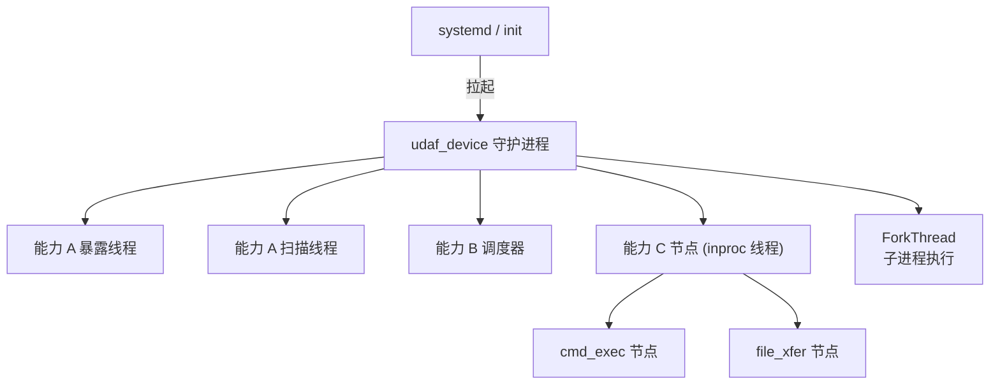
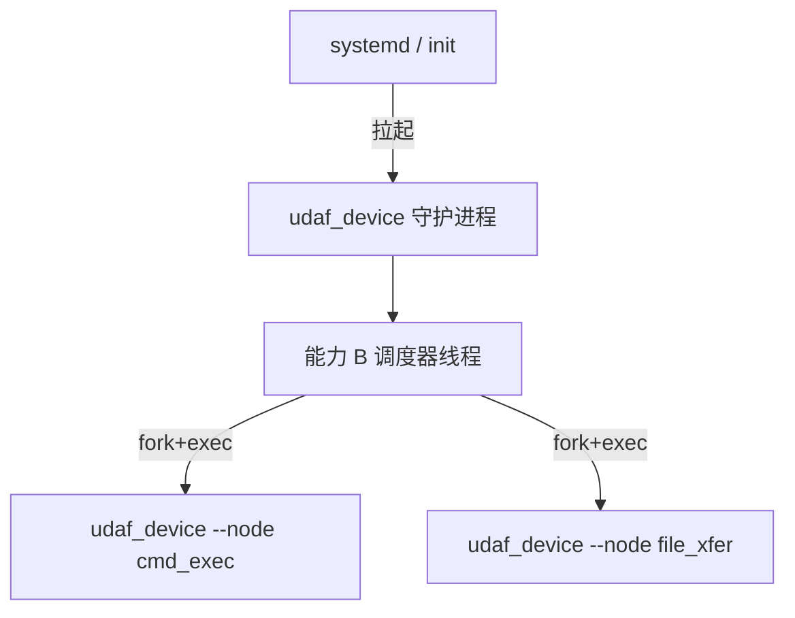
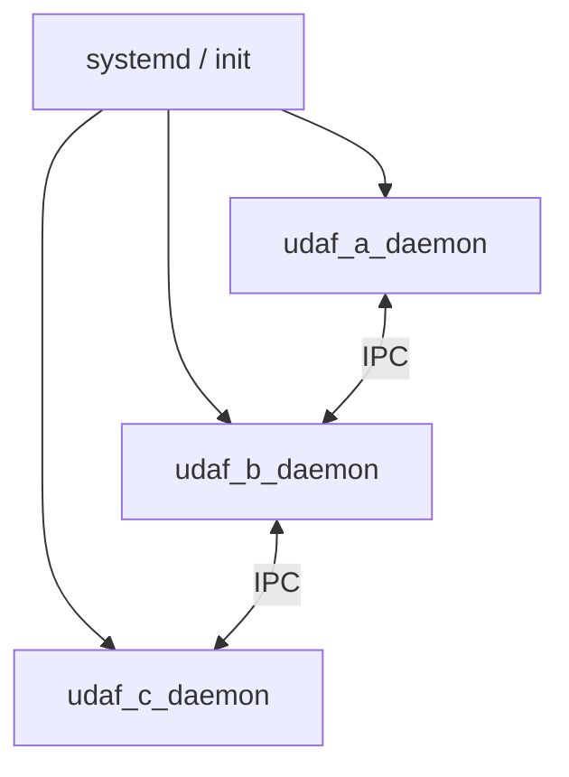

# ADR-003: 进程模型（设备端 / 主机端）

> **状态**：已批准
> **日期**：2026-08-26（提议）
> **批准日期**：2026-09-01（实现阶段完成，446/446 测试通过，0 编译警告）
> **前置**：[`docs/01-requirements.md`](../01-requirements.md) v1.0 §5.5 / §7.6 / §10.1
> **响应需求 TBD**：进程模型（§11.2 第 3 项）

---

## 1. 背景

需求 v1.0 对进程模型的要求：
- §1.2 三大能力并列，A/B/C 各自有清晰的进程边界
- §5.1 性能：设备端 < 8MB 内存，启动 < 200ms
- §7.6 整进程崩溃需 watchdog 拉起；崩溃恢复时延 ≤ 5s
- §7.6 watchdog 监督拓扑：单层 watchdog 守护主进程；节点级崩溃由 B 框架自愈
- §10.1 API 语言分端：设备端 C、主机端 C++

需求 §5.7 watchdog 重启预算：
- 同一进程 60 秒内连续崩溃 3 次后停止自动重启并告警
- watchdog 自身崩溃时降级到"节点级自愈"模式

## 2. 候选方案

### 2.1 设备端：单可执行 + 多线程 + 节点子进程



| 维度 | 评估 |
|------|------|
| Footprint | 低（单可执行 ~5MB） |
| 启动时间 | 快（200ms 可达成） |
| 节点隔离 | 弱（inproc 节点共享进程空间，崩溃会影响主进程） |
| 资源开销 | 低 |
| 部署复杂度 | 低 |
| watchdog 集成 | systemd 拉起 udaf_device 主进程 |

### 2.2 设备端：单可执行 + 多节点独立子进程



| 维度 | 评估 |
|------|------|
| Footprint | 中（每个节点独立进程） |
| 启动时间 | 中 |
| 节点隔离 | 强（节点崩溃不影响主进程） |
| 资源开销 | 中（多进程上下文切换） |
| 部署复杂度 | 中（需管理多个进程） |
| watchdog 集成 | systemd 拉起 udaf_device 主进程 + B 框架自愈节点级崩溃 |

### 2.3 设备端：多独立守护进程（每能力一个）



| 维度 | 评估 |
|------|------|
| Footprint | 高（多个守护进程） |
| 启动时间 | 慢（多个进程协调） |
| 节点隔离 | 最强 |
| 资源开销 | 高 |
| 部署复杂度 | 高（多个 systemd unit） |
| watchdog 集成 | 每个 daemon 独立 |

## 3. 决策

**采用方案 2.2：单可执行 + 多节点独立子进程**，理由：

1. **节点隔离**：满足需求 §1.2 "A/B 都是 C 的基础，C 不是独立中间件"的设计哲学
2. **资源可控**：单可执行 < 5MB（满足 §5.1），子进程按需 fork
3. **崩溃恢复**：主进程由 systemd 拉起，节点级崩溃由 B 框架自愈
4. **watchdog 分层**：
   - **systemd / init** 拉起 `udaf_device` 主进程（响应需求 §7.6 第 6 行）
   - **B 框架调度器** 管理节点子进程生命周期（崩溃自动重启）
   - **节点级 self-healing**：单个节点崩溃不影响主进程和其他节点

### 3.1 设备端进程拓扑

```
systemd / init
└── udaf_device (主守护进程)
    ├── 主线程：信号处理 + 日志 + 配置
    ├── A 暴露线程（定期广播自身）
    ├── A 扫描线程（定期扫描 + 注册表）
    ├── B 调度器线程（coordinator）
    ├── ForkThread（fork 子进程执行命令）
    └── [按需] C 节点子进程
        ├── cmd_exec_node
        ├── file_xfer_node
        ├── heartbeat_node
        └── net_info_node
```

### 3.2 主机端进程拓扑

```
systemd / init
└── udaf_host (主守护进程)
    ├── A 暴露/扫描线程
    ├── B 调度器线程
    ├── [独立进程] broker_proxy（跨主机联邦，可选）
    └── [按需] C 节点子进程
        └── (同设备端)
```

### 3.3 跨主机联邦（主机端）

主机间通过 TCP 长连接联邦，**仅主机端**支持跨主机联邦（设备端不直接联邦，避免设备间 N² 连接）：

```
Host A                       Host B
udaf_host  ←── TCP 长连接 ──→  udaf_host
```

## 4. 节点崩溃重启策略（响应需求 §7.6）

| 层级 | 监督者 | 重启预算 |
|------|--------|----------|
| **主进程崩溃** | systemd / init | 60s 内连续 3 次后停止，告警 |
| **节点子进程崩溃** | B 调度器 | 60s 内连续 3 次后停止该节点，告警 |
| **A 线程崩溃** | 主进程监控 | 立即重启 |
| **watchdog 自身崩溃** | systemd / init | 降级到"节点级自愈"模式（节点由 B 调度器自管） |

## 5. 设备端资源预算

### 5.1 内存分解表

| 组件 | 估算 RSS | 说明 |
|------|---------|------|
| 主进程 udaf_device（静态 5MB + heap + 栈） | ~5.5-6.5 MB | 含 libzmq + protobuf + mbedTLS |
| 节点子进程（fork，COW 共享代码段） | ~0.5 MB / 进程 | 初始 RSS，COW 共享主进程代码段 |
| 每节点 protobuf message 实例 + ZMQ IPC 缓冲区 | +0.5-1 MB / 进程 | 文件传输节点可能更高 |
| **合计（5 节点满载）** | **~8-12 MB** | 需监控实际 RSS，配置 ZMQ 缓冲区上限 |

**内存控制措施**：
- 所有节点子进程统一 fork（无 exec），共享主进程代码段，最大限度利用 COW
- 配置 ZMQ socket 缓冲区上限（`ZMQ_RCVHWM` / `ZMQ_SNDHWM`）防内存爆炸
- 节点子进程设置 `RLIMIT_AS`（虚拟内存上限）+ cgroup v2 memory limit
- 需求 §5.1"空闲 < 8MB"与 §5.7"满载 < 16MB"的过渡由节点数量控制

### 5.2 启动时间分解

| 启动阶段 | 预算 | 说明 |
|---------|------|------|
| 进程初始化（kernel → main） | ≤ 30ms | OS 相关 |
| libc++ 静态初始化 | ≤ 15ms | 编译期确定 |
| yaml-cpp 加载配置（1KB） | ≤ 15ms | I/O 密集 |
| mbedTLS context 初始化 | ≤ 15ms | 加密库预热 |
| libzmq context 初始化 | ≤ 10ms | ZMQ 就绪 |
| 加密派生（PSK HKDF） | ≤ 5ms | ADR-007 |
| 主循环启动 + 线程创建 | ≤ 10ms | |
| **合计（冷启动，无 WAL 回放）** | **≤ 100ms** | 裕度 100ms |
| WAL 回放（崩溃恢复路径） | 0-5000ms | **独立于冷启动**，标记为"recovery 模式" |

**冷启动 vs 崩溃恢复分离**：
- 冷启动（首次启动）：≤ 200ms，不含 WAL 回放
- 崩溃恢复（异常退出后重启）：允许超过 200ms，标记为"recovery 模式"
- WAL 惰性恢复：回放超过 100ms 时采用后台 replay，不阻塞主循环

### 5.3 Flash 写入寿命预算（目标 ≥ 5 年）

| 写入源 | 频率 | 年写入量 | 说明 |
|--------|------|---------|------|
| **WAL fdatasync** | 10s/次（批量） | ~3 GB/年 | 累积 64KB + 10s fdatasync |
| **审计日志 fdatasync** | 60s/次（异步） | ~0.5 GB/年 | gzip 压缩 + rotate 到 /var/log/udaf/audit/ |
| **关键事件强制 sync** | 10-100 次/天 | ~0.05 GB/年 | 加密握手完成 / 配置变更 / 白名单变更 |
| **WAL rotate + truncate** | 1 次/天 | ~0.02 GB/年 | 当 WAL 文件 > 10MB 时截断 |
| **合计** | | **~3.5 GB/年** | 5 年累计 ~17.5 GB |

**MLC NAND 寿命估算**（3000 P/E cycles，128KB 块，典型工业级 eMMC）：
- 总写入量：5 年 × 17.5 GB ≈ **87.5 GB**
- 平均块擦除次数：87.5 GB / 128KB ≈ **700,000 次**（按全块覆盖）
- 总块数（以 8GB eMMC 为例）：8 GB / 128KB = **65,536 块**
- 平均每块 P/E：700,000 / 65,536 ≈ **10.7 次**（远低于 3000 次限制）
- **结论**：✅ 5 年寿命目标达成（裕度 ~280 倍）

**寿命优化措施**（v1.0 必须）：
1. **WAL 批量 fdatasync**：累积 64KB + 10s 超时，避免每秒一次 sync
2. **审计日志异步 + rotate**：60s/次 fdatasync + 日切割 + gzip（~10%）
3. **关键事件分级**：加密握手完成 / 配置变更 / 白名单变更 → 立即 fdatasync；其余累积
4. **避免 log_write 触发元数据写**：使用 `O_APPEND` 而非 `O_CREAT|O_TRUNC`，减少 inode 元数据变更
5. **写入对齐**：所有写入按 4KB sector 对齐（避免 read-modify-write）

**寿命监控**：
- 通过 `/sys/block/mmcblk0/stat` 读取 `write_ios` 估算累计写入量
- 写入量超过 50% 寿命预算时告警（v1.x）

### 5.4 进程调度策略

- **设备端**：CFS 默认 + nice 值调整（不启用 SCHED_FIFO，接受 CFS 抖动 ~1-5ms）
- **实时性权衡**：数据流节点 inproc 线程在主进程内（低延迟）；CPU/IO 密集型节点用子进程（隔离性）
- **调度延迟预算**：同主机 P95 < 100μs 仅适用于 inproc 通道；IPC/TCP 通道的端到端延迟包含调度抖动

### 5.5 fork/exec 性能

| 路径 | 延迟（x86_64） | 延迟（aarch64） | 说明 |
|------|---------------|----------------|------|
| fork-only（热路径，已加载库） | ~2-3ms | ~3-5ms | COW 共享地址空间 |
| fork+exec（冷路径） | ~8-15ms | ~10-20ms | 含 ELF 加载 + 动态链接 |

**最坏情况计算**：fork+exec(15ms) + on_init(50ms) + 序列化器初始化(5ms) + IPC 握手(10ms) = 80ms（裕度 20ms）

## 6. 节点重启退避策略（需求 §5.2）

| 重启次数 | 退避间隔 | 说明 |
|---------|---------|------|
| 第 1 次 | 1s | 立即重试 |
| 第 2 次 | 2s | 指数退避 |
| 第 3 次 | 4s | 指数退避 |
| 第 4 次 | 8s | 指数退避 |
| 第 5 次 | 16s（最大） | + ±20% 随机抖动 |
| 60s 内连续 3 次崩溃 | **停止重启** | 告警，等待人工介入 |

## 7. 后果

- ✅ 满足 §5.1 设备端 < 8MB 内存（空闲）/ < 16MB（满载）
- ✅ 满足 §7.6 watchdog 分层监督（systemd 主 + B 调度器节点级）
- ✅ 满足 §7.6 重启预算（60s 内 3 次 + 指数退避）
- ✅ 启动时间预算分解明确（冷启动 ≤ 100ms，崩溃恢复独立）
- ✅ Flash 5 年寿命目标量化达成（裕度 ~280 倍）
- ⚠️ 内存满载 8-12MB 接近 16MB 上限，需监控实际 RSS

## 8. 未来演进

- **v1.x**：评估 fork-only 模式（仅调试模式 fork+exec）
- **v1.x**：评估 io_uring 替代 ZMQ IPC（延迟对比基准）
- **v2.0+**：考虑容器化（systemd-nspawn）作为可选部署形态

## 7. 引用

- [需求 §5.1 性能契约](../01-requirements.md#51-性能契约)
- [需求 §7.6 运行环境异常](../01-requirements.md#76-运行环境异常)
- [需求 §10.1 MVP 必含](../01-requirements.md#101-v10-mvp-必含)
- [架构 §5.5 动态拓扑](../02-architecture.md#55-动态拓扑由-a-驱动)
