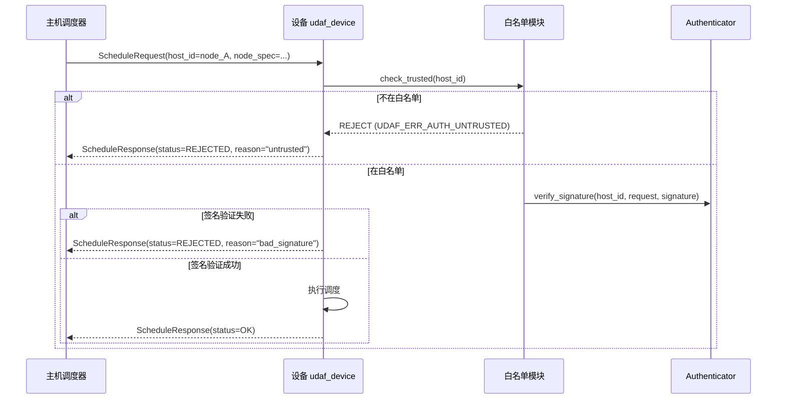

# ADR-005: 跨主机调度白名单

> **状态**：提议（待评审）
> **日期**：2026-08-26
> **前置**：[`docs/01-requirements.md`](../01-requirements.md) v1.0 §6.2
> **响应需求**：CLAUDE.md 关键约束 7"跨主机节点调度必须白名单（设备端防恶意调度）" + 需求 §6.2"跨主机调度白名单"

---

## 1. 背景

需求 §6.2 硬约束："设备端只接受已认证主机下发的调度指令"。架构 v2.0 §5.4 `NodeSpec` 仅有 `host_id` 字段，无白名单校验机制。恶意主机接入同一网络后可伪造调度指令。

## 2. 决策

**设备端维护 `trusted_hosts.yaml`，每次调度请求需经 HMAC/签名校验**。

### 2.1 白名单数据结构

```yaml
# /etc/udaf/trusted_hosts.yaml (设备端)
# 权限 600，仅 udaf 用户可读
# 文件末尾必须包含 _integrity 字段（HMAC-SHA256 签名），启动时校验
trusted_hosts:
  - node_id: "aaaa-bbbb-cccc-dddd"
    hostname: "host-workstation-01"
    psk_fingerprint: "SHA256:abcdef1234567890..."   # PSK 的 SHA-256 指纹（不存 PSK 本身）
    added_at: "2026-08-26T10:00:00Z"
    added_by: "admin@prod-01"
  - node_id: "eeee-ffff-gggg-hhhh"
    hostname: "host-server-02"
    cert_fingerprint: "SHA256:0987654321fedcba..."  # v1.x PKI 证书指纹
    added_at: "2026-08-26T11:00:00Z"
    added_by: "admin@prod-01"

# 文件完整性签名：HMAC-SHA256(file_content_excluding_this_field, key=trust_signing_key)
# key 派生自设备首次启动时生成的 trust_signing_key（独立于 PSK，存储于 /etc/udaf/trust_key.bin，0600）
_integrity:
  algorithm: "HMAC-SHA256"
  value: "f4e2...8c91..."
  signed_at: "2026-08-26T12:00:00Z"
```

**文件完整性校验流程**：
1. `udaf_device` 启动时加载 `trusted_hosts.yaml`
2. 提取 `_integrity.value` 之外的所有字段作为待签内容
3. 用 `trust_signing_key` 计算 HMAC-SHA256，与 `_integrity.value` 严格比对
4. 校验失败 → 拒绝加载，回退到上次成功加载的快照（如有），并写审计日志（`WHITELIST_CHANGE` + 错误详情）
5. 校验成功 → 写审计日志（`WHITELIST_CHANGE` + 新增/删除条目摘要）

**`udaf_trust` CLI 写流程**：
1. CLI 修改文件 → 调用 `whitelist::sign_file(path)` → 自动重算 `_integrity.value`
2. CLI 不直接持有 `trust_signing_key`，通过 IPC 调用主进程完成签名（防本地恶意脚本绕过）

### 2.2 调度校验流程



### 2.3 白名单操作 API

| API | 说明 |
|-----|------|
| `whitelist_add(node_id, fingerprint, added_by)` | 手动添加（本地 CLI / 产线脚本） |
| `whitelist_remove(node_id)` | 移除 |
| `whitelist_list()` | 列出所有已信任主机 |
| `whitelist_verify(node_id, request, signature)` | 校验签名 |

**关键约束**：
- 白名单变更仅支持本地操作（`udaf_trust` CLI），不支持远程变更（防注入）
- 白名单文件变更自动触发审计日志记录
- 设备首次接入时通过 USB/串口一次性写入初始白名单

## 3. 后果

- ✅ 满足 CLAUDE.md 关键约束 7
- ✅ 防止恶意主机调度设备
- ⚠️ 产线部署需额外步骤写入白名单
- ⚠️ 设备数量 > 100 时需批量管理工具（v1.x 扩展）

## 4. 引用

- [CLAUDE.md §3 关键约束 7](../../CLAUDE.md#3-不可违反的关键约束)
- [需求 §6.2 安全硬约束](../01-requirements.md#62-安全硬约束)
- [ADR-004 认证模型](ADR-004-auth-model.md)
