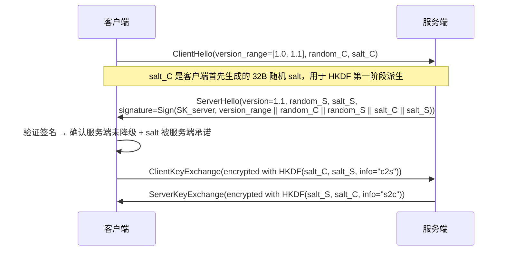

# ADR-007: PSK KDF 派生与 AEAD 加密

> **状态**：已批准
> **日期**：2026-08-26（提议）
> **批准日期**：2026-09-01（实现阶段完成，446/446 测试通过，0 编译警告）
> **前置**：[`docs/01-requirements.md`](../01-requirements.md) v1.0 §5.3 / §6.2
> **响应需求**：密码学最佳实践 + 发现消息重放防护 + v1.x 降级防护

---

## 1. 背景

架构 v2.0 存在以下安全缺陷：
1. `AdvertisementPayload.hmac` 截断到 32bit（`uint32_t`），抗碰撞性不足
2. PSK 直接用作 HMAC 密钥，未派生会话密钥（key wear-out 风险）
3. 无 IV/Nonce，同一密钥下多次加密相同明文产生相同密文
4. 重放窗口未定义
5. v1.x 双模式共存时可被强制降级到 PSK-only

## 2. 决策

### 2.1 KDF 派生链

```
PSK (32 字节，≥ 256 bit 熵)
  │
  ├── HKDF-SHA256(salt=random, info="udaf-psk-v1-session")
  │     └── Session Key (32 字节)
  │           │
  │           ├── HKDF-SHA256(salt=client_random, info="client-to-server")
  │           │     └── Encryption Key (32 字节, AES-256-GCM)
  │           │     └── MAC Key (32 字节, HMAC-SHA256)
  │           │
  │           └── HKDF-SHA256(salt=server_random, info="server-to-client")
  │                 └── Encryption Key (32 字节, AES-256-GCM)
  │                 └── MAC Key (32 字节, HMAC-SHA256)
```

**约束**：
- PSK 熵 ≥ 256 bit（32 字节随机），禁止密码短语直接作为 PSK
- 每个会话（TCP 连接生命周期）派生独立密钥
- 加密密钥与 MAC 密钥分离（即使 AEAD 也需要独立 MAC 用于明文部分签名）

### 2.2 AdvertisementPayload 修订

```cpp
struct AdvertisementHeader {
    uint32_t magic;                // 0x55444141 "UDAA"
    uint8_t  version;              // 协议版本
    uint8_t  reserved[1];
    uint8_t  nonce[12];            // AEAD 随机 nonce（96 bit，永不重用）
    uint32_t encrypted_payload_len;
    uint8_t  mac[32];              // HMAC-SHA256（完整 256 bit，覆盖 header + 密文）
};

struct AdvertisementPayload {
    NodeId       node_id;
    char         hostname[64];
    uint32_t     ip_v4;
    uint16_t     port;
    char         model[32];
    char         serial[32];
    uint16_t     protocol_version;
    uint64_t     timestamp_ns;
    uint64_t     sequence;         // 单调递增序列号（防重放）
    uint8_t      services_count;
    ServiceEntry services[8];
};
```

**加密方式**：AES-256-GCM（AEAD），密文 = AES-GCM(plaintext, nonce, aad=header)
**MAC**：HMAC-SHA256(MAC_key, header || ciphertext)，32 字节完整 MAC

### 2.3 重放防护

| 机制 | 说明 |
|------|------|
| **nonce** | 12 字节随机，加密引擎内部维护计数器 + 随机组合，永不重用 |
| **序列号** | `AdvertisementPayload.sequence` 单调递增，接收方记录每个节点的最高序列号 |
| **时间戳窗口** | `timestamp_ns` 容差 ≤ 5 秒（NTP 漂移容忍度） |
| **重放检测** | 接收方缓存最近 64 个 (node_id, sequence) 对，命中则丢弃 |

### 2.4 协议降级防护（v1.x）



**约束**：
- 服务端必须签名"支持的最低版本"，客户端校验签名
- 配置项 `auth.min_version`（默认当前版本），低于此值直接拒绝
- 任何降级尝试记录审计日志
- **HKDF salt 在 ClientHello / ServerHello 中明文传输，但被服务端签名覆盖**：攻击者无法篡改 salt（会导致签名验证失败）；重放 salt 需要同时重放 random_C（受 5s 时间戳窗口约束）
- **salt 必须每次握手独立生成**：禁止重用 salt（防止 key wear-out）

### 2.5 PSK 池加密存储（v1.0 主机端）

```yaml
# /etc/udaf/psk_pool.enc（加密后的 PSK 池）
# 主密钥通过 OS keyring / argon2id 派生
version: 1
kdf: argon2id
salt: <16 字节随机>
memory_cost: 65536
time_cost: 3
parallelism: 4
entries:
  - device_node_id: "aaaa-bbbb-cccc-dddd"
    encrypted_psk: <base64 AES-256-GCM 加密的 PSK>
    iv: <12 字节>
    added_at: "2026-08-26T10:00:00Z"
```

**密钥保护**：主机端使用 Argon2id 派生主密钥（从 OS keyring 获取 passphrase），加密 PSK 池文件。

## 3. 后果

- ✅ 满足密码学最佳实践（KDF + AEAD + nonce + 重放防护）
- ✅ 防止密钥磨损攻击
- ✅ 防止协议降级攻击
- ✅ 主机端 PSK 池加密存储
- ⚠️ HKDF + AES-GCM 增加 ~50μs 开销（仍在 < 2ms P95 内）
- ⚠️ PSK 管理工具需更新（生成 32 字节随机 PSK）

## 4. 引用

- [NIST SP 800-107 HKDF](https://csrc.nist.gov/publications/detail/sp/800-107/rev-1/final)
- [RFC 5869 HKDF](https://datatracker.ietf.org/doc/html/rfc5869)
- [需求 §5.3 安全契约](../01-requirements.md#53-安全契约)
- [需求 §6.2 安全硬约束](../01-requirements.md#62-安全硬约束)
- [ADR-004 认证模型](ADR-004-auth-model.md)
